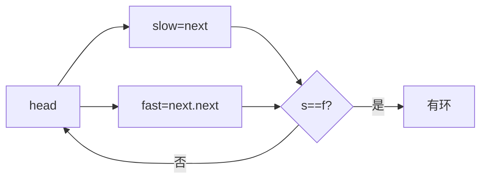
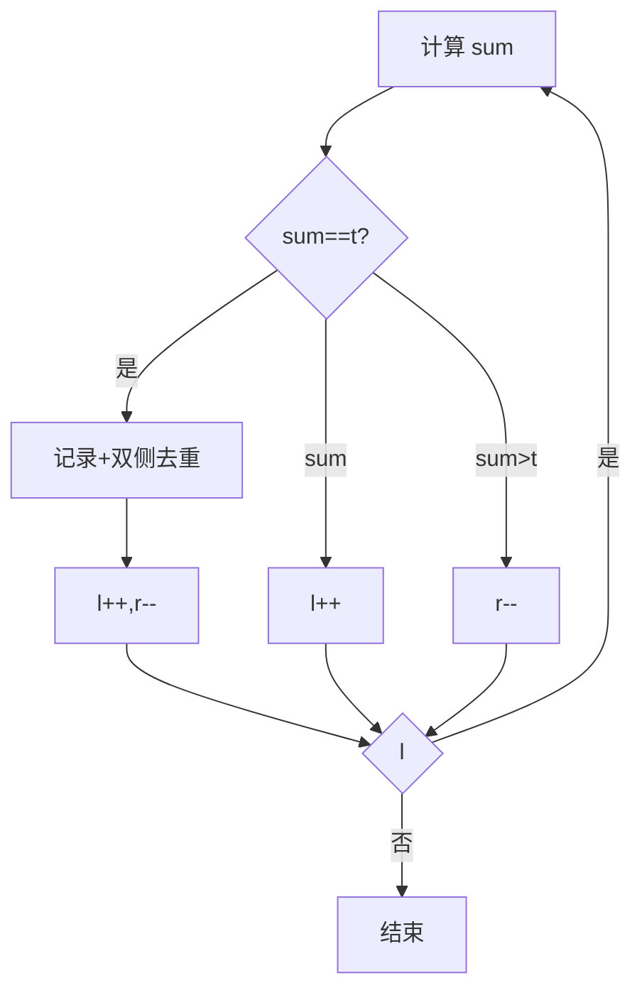

# 双指针

## 一、总览

| 类型 | 指针方向 | 典型题 |
| --- | --- | --- |
| 快慢指针 | 同向，速度不同 | 环检测、移除元素 |
| 左右指针 | 相向（对撞） | 两数之和、盛水、二分 |
| 滑动窗口 | 同向，维护区间 | 见「滑动窗口.md」 |

## 二、快慢指针（同向）

### 2.1 环形链表检测（141）

```java
public boolean hasCycle(ListNode head) {
    ListNode s = head, f = head;
    while (f != null && f.next != null) {
        s = s.next; f = f.next.next;
        if (s == f) return true;
    }
    return false;
}
```



### 2.2 移除元素（27）

```java
public int removeElement(int[] nums, int val) {
    int i = 0;
    for (int j = 0; j < nums.length; j++)
        if (nums[j] != val) nums[i++] = nums[j];
    return i;
}
```
- 慢指针 i 收集保留元素，快指针 j 遍历。

## 三、左右指针（对撞）

### 3.1 两数之和 II（167）

```java
public int[] twoSum(int[] nums, int target) {
    int l = 0, r = nums.length - 1;
    while (l < r) {
        int sum = nums[l] + nums[r];
        if (sum == target) return new int[]{l+1, r+1};
        else if (sum < target) l++; else r--;
    }
    return new int[]{};
}
```

### 3.2 盛最多水的容器（11）

```java
public int maxArea(int[] h) {
    int l = 0, r = h.length-1, ans = 0;
    while (l < r) {
        ans = Math.max(ans, Math.min(h[l], h[r]) * (r - l));
        if (h[l] < h[r]) l++; else r--;
    }
    return ans;
}
```
- 每次移矮的一侧，因为移高侧面积必不增。

### 3.3 二分查找（704）

```java
public int search(int[] nums, int t) {
    int l = 0, r = nums.length - 1;
    while (l <= r) {
        int m = l + (r - l)/2;
        if (nums[m] == t) return m;
        else if (nums[m] < t) l = m + 1; else r = m - 1;
    }
    return -1;
}
```

```python
def search(nums, t):
    l, r = 0, len(nums)-1
    while l <= r:
        m = (l+r)//2
        if nums[m]==t: return m
        elif nums[m]<t: l=m+1
        else: r=m-1
    return -1
```

## 四、滑动窗口

同向双指针维护一个可变区间，详见「滑动窗口.md」。核心模板：

```java
int left = 0;
for (int right = 0; right < s.length(); right++) {
    // 右移扩大窗口，更新状态
    while (窗口不满足条件) {
        // 左移收缩窗口
        left++;
    }
    // 更新答案
}
```

## 五、题型识别

| 现象 | 优先尝试 |
| --- | --- |
| 链表找环 / 中间点 | 快慢指针 |
| 有序数组两数之和 | 左右指针 |
| 最值容器 / 盛水 | 左右指针 |
| 查找 / 下界 | 二分 |
| 子串 / 子数组最值 | 滑动窗口 |

## 六、更多题型（对撞 + 快慢进阶）

### 6.4 三数之和（15）

排序后固定 `i`，双指针在 `[i+1, n-1]` 对撞，左右两侧分别去重。

```java
public List<List<Integer>> threeSum(int[] nums) {
    Arrays.sort(nums);
    List<List<Integer>> res = new ArrayList<>();
    for (int i = 0; i < nums.length - 2; i++) {
        if (i > 0 && nums[i] == nums[i-1]) continue;        // i 去重
        int l = i + 1, r = nums.length - 1;
        while (l < r) {
            int s = nums[i] + nums[l] + nums[r];
            if (s < 0) l++;
            else if (s > 0) r--;
            else {
                res.add(Arrays.asList(nums[i], nums[l], nums[r]));
                while (l < r && nums[l] == nums[l+1]) l++;   // 左去重
                while (l < r && nums[r] == nums[r-1]) r--;   // 右去重
                l++; r--;
            }
        }
    }
    return res;
}
```
- 时间 O(n²)，空间 O(1)（不计返回）。扩展四数之和（18）套两层外层循环 + 对撞，O(n³)。

### 6.5 接雨水（42，双指针版）

当前格能接的水量 = `min(左侧最高, 右侧最高) - 自身高`。移动较小 max 一侧，因为小侧瓶颈已确定。

```java
public int trap(int[] h) {
    int l = 0, r = h.length - 1, leftMax = 0, rightMax = 0, ans = 0;
    while (l < r) {
        leftMax = Math.max(leftMax, h[l]);
        rightMax = Math.max(rightMax, h[r]);
        if (leftMax < rightMax) ans += leftMax - h[l++];
        else ans += rightMax - h[r--];
    }
    return ans;
}
```
- 时间 O(n)，空间 O(1)。也可用「单调栈」按高度求，思路互补。

### 6.6 颜色分类（75，三指针 / 荷兰国旗）

`p0` 维护 0 的右边界，`p2` 维护 2 的左边界，`i` 当前遍历。换 0 后 `i` 推进（来自 p0 的必为 1）；换 2 后 `i` 不动（来自 p2 的可能仍是 2）。

```java
public void sortColors(int[] nums) {
    int p0 = 0, p2 = nums.length - 1, i = 0;
    while (i <= p2) {
        if (nums[i] == 0) swap(nums, i++, p0++);
        else if (nums[i] == 2) swap(nums, i, p2--);
        else i++;
    }
}
```
- 时间 O(n)，一次遍历原地排序。

### 6.7 快乐数（202，快慢指针判环）

把"各位平方和"看作链表的 `next`：进入 1 的环即快乐；进入其他环则永不达 1。快指针步长 2，相遇即判环。

```java
public boolean isHappy(int n) {
    int slow = n, fast = n;
    do {
        slow = get(slow);
        fast = get(get(fast));
    } while (slow != fast);
    return slow == 1;
}
```
- 时间 O(环长)，空间 O(1)。无需哈希表。

### 6.8 相交链表（160，双指针错位）

两指针各走完自己再走对方，走过总路程都是 `A+B`（无交点时 `A+B-C` 不适用，但都到 null 退出）。

```java
public ListNode getIntersectionNode(ListNode a, ListNode b) {
    ListNode p = a, q = b;
    while (p != q) {
        p = (p == null) ? b : p.next;
        q = (q == null) ? a : q.next;
    }
    return p;
}
```
- 时间 O(A+B)，空间 O(1)。

## 七、快慢指针进阶：找中点与环入口证明

### 7.1 找中点（876）

```java
public ListNode middleNode(ListNode head) {
    ListNode s = head, f = head;
    while (f != null && f.next != null) { s = s.next; f = f.next.next; }
    return s; // 偶数个返回下中点
}
```
- 快指针到尾时慢指针恰走一半，落在中点（偶数返回第二个中点）。

### 7.2 环入口证明（142）

设头到入口距离为 `a`，入口到相遇点 `b`，环长 `L = b + c`。快比慢多走整圈：
`2(a+b) = a + b + kL ⇒ a = kL - b = (k-1)L + c`。
即「头到入口」=「相遇点再走 c 并绕 (k-1) 圈」。故头与相遇点各放一指针同步前进，必在入口相会。

```java
public ListNode detectCycle(ListNode head) {
    ListNode s = head, f = head;
    while (f != null && f.next != null) {
        s = s.next; f = f.next.next;
        if (s == f) {
            ListNode p = head;
            while (p != s) { p = p.next; s = s.next; }
            return p;
        }
    }
    return null;
}
```

## 八、左右指针二分边界细节

二分三种常见目标：

| 目标 | 循环 | 收敛 |
| --- | --- | --- |
| 等于 target | `while(l<=r)` | 命中返回，否则 -1 |
| 第一个 ≥ target（lower_bound） | `while(l<r)` | `r=m`（含 mid） |
| 最后一个 < target | `while(l<r)` | `l=m+1` |

```java
// 第一个 >= target（左闭右开，避免死循环）
int lowerBound(int[] a, int t) {
    int l = 0, r = a.length;
    while (l < r) {
        int m = l + (r - l)/2;
        if (a[m] >= t) r = m; else l = m + 1;
    }
    return l;
}
```
- 易错点：区间长 2 且 `r=m` 时用 `l<=r` + `m=(l+r)/2` 可能死循环。统一用「左闭右开 + `l<r`」最稳。

## 九、碰撞指针模板 & 易错点表

碰撞指针通用框架：

```java
Arrays.sort(nums);
for (int i = 0; i < nums.length; i++) {
    int l = i + 1, r = nums.length - 1;
    while (l < r) {
        int s = f(nums[i], nums[l], nums[r]);
        if (s == target) { 记录; 双指针收缩 + 去重; }
        else if (s < target) l++;
        else r--;
    }
}
```

易错点表：

| 易错点 | 现象 | 对策 |
| --- | --- | --- |
| 双指针忘排序 | 对撞前提失效 | 三/四数和先 sort |
| 去重位置错 | 丢解或重复 | 移动后再 while 跳过相同 |
| 二分死循环 | 区间长 2 卡住 | 左闭右开 + `l<r` |
| 接雨水移动方向错 | 答案偏小 | 移动较小 max 一侧 |
| 颜色分类 i 推进错 | 漏 2 | 换 2 时 i 不增 |


