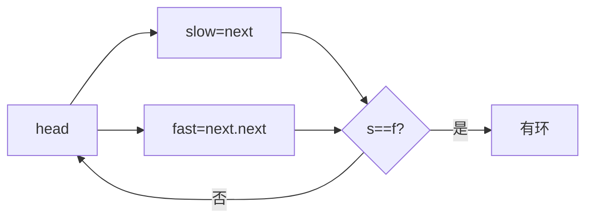

# 双指针

> ⚠️ 本页内容待补充。

## 一、总览

| 类型 | 指针方向 | 典型题 |
| --- | --- | --- |
| 快慢指针 | 同向，速度不同 | 环检测、移除元素 |
| 左右指针 | 相向（对撞） | 两数之和、盛水、二分 |
| 滑动窗口 | 同向，维护区间 | 见「滑动窗口.md」 |

## 二、快慢指针（同向）

### 2.1 环形链表检测（141）

```java
public boolean hasCycle(ListNode head) {
    ListNode s = head, f = head;
    while (f != null && f.next != null) {
        s = s.next; f = f.next.next;
        if (s == f) return true;
    }
    return false;
}
```



### 2.2 移除元素（27）

```java
public int removeElement(int[] nums, int val) {
    int i = 0;
    for (int j = 0; j < nums.length; j++)
        if (nums[j] != val) nums[i++] = nums[j];
    return i;
}
```
- 慢指针 i 收集保留元素，快指针 j 遍历。

## 三、左右指针（对撞）

### 3.1 两数之和 II（167）

```java
public int[] twoSum(int[] nums, int target) {
    int l = 0, r = nums.length - 1;
    while (l < r) {
        int sum = nums[l] + nums[r];
        if (sum == target) return new int[]{l+1, r+1};
        else if (sum < target) l++; else r--;
    }
    return new int[]{};
}
```

### 3.2 盛最多水的容器（11）

```java
public int maxArea(int[] h) {
    int l = 0, r = h.length-1, ans = 0;
    while (l < r) {
        ans = Math.max(ans, Math.min(h[l], h[r]) * (r - l));
        if (h[l] < h[r]) l++; else r--;
    }
    return ans;
}
```
- 每次移矮的一侧，因为移高侧面积必不增。

### 3.3 二分查找（704）

```java
public int search(int[] nums, int t) {
    int l = 0, r = nums.length - 1;
    while (l <= r) {
        int m = l + (r - l)/2;
        if (nums[m] == t) return m;
        else if (nums[m] < t) l = m + 1; else r = m - 1;
    }
    return -1;
}
```

```python
def search(nums, t):
    l, r = 0, len(nums)-1
    while l <= r:
        m = (l+r)//2
        if nums[m]==t: return m
        elif nums[m]<t: l=m+1
        else: r=m-1
    return -1
```

## 四、滑动窗口

同向双指针维护一个可变区间，详见「滑动窗口.md」。核心模板：

```java
int left = 0;
for (int right = 0; right < s.length(); right++) {
    // 右移扩大窗口，更新状态
    while (窗口不满足条件) {
        // 左移收缩窗口
        left++;
    }
    // 更新答案
}
```

## 五、题型识别

| 现象 | 优先尝试 |
| --- | --- |
| 链表找环 / 中间点 | 快慢指针 |
| 有序数组两数之和 | 左右指针 |
| 最值容器 / 盛水 | 左右指针 |
| 查找 / 下界 | 二分 |
| 子串 / 子数组最值 | 滑动窗口 |
