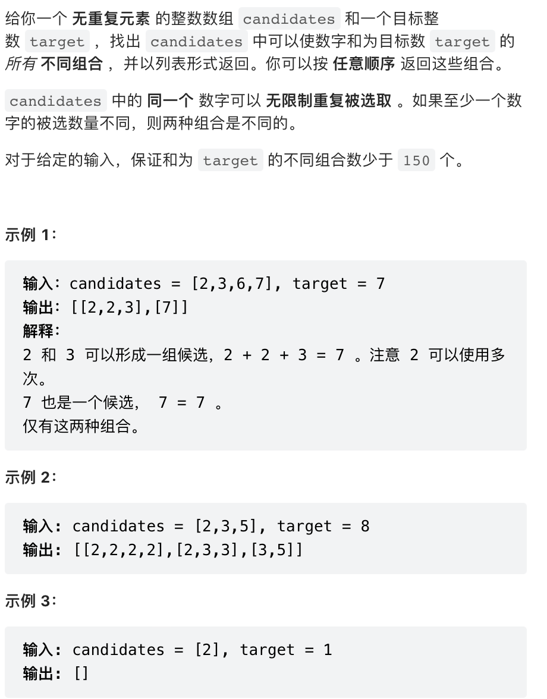
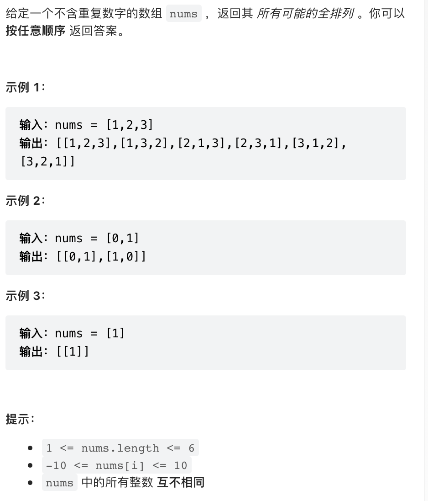
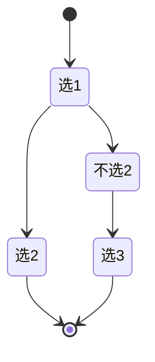
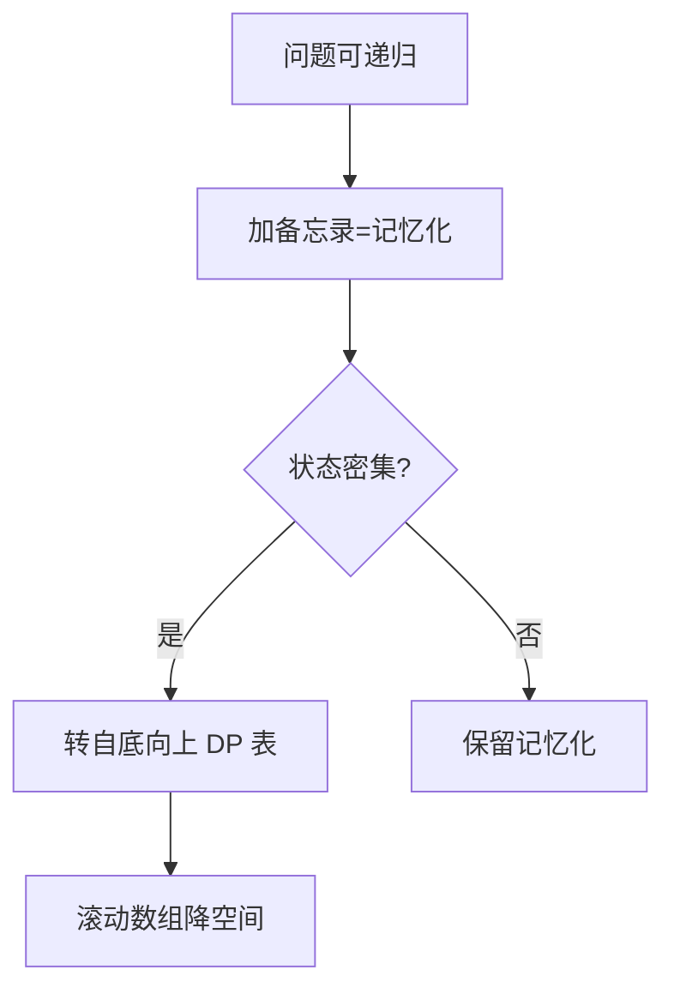

# 回溯（DFS）

回溯算法本质是**深度优先搜索 + 状态撤销**：在递归尝试每一种选择后，撤销本次选择造成的影响，以便尝试下一种选择。

## 模板

### Java 模板

```java
void backtracking(参数) {
    if (终止条件) {
        存放结果;
        return;
    }

    for (选择：本层集合中元素（树中节点孩子的数量就是集合的大小）) {
        处理节点;
        backtracking(路径，选择列表); // 递归
        回溯，撤销处理结果
    }
}
```

### Python 模板（伪代码）

```python
for 选择 in 选择列表:
    # 做选择
    将该选择从选择列表移除
    路径.add(选择)
    backtrack(路径, 选择列表)
    # 撤销选择
    路径.remove(选择)
    将该选择再加入选择列表
```

## 典型例题

### 1. LeetCode 39 组合总和



```java
class Solution {
    public List<List<Integer>> combinationSum(int[] candidates, int target) {
        int len = candidates.length;
        List<List<Integer>> res = new ArrayList<>();
        if (len == 0) {
            return res;
        }

        Deque<Integer> path = new ArrayDeque<>();
        dfs(candidates, 0, len, target, path, res);
        return res;
    }

    /**
     * @param candidates 候选数组
     * @param begin      搜索起点
     * @param len        冗余变量，是 candidates 里的属性，可以不传
     * @param target     每减去一个元素，目标值变小
     * @param path       从根结点到叶子结点的路径，是一个栈
     * @param res        结果集列表
     */
    private void dfs(int[] candidates, int begin, int len, int target, Deque<Integer> path, List<List<Integer>> res) {
        // target 为负数和 0 的时候不再产生新的孩子结点
        if (target < 0) {
            return;
        }
        if (target == 0) {
            res.add(new ArrayList<>(path));
            return;
        }

        // 重点理解这里从 begin 开始搜索的语意
        for (int i = begin; i < len; i++) {
            path.addLast(candidates[i]);

            // 注意：由于每一个元素可以重复使用，下一轮搜索的起点依然是 i，这里非常容易弄错
            dfs(candidates, i, len, target - candidates[i], path, res);

            // 状态重置
            path.removeLast();
        }
    }
}
```

### 2. LeetCode 46 全排列



```java
class Solution {
    public List<List<Integer>> permute(int[] nums) {
        int len = nums.length;
        List<Integer> list = new ArrayList();
        List<List<Integer>> res = new ArrayList();
        boolean[] used = new boolean[len];
        dfs(nums, len, list, res, used);
        return res;
    }

    public void dfs(int[] nums, int len, List<Integer> list, List<List<Integer>> res, boolean[] used) {
        if(list.size() == len) {
            res.add(new ArrayList(list));
        }

        for(int i = 0; i < len; i++) {
            if(!used[i]) {
                list.add(nums[i]);
                used[i] = true;
                dfs(nums, len, list, res, used);
                used[i] = false;
                list.remove(list.size() - 1);
            }
        }
    }
}

## 三、剪枝策略

| 剪枝类型 | 做法 |
| --- | --- |
| 可行性 | 当前路径已不可能成解 → return |
| 重复性 | 同层相同元素跳过（先排序 + used 标记） |
| 最优性 | 当前代价已超已知最优解 → return |
| 顺序 | 规定枚举顺序避免对称重复 |

## 四、排列 / 组合 / 子集

### 4.1 子集（78）

```java
public List<List<Integer>> subsets(int[] nums) {
    List<List<Integer>> res = new ArrayList<>();
    backtrack(nums, 0, new ArrayList<>(), res);
    return res;
}
void backtrack(int[] nums, int start, List<Integer> path, List<List<Integer>> res) {
    res.add(new ArrayList<>(path));
    for (int i = start; i < nums.length; i++) {
        path.add(nums[i]);
        backtrack(nums, i+1, path, res);
        path.remove(path.size()-1);
    }
}
```

### 4.2 组合（77，带剪枝）

```java
public List<List<Integer>> combine(int n, int k) {
    List<List<Integer>> res = new ArrayList<>();
    backtrack(n, k, 1, new ArrayList<>(), res);
    return res;
}
void backtrack(int n, int k, int start, List<Integer> path, List<List<Integer>> res) {
    if (path.size() == k) { res.add(new ArrayList<>(path)); return; }
    for (int i = start; i <= n - (k - path.size()) + 1; i++) { // 剪枝
        path.add(i);
        backtrack(n, k, i+1, path, res);
        path.remove(path.size()-1);
    }
}
```

### 4.3 全排列去重（47）

```java
public List<List<Integer>> permuteUnique(int[] nums) {
    Arrays.sort(nums);
    List<List<Integer>> res = new ArrayList<>();
    backtrack(nums, new boolean[nums.length], new ArrayList<>(), res);
    return res;
}
void backtrack(int[] nums, boolean[] used, List<Integer> path, List<List<Integer>> res) {
    if (path.size() == nums.length) { res.add(new ArrayList<>(path)); return; }
    for (int i = 0; i < nums.length; i++) {
        if (used[i]) continue;
        if (i > 0 && nums[i] == nums[i-1] && !used[i-1]) continue; // 同层去重
        used[i] = true; path.add(nums[i]);
        backtrack(nums, used, path, res);
        used[i] = false; path.remove(path.size()-1);
    }
}
```

## 五、棋盘与 N 皇后（51）

```java
public List<List<String>> solveNQueens(int n) {
    List<List<String>> res = new ArrayList<>();
    int[] queens = new int[n]; Arrays.fill(queens, -1);
    boolean[] cols = new boolean[n], dg = new boolean[2*n], udg = new boolean[2*n];
    backtrack(0, n, queens, cols, dg, udg, res);
    return res;
}
void backtrack(int row, int n, int[] q, boolean[] cols, boolean[] dg, boolean[] udg, List<List<String>> res) {
    if (row == n) { res.add(build(q, n)); return; }
    for (int col = 0; col < n; col++) {
        if (cols[col] || dg[row-col+n] || udg[row+col]) continue;
        q[row] = col; cols[col]=dg[row-col+n]=udg[row+col]=true;
        backtrack(row+1, n, q, cols, dg, udg, res);
        q[row] = -1; cols[col]=dg[row-col+n]=udg[row+col]=false; // 撤销
    }
}
```
- 用列、主对角线 `row-col`、副对角线 `row+col` 三个布尔数组做 O(1) 冲突检测。

## 六、记忆化搜索（自顶向下 DP）

回溯 + 备忘录等价于 DP，写法更直观：

```java
Map<String, Integer> memo = new HashMap<>();
int dfs(int i, int j) {
    if (i == 0 || j == 0) return 0;
    String key = i + "," + j;
    if (memo.containsKey(key)) return memo.get(key);
    int res = Math.max(dfs(i-1, j), dfs(i, j-1)) + 1; // 示例
    memo.put(key, res);
    return res;
}
```



## 七、更多棋盘 / 矩阵回溯

### 7.1 解数独（37）

```java
public void solveSudoku(char[][] b){
    backtrack(b);
}
boolean backtrack(char[][] b){
    for (int i=0;i<9;i++) for (int j=0;j<9;j++){
        if (b[i][j]=='.'){
            for (char c='1';c<='9';c++){
                if (valid(b,i,j,c)){
                    b[i][j]=c;
                    if (backtrack(b)) return true;
                    b[i][j]='.'; // 重置
                }
            }
            return false; // 九个数字都填不了，回溯
        }
    }
    return true; // 无空格，完成
}
boolean valid(char[][] b,int r,int c,char v){
    for (int k=0;k<9;k++)
        if (b[r][k]==v||b[k][c]==v||b[(r/3)*3+k/3][(c/3)*3+k%3]==v) return false;
    return true;
}
```
- 找到空格逐个试 1~9，冲突回溯；返回 boolean 让第一个解立即结束。剪枝后远快于 9^81。

### 7.2 单词搜索（79）

```java
public boolean exist(char[][] b, String w){
    for (int i=0;i<b.length;i++) for (int j=0;j<b[0].length;j++)
        if (dfs(b,w,i,j,0)) return true;
    return false;
}
boolean dfs(char[][] b,String w,int i,int j,int k){
    if (k==w.length()) return true;
    if (i<0||j<0||i>=b.length||j>=b[0].length||b[i][j]!=w.charAt(k)) return false;
    char t=b[i][j]; b[i][j]='#';
    boolean ok=dfs(b,w,i+1,j,k+1)||dfs(b,w,i-1,j,k+1)||dfs(b,w,i,j+1,k+1)||dfs(b,w,i,j-1,k+1);
    b[i][j]=t; // 状态重置
    return ok;
}
```
- 关键：临时标记 `#` 防走回头，递归后还原原字符。

### 7.3 分割回文串（131）

```java
public List<List<String>> partition(String s){
    List<List<String>> res=new ArrayList<>();
    dfs(s,0,new ArrayList<>(),res);
    return res;
}
void dfs(String s,int start,List<String> path,List<List<String>> res){
    if (start==s.length()){ res.add(new ArrayList<>(path)); return; }
    for (int end=start+1;end<=s.length();end++){
        if (isPal(s,start,end-1)){
            path.add(s.substring(start,end));
            dfs(s,end,path,res);
            path.remove(path.size()-1);
        }
    }
}
boolean isPal(String s,int l,int r){
    while(l<r) if(s.charAt(l++)!=s.charAt(r--)) return false;
    return true;
}
```
- 枚举分割点，非回文段剪枝。可预处理 `pal[i][j]` 加速。

## 八、DFS + 状态重置陷阱

| 陷阱 | 现象 | 对策 |
| --- | --- | --- |
| 忘了还原全局变量 | 上一层残留脏数据 | 数独/单词搜索必须还原标记 |
| 改错对象 | res 全变 | 存入前 `new ArrayList<>(path)` 拷贝 |
| used 与 path 不同步 | 排列去重出错 | used 与 add 严格对称撤销 |
| 共享可变对象 | 结果集全是同一引用 | 拷贝引用，勿存原对象 |

记忆：每次「做选择 → 递归 → 撤销选择」三步走，撤销必须与选择严格对称。

## 九、位运算枚举（子集 / 组合压缩）

当 n ≤ 20，可用 `0..(1<<n)` 枚举所有子集，替代回溯：

```java
// 枚举所有子集
for (int mask=0; mask<(1<<n); mask++){
    for (int i=0;i<n;i++) if ((mask>>i&1)==1) use(i);
}
// 枚举 mask 的所有非空子集（总次数 = 2^popcount(mask)）
for (int sub=mask; sub>0; sub=(sub-1)&mask) { /* 处理 sub */ }
```
- 优点：无递归、易去重；缺点：只适合 n 很小（如集合划分、小规模 NP 枚举）。

## 十、记忆化搜索与 DP 转换进阶

回溯（自顶向下）加备忘录 = 记忆化搜索；若要提速/降栈，可改写成「自底向上 DP 表」。

转换四步：
1. 递归参数 → DP 状态维度；
2. 递归 base case → DP 初始化；
3. 递归返回值 → DP 转移方程；
4. 递归调用 → 填表顺序（拓扑序）。

```java
// 记忆化（自顶向下）
Map<Integer,Integer> memo=new HashMap<>();
int fib(int n){ if(n<2) return n; if(memo.containsKey(n)) return memo.get(n);
    int r=fib(n-1)+fib(n-2); memo.put(n,r); return r; }
// 自底向上 DP
int fibDP(int n){ int[] dp=new int[n+1]; dp[0]=0;dp[1]=1;
    for(int i=2;i<=n;i++) dp[i]=dp[i-1]+dp[i-2]; return dp[n]; }
```
- 记忆化写法直观、天然处理稀疏状态；DP 写法省递归开销与栈深，竞赛大状态优先 DP。


```

---

## 十一、实战追问升级 & 自测卡

### 11.1 高频追问表

| 追问 | 回答要点 |
|------|------|
| "回溯和 DFS 区别？" | 回溯 = DFS + 状态撤销；强调"试错后回头" |
| "剪枝有哪些？" | 可行性/重复/最优性/顺序（见三） |
| "排列去重为什么 `!used[i-1]`？" | 同层跳过；`used[i-1]==false` 表示上一层的相同值已回溯，当前层不能再选（见 4.3） |
| "子集/组合去重？" | 先排序，同层相同值跳过（`i>start && nums[i]==nums[i-1]`） |
| "记忆化搜索 vs DP？" | 同一张表，自顶向下 vs 自底向上（见六、十） |
| "回溯空间复杂度？" | O(递归深度)（路径栈） |

### 11.2 一道综合题：_全排列（46，Go）

```go
func permute(nums []int) [][]int {
    res := [][]int{}; used := make([]bool, len(nums))
    var dfs func(path []int)
    dfs = func(path []int) {
        if len(path) == len(nums) { res = append(res, append([]int{}, path...)); return }
        for i := 0; i < len(nums); i++ {
            if used[i] { continue }
            used[i] = true; path = append(path, nums[i])
            dfs(path)
            path = path[:len(path)-1]; used[i] = false // 撤销
        }
    }
    dfs([]int{})
    return res
}
// 时间 O(n·n!)，空间 O(n)（递归栈 + 去重）。"做选择→递归→撤销"三步走。
```

### 11.3 自测卡

| 自测题 | 你能秒答吗？ | 要点 |
|------|------|------|
| 组合总和（39） | ✅ 起点 i 可重复 | 见前文一 |
| 全排列（46） | ✅ used 标记 | 见 11.2 |
| 子集（78） | ✅ start 推进 | 见四.1 |
| 组合（77） | ✅ 剪枝 `n-(k-len)+1` | 见四.2 |
| N 皇后（51） | ✅ 三布尔数组 | 见五 |
| 解数独（37） | ✅ boolean 早停 | 见七.1 |
| 分割回文串（131） | ✅ 枚举分割点 | 见七.3 |

> 自测标准：**撤销与选择严格对称、排列去重 `!used[i-1]`、组合剪枝边界、N 皇后三布尔数组**零失误。

---

## 十二、相关主题反向链接

- 状态压缩枚举替代回溯：见 [位运算](位运算.md)（n≤20 用 mask）
- 回溯转 DP：见 [动态规划](动态规划.md)（记忆化同构）
- 棋盘搜索 + Trie：见 [字符串](字符串.md)（单词搜索 II 212）
- 组合/子集的 Go 实现：见 [位运算](位运算.md)（枚举子集）
