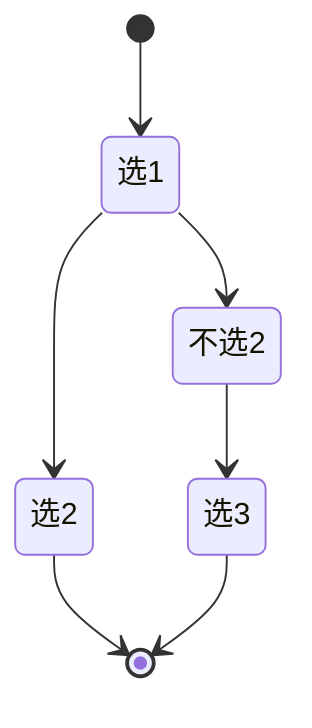

# 回溯（DFS）

回溯算法本质是**深度优先搜索 + 状态撤销**：在递归尝试每一种选择后，撤销本次选择造成的影响，以便尝试下一种选择。

## 模板

### Java 模板

```java
void backtracking(参数) {
    if (终止条件) {
        存放结果;
        return;
    }

    for (选择：本层集合中元素（树中节点孩子的数量就是集合的大小）) {
        处理节点;
        backtracking(路径，选择列表); // 递归
        回溯，撤销处理结果
    }
}
```

### Python 模板（伪代码）

```python
for 选择 in 选择列表:
    # 做选择
    将该选择从选择列表移除
    路径.add(选择)
    backtrack(路径, 选择列表)
    # 撤销选择
    路径.remove(选择)
    将该选择再加入选择列表
```

## 典型例题

### 1. LeetCode 39 组合总和


```java
class Solution {
    public List<List<Integer>> combinationSum(int[] candidates, int target) {
        int len = candidates.length;
        List<List<Integer>> res = new ArrayList<>();
        if (len == 0) {
            return res;
        }

        Deque<Integer> path = new ArrayDeque<>();
        dfs(candidates, 0, len, target, path, res);
        return res;
    }

    /**
     * @param candidates 候选数组
     * @param begin      搜索起点
     * @param len        冗余变量，是 candidates 里的属性，可以不传
     * @param target     每减去一个元素，目标值变小
     * @param path       从根结点到叶子结点的路径，是一个栈
     * @param res        结果集列表
     */
    private void dfs(int[] candidates, int begin, int len, int target, Deque<Integer> path, List<List<Integer>> res) {
        // target 为负数和 0 的时候不再产生新的孩子结点
        if (target < 0) {
            return;
        }
        if (target == 0) {
            res.add(new ArrayList<>(path));
            return;
        }

        // 重点理解这里从 begin 开始搜索的语意
        for (int i = begin; i < len; i++) {
            path.addLast(candidates[i]);

            // 注意：由于每一个元素可以重复使用，下一轮搜索的起点依然是 i，这里非常容易弄错
            dfs(candidates, i, len, target - candidates[i], path, res);

            // 状态重置
            path.removeLast();
        }
    }
}
```

### 2. LeetCode 46 全排列


```java
class Solution {
    public List<List<Integer>> permute(int[] nums) {
        int len = nums.length;
        List<Integer> list = new ArrayList();
        List<List<Integer>> res = new ArrayList();
        boolean[] used = new boolean[len];
        dfs(nums, len, list, res, used);
        return res;
    }

    public void dfs(int[] nums, int len, List<Integer> list, List<List<Integer>> res, boolean[] used) {
        if(list.size() == len) {
            res.add(new ArrayList(list));
        }

        for(int i = 0; i < len; i++) {
            if(!used[i]) {
                list.add(nums[i]);
                used[i] = true;
                dfs(nums, len, list, res, used);
                used[i] = false;
                list.remove(list.size() - 1);
            }
        }
    }
}

## 三、剪枝策略

| 剪枝类型 | 做法 |
| --- | --- |
| 可行性 | 当前路径已不可能成解 → return |
| 重复性 | 同层相同元素跳过（先排序 + used 标记） |
| 最优性 | 当前代价已超已知最优解 → return |
| 顺序 | 规定枚举顺序避免对称重复 |

## 四、排列 / 组合 / 子集

### 4.1 子集（78）

```java
public List<List<Integer>> subsets(int[] nums) {
    List<List<Integer>> res = new ArrayList<>();
    backtrack(nums, 0, new ArrayList<>(), res);
    return res;
}
void backtrack(int[] nums, int start, List<Integer> path, List<List<Integer>> res) {
    res.add(new ArrayList<>(path));
    for (int i = start; i < nums.length; i++) {
        path.add(nums[i]);
        backtrack(nums, i+1, path, res);
        path.remove(path.size()-1);
    }
}
```

### 4.2 组合（77，带剪枝）

```java
public List<List<Integer>> combine(int n, int k) {
    List<List<Integer>> res = new ArrayList<>();
    backtrack(n, k, 1, new ArrayList<>(), res);
    return res;
}
void backtrack(int n, int k, int start, List<Integer> path, List<List<Integer>> res) {
    if (path.size() == k) { res.add(new ArrayList<>(path)); return; }
    for (int i = start; i <= n - (k - path.size()) + 1; i++) { // 剪枝
        path.add(i);
        backtrack(n, k, i+1, path, res);
        path.remove(path.size()-1);
    }
}
```

### 4.3 全排列去重（47）

```java
public List<List<Integer>> permuteUnique(int[] nums) {
    Arrays.sort(nums);
    List<List<Integer>> res = new ArrayList<>();
    backtrack(nums, new boolean[nums.length], new ArrayList<>(), res);
    return res;
}
void backtrack(int[] nums, boolean[] used, List<Integer> path, List<List<Integer>> res) {
    if (path.size() == nums.length) { res.add(new ArrayList<>(path)); return; }
    for (int i = 0; i < nums.length; i++) {
        if (used[i]) continue;
        if (i > 0 && nums[i] == nums[i-1] && !used[i-1]) continue; // 同层去重
        used[i] = true; path.add(nums[i]);
        backtrack(nums, used, path, res);
        used[i] = false; path.remove(path.size()-1);
    }
}
```

## 五、棋盘与 N 皇后（51）

```java
public List<List<String>> solveNQueens(int n) {
    List<List<String>> res = new ArrayList<>();
    int[] queens = new int[n]; Arrays.fill(queens, -1);
    boolean[] cols = new boolean[n], dg = new boolean[2*n], udg = new boolean[2*n];
    backtrack(0, n, queens, cols, dg, udg, res);
    return res;
}
void backtrack(int row, int n, int[] q, boolean[] cols, boolean[] dg, boolean[] udg, List<List<String>> res) {
    if (row == n) { res.add(build(q, n)); return; }
    for (int col = 0; col < n; col++) {
        if (cols[col] || dg[row-col+n] || udg[row+col]) continue;
        q[row] = col; cols[col]=dg[row-col+n]=udg[row+col]=true;
        backtrack(row+1, n, q, cols, dg, udg, res);
        q[row] = -1; cols[col]=dg[row-col+n]=udg[row+col]=false; // 撤销
    }
}
```
- 用列、主对角线 `row-col`、副对角线 `row+col` 三个布尔数组做 O(1) 冲突检测。

## 六、记忆化搜索（自顶向下 DP）

回溯 + 备忘录等价于 DP，写法更直观：

```java
Map<String, Integer> memo = new HashMap<>();
int dfs(int i, int j) {
    if (i == 0 || j == 0) return 0;
    String key = i + "," + j;
    if (memo.containsKey(key)) return memo.get(key);
    int res = Math.max(dfs(i-1, j), dfs(i, j-1)) + 1; // 示例
    memo.put(key, res);
    return res;
}
```


```
