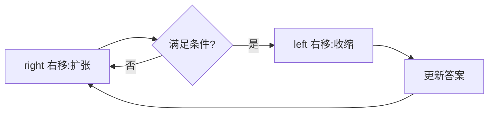

# 滑动窗口

> ⚠️ 本页内容待补充。

## 一、通用模板

### 1.1 固定窗口

窗口长度固定为 k，右移时左边界同步 +1。

```java
int k = ...;
for (int right = k-1; right < n; right++) {
    int left = right - k + 1;
    // 统计 [left, right]
}
```

### 1.2 可变窗口（最常用）

右指针扩张，满足条件后左指针收缩以逼近最优。

```java
int left = 0, valid = 0;
Map<Character,Integer> need = ..., window = ...;
for (int right = 0; right < s.length(); right++) {
    char c = s.charAt(right);
    window.put(c, window.getOrDefault(c,0)+1);
    if (need.containsKey(c) && window.get(c).equals(need.get(c))) valid++;
    while (valid == need.size()) {        // 窗口合法
        // 更新答案
        char d = s.charAt(left);
        if (need.containsKey(d) && window.get(d).equals(need.get(d))) valid--;
        window.put(d, window.get(d)-1);
        left++;
    }
}
```



## 二、最小覆盖子串（76）

```python
from collections import defaultdict, Counter
def minWindow(s, t):
    need = Counter(t); window = defaultdict(int)
    left = valid = 0; start = 0; length = len(s)+1
    for right, c in enumerate(s):
        window[c]+=1
        if need.get(c,0)>0 and window[c]==need[c]: valid+=1
        while valid==len(need):
            if right-left+1 < length: start, length = left, right-left+1
            d = s[left]
            if need.get(d,0)>0 and window[d]==need[d]: valid-=1
            window[d]-=1; left+=1
    return "" if length>len(s) else s[start:start+length]
```
- 时间 O(|s|+|t|)，空间 O(字符集)。

## 三、最长无重复子串（3）

```java
public int lengthOfLongestSubstring(String s) {
    int[] cnt = new int[128];
    int left = 0, ans = 0;
    for (int right = 0; right < s.length(); right++) {
        cnt[s.charAt(right)]++;
        while (cnt[s.charAt(right)] > 1) cnt[s.charAt(left++)]--;
        ans = Math.max(ans, right - left + 1);
    }
    return ans;
}
```

## 四、找到字符串中所有字母异位词（438）

```java
public List<Integer> findAnagrams(String s, String p) {
    List<Integer> res = new ArrayList<>();
    int[] need = new int[26], win = new int[26];
    for (char c : p.toCharArray()) need[c-'a']++;
    int left = 0;
    for (int right = 0; right < s.length(); right++) {
        win[s.charAt(right)-'a']++;
        if (right - left + 1 > p.length()) win[s.charAt(left++)-'a']--;
        if (right - left + 1 == p.length() && Arrays.equals(win, need)) res.add(left);
    }
    return res;
}
```

## 五、题型识别

| 特征 | 题 | 窗口类型 |
| --- | --- | --- |
| 含某字符最少次数 | 76 最小覆盖 | 可变 |
| 无重复 | 3 最长无重复 | 可变 |
| 等长异位词 | 438 / 567 | 固定 |
| 定长子串最大/最小 | 643 / 1423 | 固定 |
