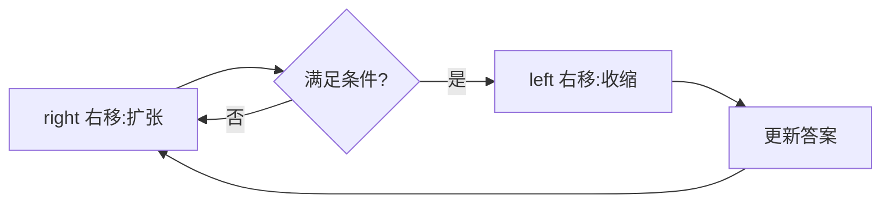
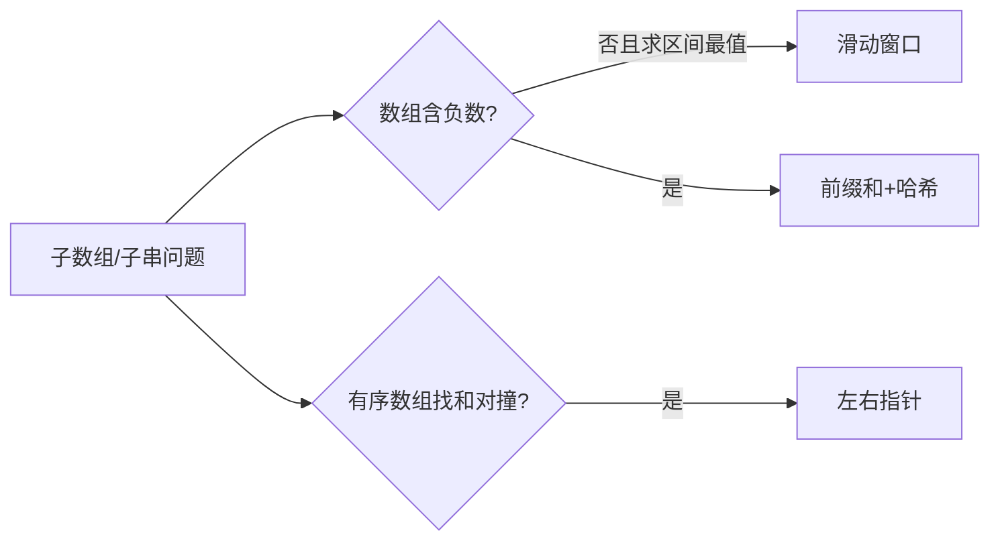

# 滑动窗口

> ⚠️ 本页内容待补充。

## 一、通用模板

### 1.1 固定窗口

窗口长度固定为 k，右移时左边界同步 +1。

```java
int k = ...;
for (int right = k-1; right < n; right++) {
    int left = right - k + 1;
    // 统计 [left, right]
}
```

### 1.2 可变窗口（最常用）

右指针扩张，满足条件后左指针收缩以逼近最优。

```java
int left = 0, valid = 0;
Map<Character,Integer> need = ..., window = ...;
for (int right = 0; right < s.length(); right++) {
    char c = s.charAt(right);
    window.put(c, window.getOrDefault(c,0)+1);
    if (need.containsKey(c) && window.get(c).equals(need.get(c))) valid++;
    while (valid == need.size()) {        // 窗口合法
        // 更新答案
        char d = s.charAt(left);
        if (need.containsKey(d) && window.get(d).equals(need.get(d))) valid--;
        window.put(d, window.get(d)-1);
        left++;
    }
}
```



## 二、最小覆盖子串（76）

```python
from collections import defaultdict, Counter
def minWindow(s, t):
    need = Counter(t); window = defaultdict(int)
    left = valid = 0; start = 0; length = len(s)+1
    for right, c in enumerate(s):
        window[c]+=1
        if need.get(c,0)>0 and window[c]==need[c]: valid+=1
        while valid==len(need):
            if right-left+1 < length: start, length = left, right-left+1
            d = s[left]
            if need.get(d,0)>0 and window[d]==need[d]: valid-=1
            window[d]-=1; left+=1
    return "" if length>len(s) else s[start:start+length]
```
- 时间 O(|s|+|t|)，空间 O(字符集)。

## 三、最长无重复子串（3）

```java
public int lengthOfLongestSubstring(String s) {
    int[] cnt = new int[128];
    int left = 0, ans = 0;
    for (int right = 0; right < s.length(); right++) {
        cnt[s.charAt(right)]++;
        while (cnt[s.charAt(right)] > 1) cnt[s.charAt(left++)]--;
        ans = Math.max(ans, right - left + 1);
    }
    return ans;
}
```

## 四、找到字符串中所有字母异位词（438）

```java
public List<Integer> findAnagrams(String s, String p) {
    List<Integer> res = new ArrayList<>();
    int[] need = new int[26], win = new int[26];
    for (char c : p.toCharArray()) need[c-'a']++;
    int left = 0;
    for (int right = 0; right < s.length(); right++) {
        win[s.charAt(right)-'a']++;
        if (right - left + 1 > p.length()) win[s.charAt(left++)-'a']--;
        if (right - left + 1 == p.length() && Arrays.equals(win, need)) res.add(left);
    }
    return res;
}
```

## 五、题型识别

| 特征 | 题 | 窗口类型 |
| --- | --- | --- |
| 含某字符最少次数 | 76 最小覆盖 | 可变 |
| 无重复 | 3 最长无重复 | 可变 |
| 等长异位词 | 438 / 567 | 固定 |
| 定长子串最大/最小 | 643 / 1423 | 固定 |

## 六、更多题型

### 6.1 至多 K 种不同字符的最长子串（340）

```java
public int lengthOfLongestSubstringKDistinct(String s, int k) {
    int[] cnt = new int[256];
    int left = 0, distinct = 0, ans = 0;
    for (int right = 0; right < s.length(); right++) {
        if (cnt[s.charAt(right)]++ == 0) distinct++;
        while (distinct > k) {
            if (--cnt[s.charAt(left)] == 0) distinct--;
            left++;
        }
        ans = Math.max(ans, right - left + 1);
    }
    return ans;
}
```
- 收缩条件：`distinct > k`。与"无重复"题区别：允许重复，只限制**种类数**。

### 6.2 和为 K 的子数组（560）

```java
public int subarraySum(int[] nums, int k) {
    Map<Integer,Integer> pre = new HashMap<>();
    pre.put(0, 1);
    int sum = 0, ans = 0;
    for (int x : nums) {
        sum += x;
        ans += pre.getOrDefault(sum - k, 0);
        pre.put(sum, pre.getOrDefault(sum, 0) + 1);
    }
    return ans;
}
```
- ⚠️ 这是「前缀和 + 哈希」，**并非滑动窗口**（数组含负数时左右单调性失效）。列入对比：**何时不能用滑动窗口**——含负数时右扩不一定增大、左缩不一定减小，单调假设破裂，须用前缀和哈希。

### 6.3 滑动窗口中位数（480，有序结构）

用两个有序集合维护窗口内大小两半，插入/删除 O(log k)，中位数 O(1)。

```java
public double[] medianSlidingWindow(int[] nums, int k) {
    TreeSet<Integer> lo = new TreeSet<>(), hi = new TreeSet<>();
    double[] res = new double[nums.length - k + 1];
    for (int i = 0; i < nums.length; i++) {
        lo.add(nums[i]); hi.add(lo.pollFirst());
        if (lo.size() < hi.size()) lo.add(hi.pollFirst());
        if (i >= k && !lo.remove(nums[i-k])) hi.remove(nums[i-k]);
        if (i >= k-1)
            res[i-k+1] = (k%2==1) ? lo.first() : ((double)lo.last() + hi.first())/2;
    }
    return res;
}
```
- 属"窗口 + 有序结构"进阶，区别于普通哈希窗口。实际可用 `int[]` + 下标避免包装。

## 七、可变窗口收缩条件模板

收缩条件取决于"合法窗口"定义，常见三类：

| 目标 | 扩张 | 收缩条件 |
| --- | --- | --- |
| 最长 | 直到不合法 | 不合法时左移 |
| 最短 | 直到合法 | 合法时左移求最小 |
| 计数 | 合法区间计数 | 越界即左移 |

通用骨架：

```java
for (right) {
    加入右端点;
    while (窗口不再满足"目标状态") {   // 目标状态因题而定
        移除左端点; left++;
    }
    更新答案(right-left+1 / 最小长度 / 计数);
}
```

## 八、单调队列滑窗（最大值 239）

窗口最值用「单调队列」O(n) 求，优于平衡 BST 的 O(n log k)。

```java
public int[] maxSlidingWindow(int[] nums, int k) {
    int n = nums.length, ans[] = new int[n-k+1];
    Deque<Integer> dq = new ArrayDeque<>(); // 存下标，队首最大
    for (int i = 0; i < n; i++) {
        while (!dq.isEmpty() && dq.peekFirst() <= i-k) dq.pollFirst(); // 出窗口
        while (!dq.isEmpty() && nums[dq.peekLast()] <= nums[i]) dq.pollLast(); // 维护递减
        dq.offerLast(i);
        if (i >= k-1) ans[i-k+1] = nums[dq.peekFirst()];
    }
    return ans;
}
```
- 队首为窗口最大值下标；新元素从队尾挤掉更小者，保证单调递减。时间 O(n)，空间 O(k)。

## 九、滑动窗口 vs 双指针

| 维度 | 滑动窗口 | 双指针（对撞） |
| --- | --- | --- |
| 指针方向 | 同向 | 相向 |
| 窗口性质 | 维护区间状态（计数/和） | 利用有序性收缩 |
| 典型题 | 子串/子数组最值 | 两数/三数之和、盛水 |
| 单调性 | 数组常非负 | 依赖排序 |
| 收缩方式 | while 循环逼近 | 每次移一侧 |


