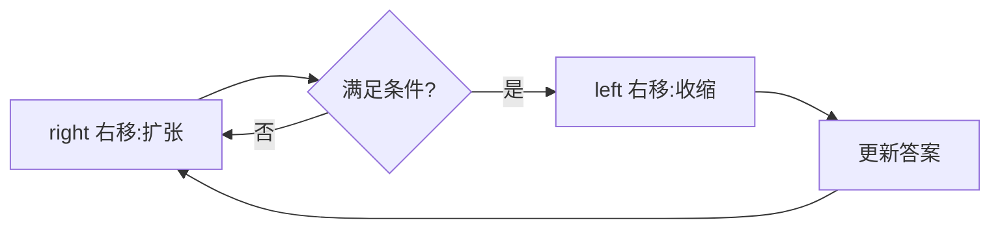
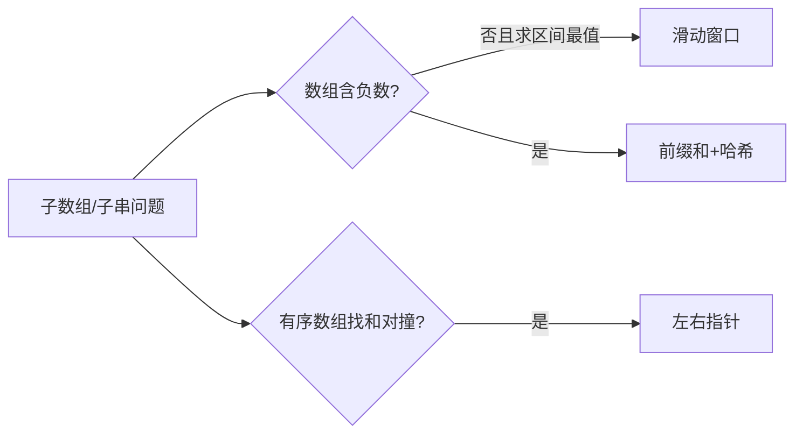
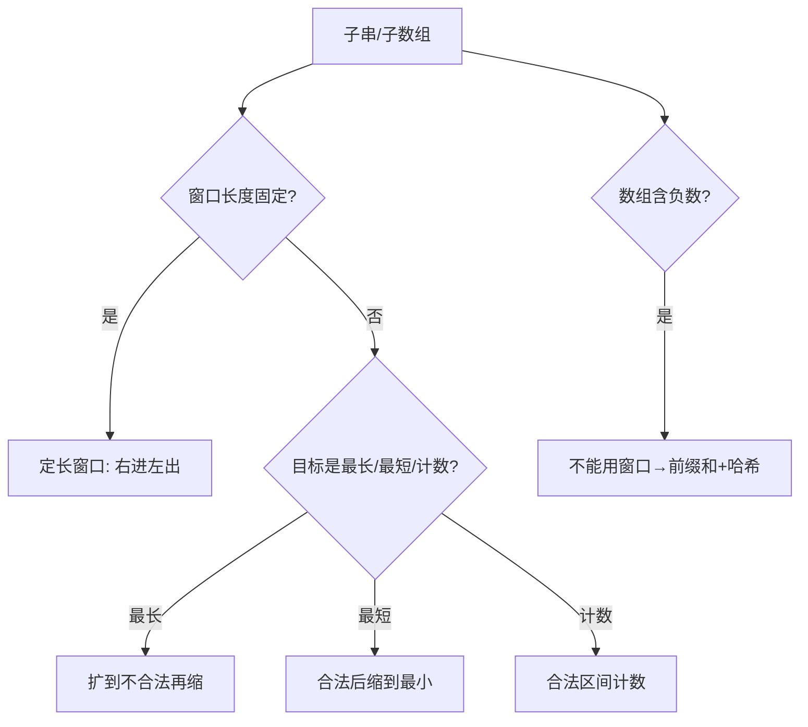

# 滑动窗口

## 一、通用模板

### 1.1 固定窗口

窗口长度固定为 k，右移时左边界同步 +1。

```java
int k = ...;
for (int right = k-1; right < n; right++) {
    int left = right - k + 1;
    // 统计 [left, right]
}
```

### 1.2 可变窗口（最常用）

右指针扩张，满足条件后左指针收缩以逼近最优。

```java
int left = 0, valid = 0;
Map<Character,Integer> need = ..., window = ...;
for (int right = 0; right < s.length(); right++) {
    char c = s.charAt(right);
    window.put(c, window.getOrDefault(c,0)+1);
    if (need.containsKey(c) && window.get(c).equals(need.get(c))) valid++;
    while (valid == need.size()) {        // 窗口合法
        // 更新答案
        char d = s.charAt(left);
        if (need.containsKey(d) && window.get(d).equals(need.get(d))) valid--;
        window.put(d, window.get(d)-1);
        left++;
    }
}
```



## 二、最小覆盖子串（76）

```python
from collections import defaultdict, Counter
def minWindow(s, t):
    need = Counter(t); window = defaultdict(int)
    left = valid = 0; start = 0; length = len(s)+1
    for right, c in enumerate(s):
        window[c]+=1
        if need.get(c,0)>0 and window[c]==need[c]: valid+=1
        while valid==len(need):
            if right-left+1 < length: start, length = left, right-left+1
            d = s[left]
            if need.get(d,0)>0 and window[d]==need[d]: valid-=1
            window[d]-=1; left+=1
    return "" if length>len(s) else s[start:start+length]
```
- 时间 O(|s|+|t|)，空间 O(字符集)。

## 三、最长无重复子串（3）

```java
public int lengthOfLongestSubstring(String s) {
    int[] cnt = new int[128];
    int left = 0, ans = 0;
    for (int right = 0; right < s.length(); right++) {
        cnt[s.charAt(right)]++;
        while (cnt[s.charAt(right)] > 1) cnt[s.charAt(left++)]--;
        ans = Math.max(ans, right - left + 1);
    }
    return ans;
}
```

## 四、找到字符串中所有字母异位词（438）

```java
public List<Integer> findAnagrams(String s, String p) {
    List<Integer> res = new ArrayList<>();
    int[] need = new int[26], win = new int[26];
    for (char c : p.toCharArray()) need[c-'a']++;
    int left = 0;
    for (int right = 0; right < s.length(); right++) {
        win[s.charAt(right)-'a']++;
        if (right - left + 1 > p.length()) win[s.charAt(left++)-'a']--;
        if (right - left + 1 == p.length() && Arrays.equals(win, need)) res.add(left);
    }
    return res;
}
```

## 五、题型识别

| 特征 | 题 | 窗口类型 |
| --- | --- | --- |
| 含某字符最少次数 | 76 最小覆盖 | 可变 |
| 无重复 | 3 最长无重复 | 可变 |
| 等长异位词 | 438 / 567 | 固定 |
| 定长子串最大/最小 | 643 / 1423 | 固定 |

## 六、更多题型

### 6.1 至多 K 种不同字符的最长子串（340）

```java
public int lengthOfLongestSubstringKDistinct(String s, int k) {
    int[] cnt = new int[256];
    int left = 0, distinct = 0, ans = 0;
    for (int right = 0; right < s.length(); right++) {
        if (cnt[s.charAt(right)]++ == 0) distinct++;
        while (distinct > k) {
            if (--cnt[s.charAt(left)] == 0) distinct--;
            left++;
        }
        ans = Math.max(ans, right - left + 1);
    }
    return ans;
}
```
- 收缩条件：`distinct > k`。与"无重复"题区别：允许重复，只限制**种类数**。

### 6.2 和为 K 的子数组（560）

```java
public int subarraySum(int[] nums, int k) {
    Map<Integer,Integer> pre = new HashMap<>();
    pre.put(0, 1);
    int sum = 0, ans = 0;
    for (int x : nums) {
        sum += x;
        ans += pre.getOrDefault(sum - k, 0);
        pre.put(sum, pre.getOrDefault(sum, 0) + 1);
    }
    return ans;
}
```
- ⚠️ 这是「前缀和 + 哈希」，**并非滑动窗口**（数组含负数时左右单调性失效）。列入对比：**何时不能用滑动窗口**——含负数时右扩不一定增大、左缩不一定减小，单调假设破裂，须用前缀和哈希。

### 6.3 滑动窗口中位数（480，有序结构）

用两个有序集合维护窗口内大小两半，插入/删除 O(log k)，中位数 O(1)。

```java
public double[] medianSlidingWindow(int[] nums, int k) {
    TreeSet<Integer> lo = new TreeSet<>(), hi = new TreeSet<>();
    double[] res = new double[nums.length - k + 1];
    for (int i = 0; i < nums.length; i++) {
        lo.add(nums[i]); hi.add(lo.pollFirst());
        if (lo.size() < hi.size()) lo.add(hi.pollFirst());
        if (i >= k && !lo.remove(nums[i-k])) hi.remove(nums[i-k]);
        if (i >= k-1)
            res[i-k+1] = (k%2==1) ? lo.first() : ((double)lo.last() + hi.first())/2;
    }
    return res;
}
```
- 属"窗口 + 有序结构"进阶，区别于普通哈希窗口。实际可用 `int[]` + 下标避免包装。

## 七、可变窗口收缩条件模板

收缩条件取决于"合法窗口"定义，常见三类：

| 目标 | 扩张 | 收缩条件 |
| --- | --- | --- |
| 最长 | 直到不合法 | 不合法时左移 |
| 最短 | 直到合法 | 合法时左移求最小 |
| 计数 | 合法区间计数 | 越界即左移 |

通用骨架：

```java
for (right) {
    加入右端点;
    while (窗口不再满足"目标状态") {   // 目标状态因题而定
        移除左端点; left++;
    }
    更新答案(right-left+1 / 最小长度 / 计数);
}
```

## 八、单调队列滑窗（最大值 239）

窗口最值用「单调队列」O(n) 求，优于平衡 BST 的 O(n log k)。

```java
public int[] maxSlidingWindow(int[] nums, int k) {
    int n = nums.length, ans[] = new int[n-k+1];
    Deque<Integer> dq = new ArrayDeque<>(); // 存下标，队首最大
    for (int i = 0; i < n; i++) {
        while (!dq.isEmpty() && dq.peekFirst() <= i-k) dq.pollFirst(); // 出窗口
        while (!dq.isEmpty() && nums[dq.peekLast()] <= nums[i]) dq.pollLast(); // 维护递减
        dq.offerLast(i);
        if (i >= k-1) ans[i-k+1] = nums[dq.peekFirst()];
    }
    return ans;
}
```
- 队首为窗口最大值下标；新元素从队尾挤掉更小者，保证单调递减。时间 O(n)，空间 O(k)。

## 九、滑动窗口 vs 双指针

| 维度 | 滑动窗口 | 双指针（对撞） |
| --- | --- | --- |
| 指针方向 | 同向 | 相向 |
| 窗口性质 | 维护区间状态（计数/和） | 利用有序性收缩 |
| 典型题 | 子串/子数组最值 | 两数/三数之和、盛水 |
| 单调性 | 数组常非负 | 依赖排序 |
| 收缩方式 | while 循环逼近 | 每次移一侧 |



---

## 十、滑动窗口逐题精讲（含 Go 实现 + 复杂度）

### 10.1 最小覆盖子串（76，Go）

```go
func minWindow(s, t string) string {
    need := map[byte]int{}
    for i := 0; i < len(t); i++ { need[t[i]]++ }
    needCnt := len(t)
    l, start, minLen := 0, 0, len(s)+1
    for r := 0; r < len(s); r++ {
        if need[s[r]] > 0 { needCnt-- } // 命中需求
        need[s[r]]--
        for needCnt == 0 { // 窗口已覆盖 → 收缩求最小
            if r-l+1 < minLen { minLen = r-l+1; start = l }
            out := s[l]
            need[out]++
            if need[out] > 0 { needCnt++ } // 移出的字符是需求 → 重新缺
            l++
        }
    }
    if minLen > len(s) { return "" }
    return s[start : start+minLen]
}
// 时间 O(|s|+|t|)，空间 O(字符集)。套路：右扩 → 满足后左缩 → 更新答案。
```

### 10.2 最长无重复子串（3）/ 至多 K 种（340）

```go
func lengthOfLongestSubstring(s string) int {
    cnt := map[byte]int{}
    l, ans := 0, 0
    for r := 0; r < len(s); r++ {
        cnt[s[r]]++
        for cnt[s[r]] > 1 { cnt[s[l]]--; l++ } // 重复 → 左移
        ans = max(ans, r-l+1)
    }
    return ans
}
// 时间 O(n)，空间 O(字符集)。注意"先加右、再缩左、再更新"。

func lengthOfLongestSubstringKDistinct(s string, k int) int {
    cnt := map[byte]int{}; l, distinct, ans := 0, 0, 0
    for r := 0; r < len(s); r++ {
        if cnt[s[r]] == 0 { distinct++ }
        cnt[s[r]]++
        for distinct > k {
            cnt[s[l]]--
            if cnt[s[l]] == 0 { distinct-- }
            l++
        }
        ans = max(ans, r-l+1)
    }
    return ans
}
// 与"无重复"区别：允许重复，只限制"种类数 ≤ k"。
```

### 10.3 定长窗口最大平均值（643）

```go
func findMaxAverage(nums []int, k int) float64 {
    sum := 0
    for i := 0; i < k; i++ { sum += nums[i] }
    maxSum := sum
    for i := k; i < len(nums); i++ {
        sum += nums[i] - nums[i-k] // 右进左出
        maxSum = max(maxSum, sum)
    }
    return float64(maxSum) / float64(k)
}
// 时间 O(n)，空间 O(1)。固定窗口：右进左出，维护 sum/最值。
```

---

## 十一、窗口类型决策图（mermaid）



---

## 十二、何时不能用滑动窗口（重要）

滑动窗口成立的前提是**单调性**：右扩增大、左缩减小（对"和/计数"这类可加量）。一旦破坏（数组含负数），右扩不一定增大、左缩不一定减小，单调假设崩塌——此时必须用**前缀和 + 哈希**（见 [前缀和与差分](前缀和与差分.md)）。典型反例：和为 K 的子数组（560），负数下滑动窗口失效。

---

## 十三、更多易错点（补充）

1. 收缩条件与更新时机：先满足条件再更新答案，别在收缩前就更新。
2. 计数窗口用 `map` 或定长数组；字符集小（26/128）用数组更快。
3. 定长窗口左边界 `i-k`（移除的是 `nums[i-k]`，下标 `i-k` 已不在窗口）。
4. "最小覆盖"返回前判 `minLen` 是否仍为初始极大值（无覆盖解返回 ""）。
5. 至多 K 种：收缩条件是 `distinct > k`，不是 `>= k`。
6. 滑窗中位数（480）需"有序结构"（双 TreeSet），不是普通哈希窗口。

---

## 十四、速记口诀与小结

> **口诀**：右扩左缩维合法，定长窗口右进左出；最小覆盖先满足再缩，最长无重遇重即退；含负数别硬上窗口，前缀哈希才是路；种类限制 distinct>k 退，定长均值右进左出。

- 面试三连：**窗口类型（固定/可变）→ 收缩条件（最长/最短/计数）→ 单调性检查（含负数换前缀和）**。
- 与 [双指针](双指针.md) 是"同向双指针"的进阶；与 [前缀和与差分](前缀和与差分.md) 互补。

---

## 十五、滑动窗口自测卡

| 自测题 | 你能秒答吗？ | 要点 |
|------|------|------|
| 最小覆盖子串 | ✅ 计数+右扩左缩 | 见 10.1 |
| 最长无重复 | ✅ 遇重即退 | 见 10.2 |
| 至多 K 种 | ✅ distinct>k 退 | 见 10.2 |
| 定长最大均值 | ✅ 右进左出 | 见 10.3 |
| 和为 K 子数组 | ❌ 不能用窗口 | 前缀和 |
| 滑窗中位数 | ⚠️ 双有序集 | 见六.3 |

> 自测标准：**收缩条件写对、含负数识别、定长窗口边界**三件事零失误。

---

## 十七、实战追问升级

| 追问 | 回答要点 |
|------|------|
| "最小覆盖子串思路？" | 右扩计数 + 满足后左缩求最小（见 10.1） |
| "最长无重复？" | 遇重复左移直到无重（见 10.2） |
| "含负数为何不能用窗口？" | 单调性破裂 → 前缀和+哈希（见十二） |
| "至多 K 种？" | `distinct>k` 收缩（见 10.2） |
| "定长窗口？" | 右进左出维护 sum/最值（见 10.3） |
| "滑窗中位数？" | 需双有序集（非哈希窗口，见六.3） |
| "窗口 vs 双指针？" | 同向维护区间 vs 相向利用有序（见九） |

### 17.1 一道综合题：_字符串排列（567）

```go
// 判断 s2 是否含 s1 的排列 → 固定长度 = len(s1) 的窗口，计数匹配
func checkInclusion(s1, s2 string) bool {
    if len(s1) > len(s2) { return false }
    need, win := [26]int{}, [26]int{}
    for i := 0; i < len(s1); i++ { need[s1[i]-'a']++ }
    for r := 0; r < len(s2); r++ {
        win[s2[r]-'a']++
        if r >= len(s1) { win[s2[r-len(s1)]-'a']-- } // 左出
        if win == need { return true }
    }
    return false
}
// 时间 O(|s2|)，空间 O(1)（定长数组）。定长窗口 + 计数比较的经典。
```

> 小结：**滑动窗口 = 右扩左缩维护合法区间；单调性是前提，含负数请换前缀和**。

---

## 十八、附：窗口长度 vs 双指针对照速记

| 维度 | 滑动窗口（同向） | 对撞双指针（相向） |
|------|------|------|
| 指针关系 | 同向、一前一后 | 一头一尾向中间 |
| 数组特征 | 常非负、满足区间单调 | 有序数组 |
| 维护内容 | 区间计数/和/最值状态 | 利用有序性收缩 |
| 典型题 | 子串/子数组最值、异位词 | 两/三/四数之和、盛水 |
| 收缩方式 | `while(不合法) left++` | 每步移一侧 `l++/r--` |

> 记忆：**同向管"区间状态"、相向管"有序收缩"**；二者都是 O(n) 双指针家族，区别在指针方向与前提。详见 [双指针](双指针.md)。

---

## 十六、相关主题反向链接

- 含负数改前缀和：见 [前缀和与差分](前缀和与差分.md)（560）
- 对撞双指针：见 [双指针](双指针.md)
- 窗口最值：见 [单调栈与单调队列](单调栈与单调队列.md)（239 单调队列）
- 字符串窗口：见 [字符串](字符串.md)（最小覆盖子串 + 计数）
