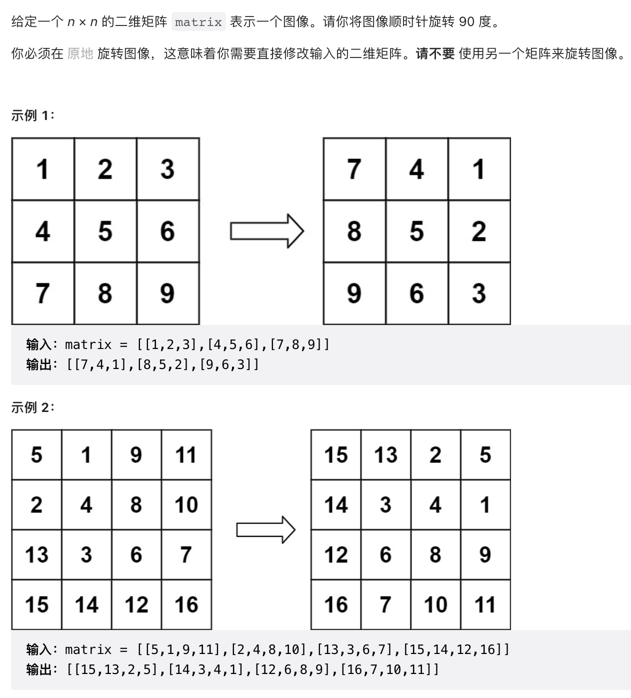
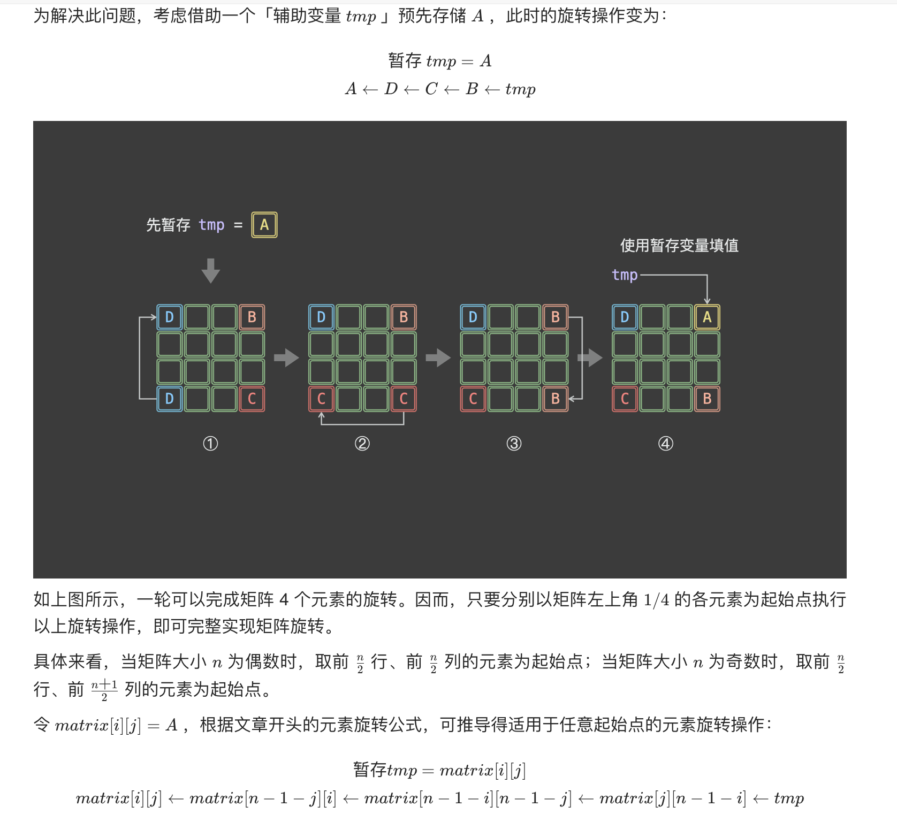
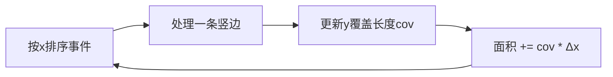
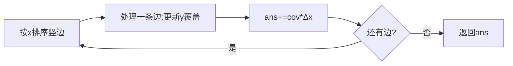

# 矩形

> 本页记录矩阵/矩形相关的算法题，目前收录 LeetCode 48（旋转图像）。

## LeetCode 48 旋转图像





```java
class Solution {
    public void rotate(int[][] matrix) {
        int n = matrix.length;
        for (int i = 0; i < n / 2; i++) {
            for (int j = 0; j < (n + 1) / 2; j++) {
                int tmp = matrix[i][j];
                matrix[i][j] = matrix[n - 1 - j][i];
                matrix[n - 1 - j][i] = matrix[n - 1 - i][n - 1 - j];
                matrix[n - 1 - i][n - 1 - j] = matrix[j][n - 1 - i];
                matrix[j][n - 1 - i] = tmp;
            }
        }
    }
}

```
## 二、矩形面积（223）

```java
public int computeArea(int A, int B, int C, int D, int E, int F, int G, int H) {
    long a1 = (long)(C-A)*(D-B);
    long a2 = (long)(G-E)*(H-F);
    long w = Math.max(0, Math.min(C,G) - Math.max(A,E));
    long h = Math.max(0, Math.min(D,H) - Math.max(B,F));
    return (int)(a1 + a2 - w*h);
}
```
- 用 `long` 防溢出；重叠区宽高取 `max(0, ...)` 自动处理不相交。

## 三、矩形重叠判断

投影法：x、y 区间均重叠才相交。

```java
boolean isOverlap(int A,int B,int C,int D,int E,int F,int G,int H){
    return Math.max(A,E) < Math.min(C,G) && Math.max(B,F) < Math.min(D,H);
}
```

## 四、最大矩形

### 4.1 柱状图最大矩形（84，单调栈）

```java
public int largestRectangleArea(int[] h) {
    int n = h.length, ans = 0;
    int[] left = new int[n], right = new int[n];
    Arrays.fill(right, n);
    Deque<Integer> st = new ArrayDeque<>();
    for (int i = 0; i < n; i++) {
        while (!st.isEmpty() && h[st.peek()] >= h[i]) { right[st.peek()] = i; st.pop(); }
        left[i] = st.isEmpty() ? -1 : st.peek();
        st.push(i);
    }
    for (int i = 0; i < n; i++) ans = Math.max(ans, h[i] * (right[i] - left[i] - 1));
    return ans;
}
```

### 4.2 矩阵中最大矩形（85）

逐行把矩阵压成柱状图高度，复用 84：

```java
public int maximalRectangle(char[][] matrix) {
    if (matrix.length == 0) return 0;
    int n = matrix[0].length, ans = 0;
    int[] h = new int[n];
    for (char[] row : matrix) {
        for (int j = 0; j < n; j++) h[j] = row[j]=='1' ? h[j]+1 : 0;
        ans = Math.max(ans, largestRectangleArea(h)); // 复用 84
    }
    return ans;
}
```

## 五、扫描线（矩形面积 II，850）

按 x 坐标排序"入边/出边"事件，用线段树/计数维护当前 y 轴被覆盖的总长度，乘相邻 x 间距累加。



## 六、题型识别

| 题型 | 特征 | 解法 |
| --- | --- | --- |
| 两矩形面积 | 给定坐标 | 投影求交后容斥 |
| 多矩形面积并 | ≤3 个 | 容斥 / 扫描线 |
| 最大矩形 | 0/1 矩阵 | 逐行转柱状图 + 单调栈 |
| 矩形重叠 | 判断是否相交 | 投影法 |
| 矩形面积并（多） | 大量矩形 | 扫描线 + 线段树 |
```

```
## 七、矩阵中最大正方形（221）

`dp[i][j]` = 以 (i,j) 为右下角的最大正方形边长，由左、上、左上三者最小值 +1 转移。

```java
public int maximalSquare(char[][] m) {
    if (m.length == 0) return 0;
    int R = m.length, C = m[0].length, ans = 0;
    int[][] dp = new int[R+1][C+1];
    for (int i = 1; i <= R; i++)
        for (int j = 1; j <= C; j++)
            if (m[i-1][j-1] == '1') {
                dp[i][j] = Math.min(dp[i-1][j], Math.min(dp[i][j-1], dp[i-1][j-1])) + 1;
                ans = Math.max(ans, dp[i][j]);
            }
    return ans * ans;
}
```
- 时间 O(RC)，空间可压缩为 O(C)。`dp` 存边长，返回 `ans*ans`。
- ASCII 示意（`dp` 值，最大边长 3 ⇒ 面积 9）：
```
矩阵:           dp:
. 1 1 1     ->  0 1 1 1
1 1 1 1     ->  1 1 2 2
1 1 1 1     ->  1 2 3 3
```

## 八、完美矩形判定（391）

给定 N 个小矩形，判断是否恰好拼成（无重叠、无空隙）一个大矩形。判定：
1. 所有小矩形面积之和 == 外层包围盒面积；
2. 恰有 4 个顶点出现奇数次，且等于包围盒四角。

用 (x,y) 计数：每读一个矩形把其四个角 ±1，最终只有大矩形四角计数为 1，其余成对抵消为 0/2/4。

```java
public boolean isRectangleCover(int[][] rects) {
    long area = 0;
    int minX=Integer.MAX_VALUE, minY=Integer.MAX_VALUE, maxX=Integer.MIN_VALUE, maxY=Integer.MIN_VALUE;
    Set<String> corners = new HashSet<>();
    for (int[] r : rects) {
        minX=Math.min(minX,r[0]); minY=Math.min(minY,r[1]);
        maxX=Math.max(maxX,r[2]); maxY=Math.max(maxY,r[3]);
        area += (long)(r[2]-r[0])*(r[3]-r[1]);
        for (int[] p : new int[][]{{r[0],r[1]},{r[2],r[3]},{r[0],r[3]},{r[2],r[1]}}) {
            String k = p[0]+","+p[1];
            if (!corners.add(k)) corners.remove(k);
        }
    }
    if (area != (long)(maxX-minX)*(maxY-minY)) return false;
    for (String c : new String[]{minX+","+minY, maxX+","+minY, minX+","+maxY, maxX+","+maxY})
        if (!corners.contains(c)) return false;
    return corners.size() == 4;
}
```
- 时间 O(N)，空间 O(N)。面积相等 + 四奇点 = 完美矩形（无重叠无空隙）。

## 九、矩形面积并（850，扫描线 + 线段树）

按 x 排序所有竖边（入边 +1 / 出边 -1），维护 y 轴被覆盖总长度 `cov`，相邻 x 间距 Δx 乘 cov 累加。离散化 y 后用线段树维护覆盖长度。

```java
class SegTree {
    int[] cnt, len; int n;
    SegTree(int n){ this.n=n; cnt=new int[4*n]; len=new int[4*n]; }
    void push(int u,int l,int r,int[] ys){
        if (cnt[u]>0) len[u]=ys[r+1]-ys[l];
        else len[u] = (l==r)?0:len[u*2]+len[u*2+1];
    }
    void update(int u,int l,int r,int ql,int qr,int v,int[] ys){
        if (ql<=l && r<=qr){ cnt[u]+=v; push(u,l,r,ys); return; }
        int m=(l+r)/2;
        if (ql<=m) update(u*2,l,m,ql,qr,v,ys);
        if (qr>m) update(u*2+1,m+1,r,ql,qr,v,ys);
        push(u,l,r,ys);
    }
}
public int rectangleArea(int[][] rects) {
    Set<Integer> set = new TreeSet<>();
    for (int[] r:rects){ set.add(r[1]); set.add(r[3]); }
    List<Integer> ys = new ArrayList<>(set);
    int m = ys.size()-1;
    SegTree st = new SegTree(m);
    int[][] es = new int[rects.length*2][];
    int idx=0;
    for (int[] r:rects){ es[idx++]=new int[]{r[0],r[1],r[3],1}; es[idx++]=new int[]{r[2],r[1],r[3],-1}; }
    Arrays.sort(es,(a,b)->a[0]-b[0]);
    long ans=0, preX=0;
    int[] ya = ys.stream().mapToInt(i->i).toArray();
    for (int[] e:es){
        ans += (long)st.len[1]*(e[0]-preX); preX=e[0];
        int l=Collections.binarySearch(ys,e[1]), r=Collections.binarySearch(ys,e[2])-1;
        st.update(1,0,m,l,r,e[3],ya);
    }
    return (int)(ans % 1000000007);
}
```
- 时间 O(N log N)。注意 y 离散化用**开区间** `[l, r+1)` 避免相邻矩形共享边重复计算。



## 十、矩形重叠计数 & 题型小结

矩形重叠计数（统计被覆盖 k 次的区域面积等）是面积并的推广：扫描线维护 `cnt`，线段树 `len` 改为按覆盖层数分段统计，`cnt>=1` 即覆盖，`cnt>=k` 即覆盖 ≥k 次。

小结表：

| 题型 | 题号 | 解法 |
| --- | --- | --- |
| 最大正方形 | 221 | DP 取三者最小 +1 |
| 完美矩形 | 391 | 面积 + 四奇点 |
| 面积并 | 850 | 扫描线 + 线段树 |
| 最大矩形 | 84/85 | 单调栈 |
| 重叠计数 | 扩展 | 扫描线按层统计 |

---

## 十一、矩形逐题精讲（含 Go 实现 + 复杂度）

### 11.1 旋转图像（48，Go）

```go
func rotate(matrix [][]int) {
    n := len(matrix)
    for i := 0; i < n/2; i++ {
        for j := 0; j < (n+1)/2; j++ {
            // 四角循环交换
            matrix[i][j], matrix[n-1-j][i], matrix[n-1-i][n-1-j], matrix[j][n-1-i] =
                matrix[n-1-j][i], matrix[n-1-i][n-1-j], matrix[j][n-1-i], matrix[i][j]
        }
    }
}
// 时间 O(n²)，空间 O(1)。一层层由外向内转，四角同时挪。
```

### 11.2 矩形面积（223）/ 重叠判断

```go
func computeArea(A, B, C, D, E, F, G, H int) int {
    a1, a2 := (C-A)*(D-B), (G-E)*(H-F)
    w := max(0, min(C, G)-max(A, E)) // 重叠宽，max(0,..) 自动处理不相交
    h := max(0, min(D, H)-max(B, F))
    return a1 + a2 - w*h // 容斥
}
// 时间 O(1)。投影法：x、y 区间都重叠才相交。
```

### 11.3 矩阵最大矩形（85，复用 84）

```go
func maximalRectangle(matrix []byte) int {
    if len(matrix) == 0 { return 0 }
    n := len(matrix[0]); h := make([]int, n); ans := 0
    for _, row := range matrix {
        for j := 0; j < n; j++ {
            if row[j] == '1' { h[j]++ } else { h[j] = 0 }
        }
        ans = max(ans, largestRectangleArea(h)) // 复用 84 单调栈
    }
    return ans
}
// 时间 O(RC)，空间 O(n)。逐行压成柱状图高度，转为一维最大矩形。
```

### 11.4 最大正方形（221，DP）

```go
func maximalSquare(m [][]byte) int {
    if len(m) == 0 { return 0 }
    R, C := len(m), len(m[0]); ans := 0
    dp := make([][]int, R+1)
    for i := range dp { dp[i] = make([]int, C+1) }
    for i := 1; i <= R; i++ {
        for j := 1; j <= C; j++ {
            if m[i-1][j-1] == '1' {
                dp[i][j] = min(dp[i-1][j], dp[i][j-1], dp[i-1][j-1]) + 1
                ans = max(ans, dp[i][j])
            }
        }
    }
    return ans * ans // dp 存边长
}
// 时间 O(RC)，空间可压成 O(C)。dp=min(上,左,左上)+1（见原文七）。
```

### 11.5 完美矩形（391）与面积并（850）

- 完美矩形：面积相等 + 恰 4 个奇点（见原文八），O(N)。
- 面积并：扫描线 + 线段树（见原文九），O(N log N)。注意 y 离散化用**开区间**避免共享边重复算。

---

## 十二、选型决策图（mermaid）

```mermaid
flowchart TD
    A[矩形问题] --> B{几个矩形?}
    B -->|2 个| C[投影求交+容斥]
    B -->|0/1 矩阵| D[逐行柱状图(85)/DP正方形(221)]
    B -->|大量矩形| E[扫描线+线段树(850)]
    A --> F{是否恰好拼满?}
    F -->|是| G[完美矩形:面积+四奇点]
```

---

## 十三、扫描线原理深解（面积并 850）

核心思想：**把"二维覆盖"降维成"一维区间覆盖随 x 变化"**。
1. 把每个矩形拆成两条竖边：入边（x, y1, y2, +1）、出边（x, y1, y2, -1）。
2. 按 x 排序所有边；从左到右扫描，遇到边就更新 y 轴"被覆盖的长度" `cov`。
3. 相邻两条边的 x 间距 `Δx` × 当前 `cov` = 这一段的面积，累加。

```
面积 = Σ (Δx_i × cov_i)
```
- `cov` 用线段树维护（y 离散化后），支持区间 +1/-1 与查询总长。
- 难点：离散化用**左闭右开**区间（`[l, r+1)`），否则相邻矩形共享边会被重复计算。

---

## 十四、更多易错点（补充）

1. 旋转图像四角交换顺序易错：用临时变量存一个，其余顺时针依次覆盖。
2. 矩形面积用 `long` 防溢出；重叠宽高 `max(0, ...)` 自动处理不相交。
3. 85 题逐行累加高度，**遇 '0' 必须把高度清零**（不能简单 +1）。
4. 221 题 `dp` 存的是"边长"，返回 `ans*ans`；`min` 取三者（上/左/左上）。
5. 完美矩形：面积相等 **且** 恰 4 个奇点，二者缺一不可（否则可能是重叠+空隙抵消）。
6. 扫描线 y 离散化边界 `m = len(ys)-1`，线段树区间查询用 `[l, r]` 对应离散区间。

---

## 十五、速记口诀与小结

> **口诀**：旋转四角转，面积投影算；0/1 矩阵转柱状（85）或 DP 正方（221）；多矩形面积并，扫描线 + 线段树；完美矩形看面积与四奇点；离散化用开区间，共享边不重算。

- 面试三连：**问题规模（2/矩阵/大量）→ 选型（投影/单调栈/扫描线）→ 边界（清零/开区间/溢出）**。
- 与 [线段树与树状数组](线段树与树状数组.md)（扫描线维护 cov）、[单调栈与单调队列](单调栈与单调队列.md)（84/85）同构。

---

## 十六、矩形自测卡

| 自测题 | 你能秒答吗？ | 要点 |
|------|------|------|
| 旋转图像 | ✅ 四角循环交换 | 见 11.1 |
| 两矩形面积 | ✅ 投影容斥 | 见 11.2 |
| 矩阵最大矩形 | ✅ 逐行 84 | 见 11.3 |
| 最大正方形 | ✅ min 三者 +1 | 见 11.4 |
| 完美矩形 | ✅ 面积+四奇点 | 见 11.5 |
| 面积并(多) | ⚠️ 扫描线+线段树 | 见十三 |

> 自测标准：**旋转四角、85 转柱状图、221 DP、扫描线开区间**四项零失误。

---

## 十八、矩形问题"画图画"心法

面试遇到矩形题，**先画坐标系**再写代码，能避免 80% 的下标错误：
1. 两个矩形：画出 x 重叠区间 `[max(A,E), min(C,G)]`、y 重叠区间，宽为负则不相交。
2. 0/1 矩阵最大矩形：把每一行想象成"地面"，向上摞柱子，问题=柱状图最大矩形（84）。
3. 最大正方形：每个 `1` 作为右下角，能扩多大取决于"左/上/左上"三个邻居的最小值 +1（像搭积木）。
4. 面积并：画竖边事件，从左到右扫，每段 `Δx × 当前覆盖高度`。

> 心法一句话：**矩形题本质都是"区间/投影/扫描"，把二维拆成一维就好写**。

---

## 十九、矩形高频追问升级

| 追问 | 回答要点 |
|------|------|
| "旋转图像能原地吗？" | 能，四角循环交换（见 11.1） |
| "85 为什么能复用 84？" | 每行高度累加，`0` 清零，转一维单调栈 |
| "221 为什么 min 三者？" | 正方形边长受"上/左/左上"最小邻居限制 |
| "完美矩形为什么看四奇点？" | 无重叠无空隙 ⇔ 面积相等 + 恰 4 个孤点 |
| "扫描线 y 为何用开区间？" | 避免相邻矩形共享边被重复计入覆盖长 |

> 矩形是"区间思想"的综合考场：投影（容斥）、柱状图（单调栈）、DP（正方形）、扫描线（线段树）一把抓。

---

## 十七、相关主题反向链接

- 扫描线线段树：见 [线段树与树状数组](线段树与树状数组.md)
- 柱状图单调栈：见 [单调栈与单调队列](单调栈与单调队列.md)
- 二维前缀和：见 [前缀和与差分](前缀和与差分.md)（矩阵区域和）
- 差分思想：见 [前缀和与差分](前缀和与差分.md)（扫描线 = x 轴差分）

