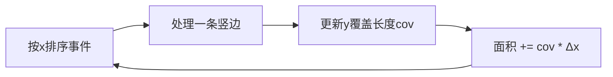

# 矩形

> 本页记录矩阵/矩形相关的算法题，目前收录 LeetCode 48（旋转图像）。

## LeetCode 48 旋转图像


```java
class Solution {
    public void rotate(int[][] matrix) {
        int n = matrix.length;
        for (int i = 0; i < n / 2; i++) {
            for (int j = 0; j < (n + 1) / 2; j++) {
                int tmp = matrix[i][j];
                matrix[i][j] = matrix[n - 1 - j][i];
                matrix[n - 1 - j][i] = matrix[n - 1 - i][n - 1 - j];
                matrix[n - 1 - i][n - 1 - j] = matrix[j][n - 1 - i];
                matrix[j][n - 1 - i] = tmp;
            }
        }
    }
}

## 二、矩形面积（223）

```java
public int computeArea(int A, int B, int C, int D, int E, int F, int G, int H) {
    long a1 = (long)(C-A)*(D-B);
    long a2 = (long)(G-E)*(H-F);
    long w = Math.max(0, Math.min(C,G) - Math.max(A,E));
    long h = Math.max(0, Math.min(D,H) - Math.max(B,F));
    return (int)(a1 + a2 - w*h);
}
```
- 用 `long` 防溢出；重叠区宽高取 `max(0, ...)` 自动处理不相交。

## 三、矩形重叠判断

投影法：x、y 区间均重叠才相交。

```java
boolean isOverlap(int A,int B,int C,int D,int E,int F,int G,int H){
    return Math.max(A,E) < Math.min(C,G) && Math.max(B,F) < Math.min(D,H);
}
```

## 四、最大矩形

### 4.1 柱状图最大矩形（84，单调栈）

```java
public int largestRectangleArea(int[] h) {
    int n = h.length, ans = 0;
    int[] left = new int[n], right = new int[n];
    Arrays.fill(right, n);
    Deque<Integer> st = new ArrayDeque<>();
    for (int i = 0; i < n; i++) {
        while (!st.isEmpty() && h[st.peek()] >= h[i]) { right[st.peek()] = i; st.pop(); }
        left[i] = st.isEmpty() ? -1 : st.peek();
        st.push(i);
    }
    for (int i = 0; i < n; i++) ans = Math.max(ans, h[i] * (right[i] - left[i] - 1));
    return ans;
}
```

### 4.2 矩阵中最大矩形（85）

逐行把矩阵压成柱状图高度，复用 84：

```java
public int maximalRectangle(char[][] matrix) {
    if (matrix.length == 0) return 0;
    int n = matrix[0].length, ans = 0;
    int[] h = new int[n];
    for (char[] row : matrix) {
        for (int j = 0; j < n; j++) h[j] = row[j]=='1' ? h[j]+1 : 0;
        ans = Math.max(ans, largestRectangleArea(h)); // 复用 84
    }
    return ans;
}
```

## 五、扫描线（矩形面积 II，850）

按 x 坐标排序"入边/出边"事件，用线段树/计数维护当前 y 轴被覆盖的总长度，乘相邻 x 间距累加。



## 六、题型识别

| 题型 | 特征 | 解法 |
| --- | --- | --- |
| 两矩形面积 | 给定坐标 | 投影求交后容斥 |
| 多矩形面积并 | ≤3 个 | 容斥 / 扫描线 |
| 最大矩形 | 0/1 矩阵 | 逐行转柱状图 + 单调栈 |
| 矩形重叠 | 判断是否相交 | 投影法 |
| 矩形面积并（多） | 大量矩形 | 扫描线 + 线段树 |
```
