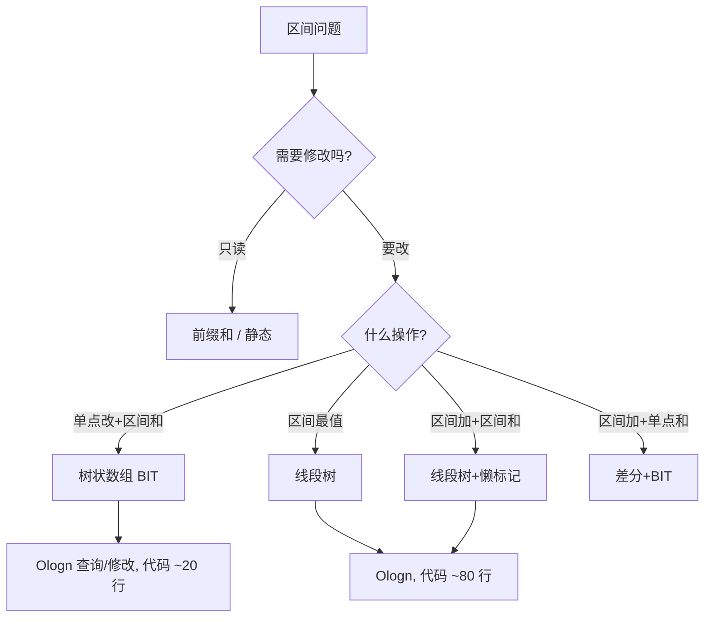

# 线段树与树状数组（区间查询 / 单点修改）

> 线段树和树状数组是处理**区间查询 + 单点修改**的经典数据结构。核心能力：**O(logn) 查询区间和/最大值/最小值，O(logn) 更新单点值**。相比前缀和（只能静态查询），线段树/树状数组支持动态更新。本篇按「解决的问题 → 原理 → 对比 → 模板」拆解。

---

## 一、要解决的问题

| 痛点 | 说明 |
|------|------|
| 区间求和 | 频繁查询 [l, r] 区间元素和，数组每次 O(n) |
| 区间最值 | 频繁查询 [l, r] 区间最大/最小值 |
| 单点更新 | 修改某个元素后，区间查询结果要同步更新 |
| 离线算法 | 树状数组可解决逆序对、区间计数等问题 |

---

## 二、树状数组（Binary Indexed Tree / BIT）

### 2.1 核心思想

```
lowbit(x) = x & (-x)：取出最低位 1 及其后面的 0

tree[x] 存储 [x-lowbit(x)+1, x] 的区间和
  tree[1] = a[1]
  tree[2] = a[1]+a[2]       (lowbit(2)=2)
  tree[3] = a[3]
  tree[4] = a[1]+a[2]+a[3]+a[4] (lowbit(4)=4)

查询前缀和：tree[x] + tree[x-lowbit(x)] + ... → O(logn)
单点更新：tree[x] += val, tree[x+lowbit(x)] += val, ... → O(logn)
```

### 2.2 代码模板

```cpp
// 树状数组模板（C++，可直接复用）
int n;
vector<int> tree;

int lowbit(int x) { return x & (-x); }

// 单点更新：a[x] += val
void update(int x, int val) {
    for (; x <= n; x += lowbit(x)) tree[x] += val;
}

// 前缀和查询：求 a[1]+...+a[x]
int query(int x) {
    int sum = 0;
    for (; x > 0; x -= lowbit(x)) sum += tree[x];
    return sum;
}

// 区间查询：[l, r]
int rangeQuery(int l, int r) {
    return query(r) - query(l - 1);
}
```

### 2.3 适用场景

- 区间求和 + 单点更新
- 逆序对计数（离线）
- 权值树（统计比 x 大/小的元素个数）

**不支持**：区间修改（需要差分 + BIT）或区间最值（需要线段树）。

---

## 三、线段树（Segment Tree）

### 3.1 核心思想

```
二叉树，每个节点存储对应区间的聚合值（和/最大/最小）

建树：O(n)
  tree[1] = 根节点，覆盖 [1, n]
  tree[2k] = 左子，覆盖 [l, mid]
  tree[2k+1] = 右子，覆盖 [mid+1, r]

查询 [ql, qr]：从根递归，完全包含则返回，部分包含则递归子节点 → O(logn)
单点更新：从根递归到叶子，沿途更新 → O(logn)
区间修改 + 懒标记：修改节点标记，查询时下推 → O(logn)
```

### 3.2 代码模板

```cpp
// 线段树模板（区间求和 + 单点修改）
const int MAXN = 100005;
int tree[MAXN * 4], arr[MAXN];

void build(int node, int l, int r) {
    if (l == r) { tree[node] = arr[l]; return; }
    int mid = (l + r) / 2;
    build(node * 2, l, mid);
    build(node * 2 + 1, mid + 1, r);
    tree[node] = tree[node * 2] + tree[node * 2 + 1];
}

void update(int node, int l, int r, int pos, int val) {
    if (l == r) { tree[node] += val; return; }
    int mid = (l + r) / 2;
    if (pos <= mid) update(node * 2, l, mid, pos, val);
    else update(node * 2 + 1, mid + 1, r, pos, val);
    tree[node] = tree[node * 2] + tree[node * 2 + 1];
}

int query(int node, int l, int r, int ql, int qr) {
    if (ql <= l && r <= qr) return tree[node];
    int mid = (l + r) / 2, sum = 0;
    if (ql <= mid) sum += query(node * 2, l, mid, ql, qr);
    if (qr > mid) sum += query(node * 2 + 1, mid + 1, r, ql, qr);
    return sum;
}
```

### 3.3 懒标记（区间修改）

```cpp
// 线段树 + 懒标记（区间加法 + 区间求和）
long long lazy[MAXN * 4];

void pushDown(int node, int l, int r) {
    if (lazy[node] != 0) {
        int mid = (l + r) / 2;
        tree[node * 2] += lazy[node] * (mid - l + 1);
        tree[node * 2 + 1] += lazy[node] * (r - mid);
        lazy[node * 2] += lazy[node];
        lazy[node * 2 + 1] += lazy[node];
        lazy[node] = 0;
    }
}

void rangeUpdate(int node, int l, int r, int ql, int qr, int val) {
    if (ql <= l && r <= qr) {
        tree[node] += val * (r - l + 1);
        lazy[node] += val;
        return;
    }
    pushDown(node, l, r);
    int mid = (l + r) / 2;
    if (ql <= mid) rangeUpdate(node * 2, l, mid, ql, qr, val);
    if (qr > mid) rangeUpdate(node * 2 + 1, mid + 1, r, ql, qr, val);
    tree[node] = tree[node * 2] + tree[node * 2 + 1];
}
```

---

## 四、线段树 vs 树状数组

| 维度 | 树状数组 | 线段树 |
|------|----------|--------|
| 代码量 | 少（~20 行） | 多（~80 行） |
| 功能 | 区间和 + 单点修改 | 任意聚合 + 区间修改 + 懒标记 |
| 常数 | 小 | 略大 |
| 灵活性 | 低 | 高（可维护最值/GCD 等） |
| 适用 | 简单区间和/逆序对 | 复杂区间操作 |

**选型关注点**：
- 只需区间求和 + 单点更新 → **树状数组**（代码简单、常数小）
- 需要区间修改/区间最值/复杂聚合 → **线段树**

---

## 五、LeetCode 常见题

| 题号 | 题目 | 用什么 |
|------|------|--------|
| 307 | Range Sum Query - Mutable | 树状数组/线段树 |
| 315 | Count of Smaller Numbers After Self | 树状数组（权值） |
| 1109 | 航班预订统计 | 差分 + 树状数组 |
| 218 | The Skyline Problem | 线段树 |
| 699 | Falling Squares | 线段树 |

---

## 六、与其他板块的关系

- 前缀和见「[前缀和与差分](./前缀和与差分.md)」；
- 二叉树见「[二叉树](./二叉树.md)」；
- 堆/优先队列见「[堆与优先队列](./堆与优先队列.md)」；
- 动态规划见「[动态规划](./动态规划.md)」。

> 一句话：**区间查询 + 单点修改 → 树状数组（简单快）；区间修改 + 区间最值 → 线段树（万能）；LeetCode 遇到区间问题先想这两个**。

---

## 七、选型决策图（mermaid）



> 经验法则：**能上 BIT 就别上线段树**——BIT 常数小、好写、不易错；只有"区间最值 / 区间修改后还要区间查询"才必须线段树。

---

## 八、逐题精讲（含 Java 实现 + 复杂度）

### 8.1 区间最大值（线段树维护最值）

```java
// 把 sum 改成 max 即可；注意建树与合并都用 Math.max
void build(int node, int l, int r) {
    if (l == r) { tree[node] = arr[l]; return; }
    int mid = (l + r) >> 1;
    build(node << 1, l, mid);
    build(node << 1 | 1, mid + 1, r);
    tree[node] = Math.max(tree[node << 1], tree[node << 1 | 1]);
}
int query(int node, int l, int r, int ql, int qr) {
    if (ql <= l && r <= qr) return tree[node];
    int mid = (l + r) >> 1, res = Integer.MIN_VALUE;
    if (ql <= mid) res = Math.max(res, query(node << 1, l, mid, ql, qr));
    if (qr > mid) res = Math.max(res, query(node << 1 | 1, mid + 1, r, ql, qr));
    return res;
}
// 时间 O(log n) 查询/建树 O(n)，空间 O(4n)。注意：最值不支持"区间减"的懒标记（无逆元），需特殊处理。
```

### 8.2 逆序对（315 / 归并排序替代）：权值树状数组

```java
// 离散化 + 从右往左：统计"已插入且小于当前值"的个数 = 逆序对
int[] countSmaller(int[] nums) {
    int[] sorted = nums.clone();
    Arrays.sort(sorted);
    Map<Integer,Integer> rank = new HashMap<>(); // 离散化到 [1..m]
    for (int i = 0; i < sorted.length; i++) rank.put(sorted[i], i + 1);
    int m = sorted.length;
    int[] bit = new int[m + 1], ans = new int[nums.length];
    for (int i = nums.length - 1; i >= 0; i--) {
        int r = rank.get(nums[i]);
        ans[i] = queryBIT(bit, r - 1);          // 已插入中比它小的个数
        for (int x = r; x <= m; x += x & -x) bit[x]++; // 插入自身
    }
    return ans;
}
int queryBIT(int[] bit, int x) {
    int s = 0;
    for (; x > 0; x -= x & -x) s += bit[x];
    return s;
}
// 时间 O(n log n)，空间 O(n)。相比归并排序，BIT 思路更直观。
```

### 8.3 航班预订统计（1109）：差分 + 树状数组

```java
// 多次区间加、最后单点查询 → 差分即可；若中途要随时查区间和，则用 BIT 维护差分数组
int[] corpFlightBookings(int[][] bookings, int n) {
    int[] diff = new int[n + 2];
    for (int[] b : bookings) { diff[b[0]] += b[2]; diff[b[1] + 1] -= b[2]; }
    int[] ans = new int[n];
    int cur = 0;
    for (int i = 0; i < n; i++) { cur += diff[i + 1]; ans[i] = cur; }
    return ans;
}
// 时间 O(k + n)，空间 O(n)。纯差分已足够；BIT 仅在"边加边查"时才必要。
```

---

## 九、懒标记原理图解与常见错误

```mermaid
graph TD
    A[区间更新 l,r,+v] --> B{完全覆盖当前节点?}
    B -->|是| C[节点值 += v*(r-l+1); 打上 lazy=v; 返回]
    B -->|否| D[pushDown: 先把 lazy 下传给左右子]
    D --> E[递归更新子区间]
    E --> F[回溯时 tree[node]=merge(左,右)]
```

常见错误：
1. **忘 pushDown**：查询/更新穿过有懒标记的节点时，必须先把标记下推，否则子节点值是旧的。
2. **pushDown 重复累加**：`lazy[node*2] += lazy[node]` 而非 `=`，避免覆盖已有待下推标记。
3. **最值区间加**：`max` 没有逆运算，不能简单地"区间减"撤销；要么不做减操作，要么用额外结构（如线段树分治 / multiset）。
4. **区间长度算错**：`tree[node] += val * (r - l + 1)`，长度用**当前节点区间**而非查询区间。
5. **数组越界**：线段树开 `4 * MAXN` 才稳妥（`2 * 2^ceil(log2 n)`）。

---

## 十、进阶：动态开点 & 可持久化（简介）

- **动态开点线段树**：不预建满树，只在访问时 `new` 节点，空间从 `4n` 降到「实际用到节点数」。适合值域巨大（如 `1e9`）的区间统计，常配离散化。
- **可持久化线段树（主席树）**：每次修改复制路径上的节点，保留历史版本，可查「第 k 小 / 区间第 k 大」。经典题：静态区间第 k 小（215 的进阶）、带修主席树。
- **二维线段树 / 树套树**：处理「矩阵内第 k 小」等，复杂度 `O(log²n)`，是扫描线 + 线段树的进阶。

---

## 十一、更多易错点（补充）

1. BIT 下标从 1 开始，`pre[x] = pre[x-lowbit(x)] + ...`，零下标会死循环。
2. 树状数组**不支持区间最值**（lowbit 结构无法合并 max 的反向信息），最值用线段树。
3. 线段树合并函数要匹配聚合语义（sum/max/min/gcd），写错 merge 全盘错。
4. 递归线段树在 `n=1e5` 级别没问题；`n=1e7` 级别考虑迭代式或 BIT 降常。
5. 离散化后注意去重与「`+1` 偏移」（区间查询 `[l,r]` 用 `query(r)-query(l-1)`）。

---

## 十二、速记口诀与小结

> **口诀**：单点改查用 BIT，区间最值上线段；区间加法懒标记，pushDown 不能忘；二维容斥四角算，动态开点省空间；逆序对用权值树，主席树存历史版。

- 面试三连：**问题归类（查/改/最值）→ 选型（BIT/线段树）→ 懒标记正确性（pushDown）**。
- 与 [前缀和与差分](前缀和与差分.md) 是「静态 vs 动态」的两极；与 [堆与优先队列](堆与优先队列.md) 互补（堆偏 TopK，线段树偏区间）。

---

## 十三、相关主题反向链接

- 静态区间求和：见 [前缀和与差分](前缀和与差分.md)
- 最值/TopK 另一种思路：见 [堆与优先队列](堆与优先队列.md)
- 扫描线求矩形面积并：见 [矩形](矩形.md)（850 用线段树维护 y 覆盖）
- DP 区间类：见 [动态规划](动态规划.md)（区间 DP 常配这种"区间聚合"思维）

---

## 十四、手推示例：单点改 + 区间查询的节点路径

以数组 `a = [1,3,5,7,9,11]`，查询 `[2,5]` 的和为例：

```
建树（下标从 1，节点存区间和）：
           [1,6]=36
         /          \
    [1,3]=9        [4,6]=27
   /     \         /     \
[1,1]=1 [2,3]=8 [4,4]=7 [5,6]=20
              /              \
         [2,2]=3 [3,3]=5   [5,5]=9 [6,6]=11

查询 [2,5]：根[1,6]部分覆盖 → 左[1,3]部分覆盖 → [2,3]完全覆盖(返回8)
                              → 右[4,6]部分覆盖 → [4,4]返回7，[5,6]部分 → [5,5]返回9
结果 = 8 + 7 + 9 = 24 = 3+5+7+9 ✅
```

> 每次查询只在「完全覆盖」节点停止，路径长度 O(log n)；这正是线段树 O(log n) 的来源。

### 14.1 懒标记手推（区间 +2）

对上面 `[2,5]` 做 `+2`：
- 根不完全覆盖 → pushDown（暂无标记）→ 进左 `[1,3]` 不完全 → 进 `[2,3]` **完全覆盖** → `tree[2,3] += 2*2 = 8 → 12`，打 `lazy=2`，返回。
- 进右 `[4,6]` 不完全 → `[4,4]` 完全覆盖 → `tree += 2` → 9；`[5,6]` 完全覆盖 → `tree += 2*2=4 → 24`。
- 回溯合并：`[1,3] = 1+12=13`，`[4,6] = 9+24=33`，根 `= 46`。
- 之后再查 `[2,3]` 必须先 pushDown 把 `lazy=2` 下推到 `[2,2]`、`[3,3]` 才能使叶子值正确。

---

## 十五、常见面试追问 & 收尾

| 追问 | 回答要点 |
|------|------|
| "BIT 为什么不能区间最值？" | lowbit 结构是前缀和累加，max 无逆运算、无法"撤销"区间修改 |
| "线段树开多大？" | `4 * MAXN` 最稳（满二叉树节点数 ≤ 2·2^⌈log2 n⌉ < 4n） |
| "懒标记什么时候下推？" | 任何"穿过该节点继续访问子节点"的查询/更新前 |
| "区间修改 + 区间最值怎么做？" | 标准线段树不支持（无逆元）；用分段（李超线段树/平衡树）或限制只做加法 |
| "动态开点 vs 普通？" | 值域巨大（1e9）时动态开点省空间，配合离散化 |

> 一句话：**区间问题先判"查/改/最值"，BIT 能解决就别上线段树；线段树上懒标记的核心纪律是——下推不能忘**。

---

## 十六、相关主题反向链接（补充）

- 矩形面积并：见 [矩形](矩形.md)（扫描线 + 线段树）
- 二维区间统计：见 [前缀和与差分](前缀和与差分.md)（静态二维前缀和）
- 堆/优先队列的 TopK 是"单点极值"的另一思路：见 [堆与优先队列](堆与优先队列.md)

---

## 十七、线段树 / 树状数组 自测卡

| 自测题 | 选 BIT 还是线段树？ | 理由 |
|------|------|------|
| 单点改 + 区间和 | BIT | 代码短、常数小 |
| 区间最大值查询 | 线段树 | BIT 不支持最值 |
| 区间加 + 区间和 | 线段树+懒标记 | 需 pushDown |
| 逆序对计数 | BIT（权值） | 离散化 + 前缀 |
| 航班预订（边加边查） | BIT / 差分 | 动态维护 |
| 矩形面积并 | 线段树（扫描线） | 维护 y 覆盖长度 |

**手写出题清单（闭卷自测）**：
1. 写出 BIT 的 `lowbit`、`update`、`query` 三件套（≤25 行）。
2. 写出线段树建树 + 单点改 + 区间查（≤30 行）。
3. 给一个数组，手推 2 次区间 `+v` 后各节点 `lazy` 与 `tree` 值（见 十四）。
4. 解释"为什么 BIT 区间最值要换成线段树"。

> 自测标准：**BIT 能默写、线段树懒标记 pushDown 不漏、选型表张口就来**。
