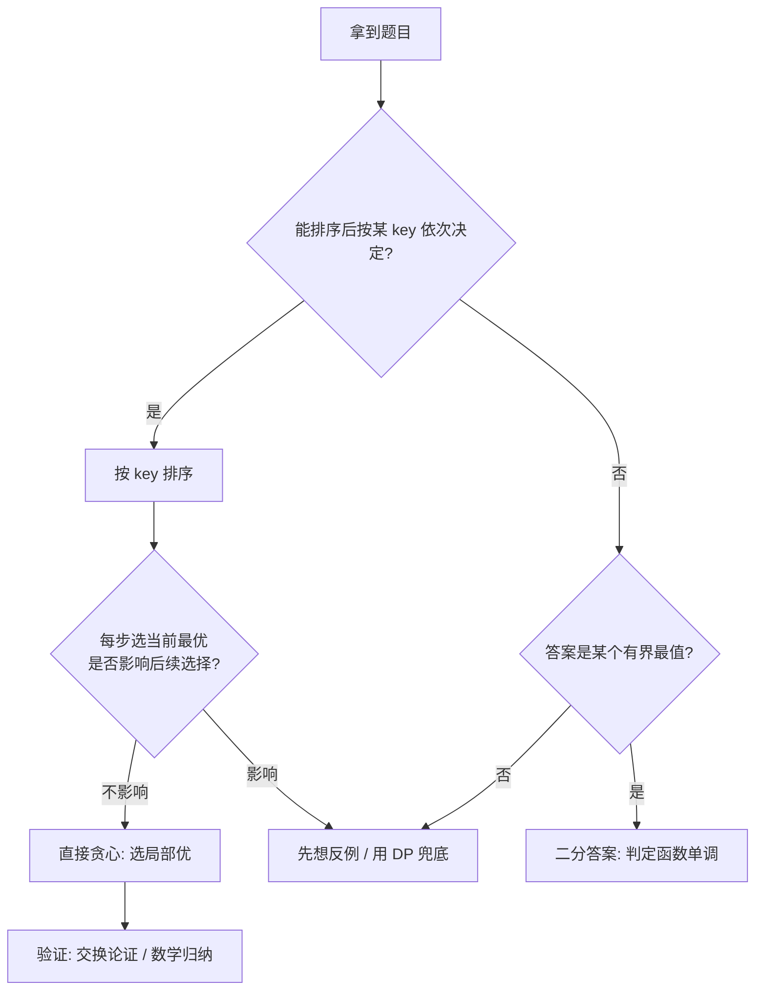

# 贪心（Greedy）

## 〇、本体介绍

**贪心**：每一步都做「当前看似最优」的选择，期望全局最优。**前提**：问题具有**贪心选择性质 + 最优子结构**，即局部最优能推出全局最优（否则要用 DP）。

**与 DP 区别**：贪心无后效、一次性决策、O(n log n) 常见；DP 考虑所有子问题、防局部陷阱。拿不准是否贪心正确时，常先用 DP 验证再用贪心。

**面试高频**：区间调度（最多不重叠区间）、分发糖果、跳跃游戏、贪心+排序（按某键排）、买卖股票（含冷冻/手续费）、哈夫曼编码、最小字典序。

---

## 一、经典例题

- **最多不重叠区间（435）**：**按结束时间升序**，依次选不冲突的——结束早的留给后面更多空间，是典型贪心正确性证明。
- **用最少箭引爆气球（452）**：按右端点排序，箭数 = 不重叠区间数，重叠区间一箭搞定。
- **分发糖果（135）**：**两次遍历**——左→右保证右>左，右→左保证左>右，取两次最大值。
- **跳跃游戏（55）**：维护「当前能到的最远」，遍历更新，能到末尾即 true（不必真跳）。
- **跳跃游戏 II（45）**：贪心跳——在可达范围内选「再跳一步能到最远」的点，计步。
- **无重叠区间/划分字母区间（763）**：记录每个字母最后出现位置，贪心切分。
- **买卖股票最佳时机（122）**：所有上升段累加（谷买峰卖等价于逐段差为正求和）。

### 1.1 深挖：高频题代码模板

```java
// 435 最多不重叠区间：按结束时间升序，贪心选最早结束的
public int eraseOverlapIntervals(int[][] intervals) {
    Arrays.sort(intervals, (a, b) -> a[1] - b[1]);   // 关键：按右端点排序
    int count = 1, end = intervals[0][1];
    for (int i = 1; i < intervals.length; i++) {
        if (intervals[i][0] >= end) { count++; end = intervals[i][1]; }
    }
    return intervals.length - count;
}

// 55 跳跃游戏：维护最远可达
public boolean canJump(int[] nums) {
    int far = 0;
    for (int i = 0; i < nums.length; i++) {
        if (i > far) return false;          // 到不了当前位置
        far = Math.max(far, i + nums[i]);
        if (far >= nums.length - 1) return true;
    }
    return true;
}

// 45 跳跃游戏 II：最少步数（区间贪心）
public int jump(int[] nums) {
    int steps = 0, curEnd = 0, far = 0;
    for (int i = 0; i < nums.length - 1; i++) {
        far = Math.max(far, i + nums[i]);
        if (i == curEnd) { steps++; curEnd = far; }  // 当前区间末尾 → 必须再跳一步
    }
    return steps;
}
```

---

## 二、贪心正确性

- **交换论证（Exchange Argument）**：证明任意最优解都可通过交换逐步变成贪心解而不更差。
- **区间调度**正因「结束早最优」可被严格证明。

### 2.1 深挖：为什么「按结束时间排序」是对的（面试要能讲）

```
反证/交换论证：
1. 设最优解的第一个区间是 [a, b]，贪心选的是最早结束的 [l, r]（r ≤ b）。
2. 若 a < l：把 [a, b] 换成 [l, r]，剩余区间仍不冲突（l ≥ ... 都不受影响），且不更差。
3. 反复交换，最优解可逐步变成贪心解 → 贪心最优。
```

> 同理可证：**Kruskal**（每次取最小不环边）与 **Dijkstra**（每次取最近节点）都是贪心——面试常问「贪心算法举例 + 为什么成立」。

---

## 三、易错点

- 别把「看起来对」当「证明对」；先思考反例。
- 排序的 key 选错（按开始时间而非结束时间）会导致错解。
- 分发糖果两类约束要两次遍历，一次不够。
- 跳跃游戏 II 的 `curEnd` 语义是「当前步数能到的边界」，别和 far 混。

---

## 四、贪心 vs DP：如何选择

| 维度 | 贪心 | DP |
|------|------|-----|
| 决策 | 每步只取一个局部最优 | 考虑所有子状态取最优 |
| 前提 | 贪心选择性质 | 最优子结构（+重叠子问题） |
| 复杂度 | 常 O(n) / O(n log n) | 常 O(n²) / O(n·状态) |
| 典型题 | 区间调度、股票、跳跃 | 背包、LCS、编辑距离 |
| 反例敏感度 | 高（一个反例全盘皆错） | 低（状态转移天然兜底） |

> 判断口诀：**「做完这步，后面还能最优」就贪心；「现在选错影响未来」就 DP**。零钱兑换、最长递增子序列都是「看似贪心实则 DP」的经典陷阱。

---

## 五、工程应用：贪心在真实系统的位置

| 场景 | 说明 |
|------|------|
| 网络路由 | 贪心选路、跳数优先 |
| 任务调度 | 按 deadline/权重排序贪心调度（EDF 最早截止优先） |
| 资源分配 | 背包类近似算法、负载均衡（最少连接优先是贪心） |
| 数据压缩 | **哈夫曼编码**（每次合并最小两频） |
| 图算法 | Kruskal/Prim 最小生成树、Dijkstra 最短路 |
| 广告/推荐 | 点击率预估下的贪心探索（与多臂老虎机结合） |
| 数据库 | 查询优化器的连接顺序启发式（贪心选最小代价） |

> 面试加分：**哈夫曼编码**证明「每次合并最小两个频率最优」也是交换论证；Kafka/数据库的页缓存淘汰（近似 LRU）本质是贪心近似。

---

## 六、与其他板块的关系

- **算法/动态规划.md**：贪心 vs DP 的选择边界（本篇反例即 DP 题型）。
- **算法/图.md**：Dijkstra、Kruskal、Prim 都是贪心算法。
- **算法/堆与优先队列.md**：合并果子（哈夫曼）用最小堆实现贪心。
- **基础知识/数据结构**：线段树区间维护中也有贪心优化。

---

## 面试高频问题（30+ 条）

1. **贪心适用条件？** 贪心选择性质（局部最优推全局）+ 最优子结构；否则用 DP。
2. **贪心和 DP 区别？** 贪心一次性局部最优、无后效；DP 枚举子问题防局部陷阱。
3. **最多不重叠区间怎么贪？** 按结束时间升序，依次选不冲突的。
4. **为什么按结束时间而非开始时间？** 结束早的留更多空间给后续，可证最优。
5. **分发糖果思路？** 左→右保证右>左，右→左保证左>右，取两次 max。
6. **跳跃游戏 I 怎么判可达？** 维护最远可达，遍历更新，到尾即 true。
7. **跳跃游戏 II 最少步数？** 在可达区间内选「下一步能到最远」跳，计步。
8. **买卖股票（122）贪心？** 所有正差价累加 = 逐段谷峰买卖。
9. **气球用最少箭？** 按右端点排序，重叠区间一箭，等价于不重叠区间数。
10. **哈夫曼编码是贪心吗？** 是，每次合并最小两个频率，得最优前缀码。
11. **怎么证明贪心正确？** 交换论证 / 数学归纳，证最优解可转成贪心解。
12. **零钱兑换能用贪心吗？** 仅特定面额（如 1/5/10/25）可贪心；一般要 DP。
13. **划分字母区间？** 记录每字母最后位置，贪心切到当前区间最大末位。
14. **贪心在调度/资源分配？** 区间调度、任务安排、负载均衡启发式。
15. **最小字典序（拼接字符串）？** 按 `a+b < b+a` 排序拼接（如 30/3 → 303<330）。
16. **活动选择问题？** 即最多不重叠区间，经典贪心入门。
17. **贪心失败的反例？** 如最长递增子序列不能贪心选最小。
18. **贪心+堆常见组合？** 如合并果子（哈夫曼）用优先队列取最小两堆。
19. **贪心时间复杂度？** 常 O(n log n)（排序主导）。
20. **如何判断该不该用贪心？** 先找反例；无反例尝试证明；否则 DP 兜底。
21. **贪心在 Kruskal 里？** 边排序取最小且不环，本质是贪心选边。
22. **Dijkstra 是贪心吗？** 是，每次确定最近节点（贪心选择性质 + 最优子结构）。
23. **交换论证的步骤？** ① 设最优解 ② 找到它与贪心解的第一个差异 ③ 交换不差 ④ 归纳收尾。
24. **「加油站绕圈（134）」贪心？** 总油够则存在解；累计油量最小点之后即起点。
25. **「任务调度器（621）」？** 贪心安排冷却：最多频率任务作骨架，剩余填空。
26. **「重构字符串（767）」？** 最大频次 ≤ (n+1)/2 才可能；贪心交错放置。
27. **「跳跃游戏为什么不用 DP？」** 可达性有贪心性质：最远可达单调递增，无需回溯。
28. **贪心在「近似算法」里的角色？** NP 难问题的贪心近似（背包、旅行商）有界近似比。
29. **「最长有效括号（32）」贪心？** 一般用栈/DP；贪心双扫描可 O(1) 空间。
30. **「课程表 III（630）」？** 按截止排序 + 大顶堆：超时踢掉耗时最长的课。
31. **贪心与排序的关系？** 大多数贪心先排序（区间按端点、物品按比值），排序 key 即决策依据。
32. **「最少会议室（253）」？** 差分/优先队列：开始 +1 结束 -1，扫描最大同时数。

---

## 七、贪心经典题型逐题精讲（含复杂度）

下面每题给出 **Go 实现 + 时间/空间复杂度分析**，便于工程落地（Java 版见前文 1.1）。

### 7.1 区间调度（最多不重叠区间 435）

```go
// 目标：删除最少的区间，使剩下的互不重叠（等价于"选最多不重叠区间"）
func eraseOverlapIntervals(intervals [][]int) int {
    sort.Slice(intervals, func(i, j int) bool { return intervals[i][1] < intervals[j][1] }) // 按右端点升序
    end, cnt := intervals[0][1], 1
    for i := 1; i < len(intervals); i++ {
        if intervals[i][0] >= end { // 不冲突才选
            cnt++
            end = intervals[i][1]
        }
    }
    return len(intervals) - cnt
}
// 时间 O(n log n)（排序主导），空间 O(1)（原地排序）或 O(log n)（sort 栈）
```

> 为什么「选最早结束」？结束越早，留给后面区间的空间越大——交换论证可证贪心最优（见 2.1）。

### 7.2 跳跃游戏 II（45）：区间贪心

核心不是线性跳，而是把「已能到达的范围」当成一个区间，在区内挑选「再跳一步能到最远」的落点作为下一区间边界。

```go
func jump(nums []int) int {
    steps, curEnd, far := 0, 0, 0
    for i := 0; i < len(nums)-1; i++ { // 注意循环到 n-2，最后一步到达不必再计
        far = max(far, i+nums[i])
        if i == curEnd { // 当前区间用完 → 必须再跳一步
            steps++
            curEnd = far
        }
    }
    return steps
}
// 时间 O(n)，空间 O(1)。每个位置只访问一次，"区间跳"把 O(n^2) 暴力降到线性。
```

### 7.3 分发糖果（135）：两次遍历

```go
func candy(ratings []int) int {
    n := len(ratings)
    c := make([]int, n)
    for i := range c { c[i] = 1 }          // 每人至少 1 颗
    for i := 1; i < n; i++ {               // 左→右：保证右边比左边高
        if ratings[i] > ratings[i-1] { c[i] = c[i-1] + 1 }
    }
    for i := n - 2; i >= 0; i-- {          // 右→左：保证左边比右边高
        if ratings[i] > ratings[i+1] { c[i] = max(c[i], c[i+1]+1) }
    }
    sum := 0
    for _, v := range c { sum += v }
    return sum
}
// 时间 O(n)，空间 O(n)。两次遍历分别满足一侧约束，取 max 兼顾两侧。
```

### 7.4 买卖股票含手续费（714）：贪心 vs DP

```go
// 贪心：持有成本 cash 表示"当前不持股的最大利润"，hold 表示"持股时的最大利润"
func maxProfit(prices []int, fee int) int {
    cash, hold := 0, -prices[0]
    for _, p := range prices[1:] {
        cash = max(cash, hold+p-fee) // 卖出（扣手续费）
        hold = max(hold, cash-p)     // 买入
    }
    return cash
}
// 时间 O(n)，空间 O(1)。等价于状态机 DP，但写成了"当天决策"的贪心形式。
```

### 7.5 用最少箭引爆气球（452）

```go
func findMinArrowShots(points [][]int) int {
    sort.Slice(points, func(i, j int) bool { return points[i][1] < points[j][1] })
    arrows, end := 1, points[0][1]
    for i := 1; i < len(points); i++ {
        if points[i][0] > end { // 不重叠 → 必须新的一箭
            arrows++
            end = points[i][1]
        }
    }
    return arrows
}
// 时间 O(n log n)，空间 O(log n)。重叠区间一箭搞定，箭数 = 不重叠区间数。
```

### 7.6 划分字母区间（763）

```go
func partitionLabels(s string) []int {
    last := make(map[byte]int)
    for i := 0; i < len(s); i++ { last[s[i]] = i } // 记录每个字母最后出现位置
    var res []int
    start, end := 0, 0
    for i := 0; i < len(s); i++ {
        end = max(end, last[s[i]]) // 当前区间必须延伸到本区间内所有字母末尾
        if i == end {              // 到达区间右界 → 切分
            res = append(res, end-start+1)
            start = end + 1
        }
    }
    return res
}
// 时间 O(n)，空间 O(Σ)（字母集大小，≤26）。典型"贪心切分 + 末位约束"。
```

### 7.7 复杂度对照（高频贪心题）

| 题号 | 题型 | 排序 key | 单步决策 | 时间 | 空间 |
|------|------|----------|----------|------|------|
| 435 | 区间调度 | 右端点 | 选最早结束 | O(n log n) | O(1) |
| 452 | 气球 | 右端点 | 重叠一箭 | O(n log n) | O(log n) |
| 45 | 跳跃 II | 无需 | 区间跳 | O(n) | O(1) |
| 55 | 跳跃 I | 无需 | 维护最远 | O(n) | O(1) |
| 135 | 糖果 | 无需 | 两次扫 | O(n) | O(n) |
| 122 | 股票 | 无需 | 正差累加 | O(n) | O(1) |
| 763 | 字母区间 | 无需 | 延伸末位 | O(n) | O(Σ) |

---

## 八、贪心决策流程图（mermaid）



> 一句话：**可排序、局部选择不拖累未来 → 贪心；否则 DP 或二分答案**。

---

## 九、更多易错点 & 经典反例

1. **零钱兑换（322）**：只有当面额满足「每个大额都是小额倍数」（如 1/5/10/25）时贪心才对；否则必须用 DP（`dp[i] = min(dp[i-c]+1)`）。
2. **最长递增子序列（300）**：不能「每次选最小能接的」，因为选小不一定最优——是 DP（耐心排序/二分）陷阱。
3. **分数背包 vs 0/1 背包**：分数背包（物品可切）能贪心（按单价排）；0/1 背包必须 DP。
4. **贪心 + 排序 key 陷阱**：「摆动序列（376）」按差值贪心即可，但「拼接最小数（179）」必须用 `a+b < b+a` 比较，普通字典序会错（`3` vs `30`：字典序 `30 < 3` 但组合应 `303 < 330`）。
5. **课程表 III（630）**：按 deadline 升序，能选就选；超时时用大顶堆踢掉已选中最耗时的课——这是「贪心 + 堆」的反悔策略。

### 9.1 反悔贪心（重要进阶）

当「选了之后发现不该选」时，引入**堆做反悔**：优先选，超约束时淘汰当前最差选项。典型模板：

```go
// 630 课程表 III：在 deadline 前尽量多修课
func scheduleCourse(courses [][]int) int {
    sort.Slice(courses, func(i, j int) bool { return courses[i][1] < courses[j][1] }) // 按 deadline
    h := &MaxHeap{} // 存已选课程的耗时
    time := 0
    for _, c := range courses {
        time += c[0]
        heap.Push(h, c[0])
        if time > c[1] {        // 超 deadline → 反悔踢掉耗时最长的
            time -= heap.Pop(h).(int)
        }
    }
    return h.Len()
}
// 时间 O(n log n)，空间 O(n)。贪心 + 反悔 = 可证最优，是「看似 DP 实则贪心」的高级形态。
```

---

## 十、速记口诀与小结

> **口诀**：区间按尾排，跳跃看区间；糖果两遍扫，股票正差加；拼数比拼接，零钱莫乱贪；选错能反悔，大堆把它踢。

- 贪心 = **排序 + 局部最优 + 可证明**；拿不准就说「先用 DP 验证」。
- 面试三连：**适用条件（贪心选择性质）→ 正确性证明（交换论证）→ 复杂度**。
- 进阶信号：**反悔贪心**（堆）、**二分答案**（最值）、**状态机**（股票）。

---

## 十一、相关主题反向链接

- 区间/统计问题：见 [前缀和与差分](前缀和与差分.md)、[线段树与树状数组](线段树与树状数组.md)
- 最值/优先决策：见 [堆与优先队列](堆与优先队列.md)（反悔贪心常配堆）
- 图论中的贪心：见 [图](图.md)（Dijkstra、Kruskal、Prim）
- 需"全局最优"而非局部时：见 [动态规划](动态规划.md)（背包、LIS、编辑距离）

---

## 十二、面试追问：贪心证明实战模板

面试官常让你"证明你的贪心是对的"。标准话术：

1. **陈述贪心策略**：我按 X 排序 / 每步选 Y。
2. **给出反例防御**：为什么不能选别的？因为选别的要么不更优，要么导致后续空间更小。
3. **交换论证**：假设最优解第一步选了 Z≠X；构造把 Z 换成 X 的操作，证明不更差；反复交换，最优解变成贪心解 → 贪心最优。
4. **复杂度收尾**：排序 O(n log n) + 一遍扫描 O(n)。

### 12.1 真题追问清单

| 追问 | 标准回答要点 |
|------|------|
| "为什么按结束时间不是开始时间？" | 结束早 → 留给后续区间的空间更大；交换论证可证最优（2.1） |
| "你怎么保证局部最优推出全局？" | 贪心选择性质 + 最优子结构；否则退回 DP（四） |
| "零钱兑换为什么不能贪心？" | 面额不成倍数时局部最优不传递（如 1/3/4 凑 6：贪心 4+1+1=3 枚，最优 3+3=2 枚） |
| "股票问题为何能贪心？" | 所有上升段累加 = 谷峰买卖；上升段之间互不影响（无交易费时） |
| "有交易费/冷冻期呢？" | 变成状态机 DP（或贪心+反悔），见 7.4 |

### 12.2 一道综合题：_TASK_SCHEDULER（621）

```go
// 任务调度：相同任务间隔 n 冷却；贪心把频率最高的任务当"骨架"，中间插其他任务
func leastInterval(tasks []byte, n int) int {
    cnt := make([]int, 26)
    maxFreq, maxCount := 0, 0
    for _, t := range tasks { cnt[t-'A']++; if cnt[t-'A'] > maxFreq { maxFreq = cnt[t-'A'] } }
    for _, c := range cnt { if c == maxFreq { maxCount++ } }
    // 公式：骨架占 (maxFreq-1)*(n+1) + maxCount
    skeleton := (maxFreq-1)*(n+1) + maxCount
    return max(skeleton, len(tasks)) // 任务很多塞满空隙时取任务数
}
// 时间 O(N)，空间 O(1)。"高频任务作骨架"是经典贪心排布。
```

> 小结：贪心不是"拍脑袋选最大"，而是**可证明的局部最优 + 不拖累未来**。拿不准就用 DP 验证，再回头套贪心。

---

## 十三、贪心真题自测卡

| 自测题 | 你能 30 秒说出思路吗？ | 关键排序 key |
|------|------|------|
| 最多不重叠区间 | ✅ 按右端点升序 | 结束时间 |
| 用最少箭引爆气球 | ✅ 重叠一箭 | 右端点 |
| 分发糖果 | ✅ 两次遍历取 max | 左/右比 |
| 跳跃游戏 I/II | ✅ 维护最远/区间跳 | — |
| 买卖股票（含费） | ✅ 正差累加/状态机 | — |
| 划分字母区间 | ✅ 延伸到末位 | — |
| 任务调度器 | ✅ 高频作骨架 | 频率 |
| 课程表 III | ⚠️ 反悔贪心+大顶堆 | deadline |
| 拼接最小数 | ⚠️ `a+b<b+a` | 字符串拼接 |
| 零钱兑换 | ❌ 不能贪心，用 DP | — |

> 自测标准：**能立刻说出"贪心选择性质 + 排序 key + 反例防御"三件套**，才是真吃透。
