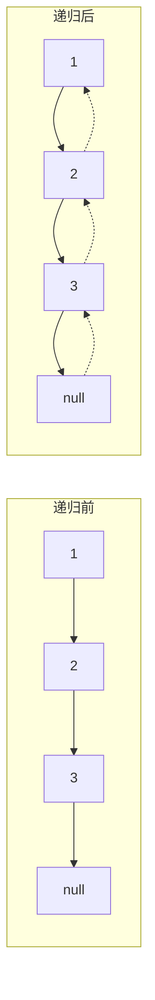

# 链表（Linked List）

## 〇、本体介绍

**链表是什么**：一串通过指针（引用）串联的节点，每个节点存「值 + 下一节点地址」。与数组连续内存不同，链表**逻辑相邻、物理离散**，插入删除 O(1)（已知前驱），但随机访问 O(n)。

**核心变体**：单链表、双向链表（多一个 prev 指针，支持 O(1) 删当前节点）、循环链表、带哨兵（dummy）头节点。

**面试高频**：反转、快慢指针（找中点/判环）、合并、相交、删除、LRU（结合哈希+双向链表）。

---

## 一、必备技巧

1. **Dummy 哨兵节点**：避免处理 head 被改的边界，统一逻辑。`dummy.next = head`。
2. **快慢指针（Floyd）**：慢指针一次 1 步、快指针一次 2 步。
   - 找中点：快到尾时慢在中点（偶数长度取上中点）。
   - 判环：相遇则有环；相遇后令一指针回 head，同速再相遇即环入口。
3. **双指针（前后间距）**：删除倒数第 k 个——快先走 k 步，再同步走，快到尾时慢在目标前驱。
4. **反转**：迭代三指针（prev/cur/next）或递归。

### 1.1 深挖：递归反转图解（面试讲清的关键）



```java
// 递归反转：reverseList(n) 返回「以 n 为头的链表反转后的新头」
public ListNode reverseList(ListNode head) {
    if (head == null || head.next == null) return head; // 尾节点是"反转后"的头
    ListNode newHead = reverseList(head.next);
    head.next.next = head;  // 让下一个节点指回自己
    head.next = null;       // 断开旧的前向指针
    return newHead;
}
```

> 关键理解：递归返回时 `head.next` 已经是「反转后链表的尾」，所以 `head.next.next = head` 即可把它接到自己后面。**回溯方向与前进相反**，这就是「反转」。

---

## 二、经典例题

- **反转链表（206）**：迭代，每次 `next = cur.next; cur.next = prev; prev = cur; cur = next`。
- **环形链表 II（142）**：Floyd 判圈 + 入口推导（head 到入口距离 = 相遇点到入口距离）。
- **合并两个有序链表（21）**：dummy + 比较取小。
- **相交链表（160）**：双指针走 `a+b` 总长，相遇即交点（无需额外空间）。
- **LRU 缓存（146）**：Hash(Map) + 双向链表，get/put O(1)；最近访问移到头，淘汰尾。

### 2.1 深挖：高频题代码模板

```java
// 1) 反转链表（迭代）
public ListNode reverseList(ListNode head) {
    ListNode prev = null, cur = head;
    while (cur != null) {
        ListNode next = cur.next;
        cur.next = prev;
        prev = cur;
        cur = next;
    }
    return prev;
}

// 2) 合并两个有序链表（递归）
public ListNode mergeTwoLists(ListNode l1, ListNode l2) {
    if (l1 == null) return l2;
    if (l2 == null) return l1;
    if (l1.val < l2.val) { l1.next = mergeTwoLists(l1.next, l2); return l1; }
    else { l2.next = mergeTwoLists(l1, l2.next); return l2; }
}

// 3) 环形链表 II —— 入口推导（重点）
// 设 head→入口 = a，入口→相遇点 = b，相遇点→入口 = c（圈长 L = b + c）
// 慢指针路程 s = a + b；快指针路程 2s = a + b + kL
// 相减得：s = kL，即 a + b = k(b + c) → a = (k-1)(b+c) + c
// 结论：从相遇点出发走 a 步，恰好到达入口 → 让 slow 回 head，双双同速，相遇点即入口
public ListNode detectCycle(ListNode head) {
    ListNode slow = head, fast = head;
    while (fast != null && fast.next != null) {
        slow = slow.next;
        fast = fast.next.next;
        if (slow == fast) {            // 相遇，证明有环
            slow = head;               // slow 回到起点
            while (slow != fast) {     // 同速前进，再次相遇即入口
                slow = slow.next;
                fast = fast.next;
            }
            return slow;
        }
    }
    return null;
}

// 4) LRU（HashMap + 双向链表，手写自实现版）
class LRUCache {
    Map<Integer, Node> map;
    Node head, tail;      // 虚拟头尾；头部最近使用，尾部最久未用
    int cap;
    public LRUCache(int capacity) {
        cap = capacity; map = new HashMap<>();
        head = new Node(); tail = new Node();
        head.next = tail; tail.prev = head;
    }
    public int get(int key) {
        Node n = map.get(key);
        if (n == null) return -1;
        moveToHead(n);
        return n.value;
    }
    public void put(int key, int value) {
        Node n = map.get(key);
        if (n != null) { n.value = value; moveToHead(n); return; }
        n = new Node(key, value);
        map.put(key, n);
        addToHead(n);
        if (map.size() > cap) {
            Node last = tail.prev;
            removeNode(last);
            map.remove(last.key);
        }
    }
    // ... addToHead / removeNode / moveToHead 三个 O(1) 基础操作
}
```

> **LRU 为什么必须双向链表**：淘汰「尾节点」时需要同时知道它的**前驱**（`last.prev`），单链表找前驱要 O(n)。

---

## 三、易错点

- 改指针顺序：先存 `next` 再断链，否则丢链。
- 边界：空链表、单节点、删除头节点（用 dummy）。
- 判环别只比值，要比值所在的节点引用。
- 递归反转后要 `head.next = null`，否则成环。
- 快慢指针循环条件：`fast != null && fast.next != null`（防空指针）。

---

## 四、工程应用：链表在源码中的位置

| 场景 | 实现 |
|------|------|
| JDK `LinkedList` | 双向链表，随机访问 O(n) |
| JDK `LinkedHashMap` | 哈希 + 双向链表，**LRU 顺序迭代**（accessOrder=true），LinkedHashSet 基于它 |
| HashMap 拉链法 | JDK8 起：链表长度 ≥8 且数组 ≥64 转红黑树 |
| ConcurrentHashMap | 扩容时用链表/树辅助迁移 |
| Redis 列表/跳表 | quicklist（ziplist 串成的双向链表）；ZSet 跳表（多层有序链表） |
| 数据库/消息队列 | LSM 内存表（memtable）用跳表；Kafka 分区日志用偏移索引（顺序文件） |

> 面试加分：LinkedHashMap 重写 `removeEldestEntry` 即可实现 LRU——面试手写 LRU 可先用它，再讲自实现的双向链表细节。

---

## 五、与其他板块的关系

- **基础知识/数据结构**：HashMap 树化、跳表底层是链表进阶。
- **源码系列/ThreadLocal与并发集合源码.md**：ConcurrentHashMap 链表与扩容。
- **基础知识/Redis**：quicklist、跳表。
- **场景设计/分布式ID生成.md**：雪花算法等与链表无关但属于面试组合题。

---

## 面试高频问题（30+ 条）

1. **数组和链表区别？** 数组连续内存、随机访问 O(1)、插入删 O(n)；链表离散、访问 O(n)、插入删 O(1)（已知前驱）。
2. **反转链表怎么写？** 三指针迭代或递归；注意先存 next、递归后断链。
3. **如何找链表中间节点？** 快慢指针，快 2 慢 1，快到尾慢在中点（偶数取上/下中点视题目）。
4. **如何判断有环？** 快慢指针相遇则有环。
5. **如何找环入口？** 相遇后一指针回 head，同速再遇即入口（数学推导 a=c）。
6. **删除倒数第 k 个？** 快慢指针间距 k，快到尾慢在前驱。
7. **两个链表相交怎么找交点？** 双指针走 a+b 总长相遇；或先求长度差再同步。
8. **为什么用 dummy 节点？** 统一 head 变更边界，避免空指针。
9. **双向链表相比单链表优势？** 支持 O(1) 删当前节点（已知节点）、逆向遍历。
10. **LRU 怎么用链表实现？** 哈希 + 双向链表，访问移到头、淘汰尾，O(1)。
11. **为什么 LRU 不能用单链表？** 删除中间节点需找前驱，单链表 O(n)；双向 O(1)。
12. **反转部分链表（92）思路？** 找到前驱与尾，反转区间再接回。
13. **合并 k 个有序链表（23）？** 优先队列（小顶堆）取最小，或分治两两合并。
14. **回文链表（234）？** 找中点 + 反转后半 + 比较；或栈/转数组（O(n) 空间）。
15. **链表排序（148）？** 归并排序（自底向上或递归切分），O(n log n)、O(1) 空间（迭代版）。
16. **拷贝带随机指针的链表（138）？** 原地处理（复制节点插原节点后 + 修 random + 拆分）或哈希映射。
17. **快慢指针为什么快 2 慢 1？** 保证有环必相遇；步长差 1 是最小可相遇配置（若快 3 慢 1 可能跳过）。
18. **链表成环风险？** 反转/重连时漏改指针会成环；注意尾节点置空。
19. **如何检测链表是否对称？** 找中点 + 反转后半比较。
20. **链表在 Redis/JDK 哪用？** Redis 列表/跳表底层、HashMap 拉链法（JDK8 链表转红黑树）、LinkedList。
21. **什么是跳表？** 多层有序链表 + 索引，查找 O(log n)，Redis ZSet 用（见源码系列/Redis）。
22. **环形链表入口公式推导？** 设 head→入口 a、入口→相遇 b、相遇→入口 c，快走 2 倍慢路程，相减得 a = (k-1)L + c。
23. **链表 vs 数组缓存局部性？** 数组连续、预取友好；链表节点离散、缓存命中差。
24. **为什么 ArrayList 插入尾部快头部慢？** 尾部不用挪动，头部 O(n) 移位。
25. **链表有索引吗？** 无；JDK 的 LinkedList 的 get 是 O(n) 遍历。
26. **什么是循环链表？** 尾指针指向头，适合环形缓冲（如键盘缓冲、定时轮）。
27. **两两交换链表节点（24）？** 三指针迭代或递归：`swapPairs(head.next.next)` 再反指。
28. **链表奇数/偶数重排（328）？** 双指针分别串奇偶链，最后偶链接奇链尾。
29. **删除链表中所有重复节点（83/82）？** 双指针跳过重复值段（82 全部删除，注意 dummy）。
30. **快慢指针还能做什么？** 找中点、判环、找环入口、找倒数第 k、判断回文、链表重排。
31. **如何在 O(1) 时间删除给定节点（237）？** 只能删「非尾节点」：复制后继值到当前，删后继。
32. **手写一个「合并两个有序链表的递归」注意什么？** 返回较小头、递归拼接剩余、终止条件空链表。

---

## 六、链表逐题精讲（含 Go 实现 + 复杂度）

### 6.1 反转链表（迭代，Go）

```go
func reverseList(head *ListNode) *ListNode {
    var prev *ListNode
    cur := head
    for cur != nil {
        next := cur.Next
        cur.Next = prev
        prev = cur
        cur = next
    }
    return prev
}
// 时间 O(n)，空间 O(1)。三指针：先存 next、再断链改指、最后前进。
```

### 6.2 环形链表 II（入口，Go）

```go
func detectCycle(head *ListNode) *ListNode {
    slow, fast := head, head
    for fast != nil && fast.Next != nil {
        slow, fast = slow.Next, fast.Next.Next
        if slow == fast { // 相遇 → 有环
            slow = head
            for slow != fast { slow, fast = slow.Next, fast.Next }
            return slow // 再遇即入口
        }
    }
    return nil
}
// 时间 O(n)，空间 O(1)。推导 a=(k-1)L+c（见前文二.2.1）。
```

### 6.3 合并 K 个有序链表（23，Go）

```go
func mergeKLists(lists []*ListNode) *ListNode {
    h := &minHeap{} // 小顶堆存 *ListNode（按 Val）
    for _, l := range lists { if l != nil { heap.Push(h, l) } }
    dummy := &ListNode{}; cur := dummy
    for h.Len() > 0 {
        node := heap.Pop(h).(*ListNode)
        cur.Next = node; cur = node
        if node.Next != nil { heap.Push(h, node.Next) }
    }
    return dummy.Next
}
// 时间 O(N log k)，空间 O(k)。也可用分治两两合并（同复杂度）。
```

### 6.4 LRU（Go 版：哈希 + 双向链表）

```go
type LRUCache struct {
    cap int
    m   map[int]*node
    head, tail *node // 虚拟头（最近）/尾（最久）
}
type node struct { key, val int; prev, next *node }
func (c *LRUCache) get(k int) int {
    n, ok := c.m[k]; if !ok { return -1 }
    c.moveToHead(n); return n.val
}
func (c *LRUCache) put(k, v int) {
    if n, ok := c.m[k]; ok { n.val = v; c.moveToHead(n); return }
    n := &node{key: k, val: v}
    c.m[k] = n; c.addToHead(n)
    if len(c.m) > c.cap { delete(c.m, c.removeTail().key) }
}
// get/put O(1)。moveToHead/addToHead/removeTail 都是指针改接，O(1)。
```

### 6.5 回文链表（234）与拷贝随机指针（138）

```go
// 回文：找中点 + 反转后半 + 比较
func isPalindrome(head *ListNode) bool {
    slow, fast := head, head
    for fast != nil && fast.Next != nil { slow, fast = slow.Next, fast.Next.Next }
    second := reverseList(slow) // 反转后半
    for p, q := head, second; q != nil; p, q = p.Next, q.Next {
        if p.Val != q.Val { return false }
    }
    return true
}
// 时间 O(n)，空间 O(1)。或转数组/用栈 O(n)。
```

---

## 七、选型决策图（mermaid）

```mermaid
flowchart TD
    A[线性结构问题] --> B{需要随机访问?}
    B -->|是| C[用数组/ArrayList]
    B -->|否| D{频繁头插/删/中间删?}
    D -->|是| E[链表 + dummy]
    D -->|需 O(1) 删当前| F[双向链表]
    A --> G{找环/中点/相交?}
    G -->|是| H[快慢指针]
    A --> I{需 O(1) 访问最近?}
    I -->|是| J[哈希+双向链表=LRI]
```

---

## 八、工程深挖（真实系统）

### 8.1 LinkedHashMap 实现 LRU

Java `LinkedHashMap(accessOrder=true)` 维护"访问顺序"双向链表，`removeEldestEntry` 重写即 LRU。面试**先用它**，再讲自实现双向链表细节（见前文四）。

### 8.2 HashMap 树化

JDK8 `HashMap` 拉链法：桶内链表长度 ≥8 且数组容量 ≥64 时转红黑树；<6 时退化为链表。链表的"退化查找 O(n)"正是树化的动机（见 [二叉树](二叉树.md)）。

### 8.3 Redis quicklist 与跳表

- **quicklist**：ziplist 紧凑块串成的双向链表，兼顾连续内存（省指针）与插入效率，是 Redis List 底层。
- **跳表（SkipList）**：多层有序链表 + 随机索引，查找 O(log n)，Redis ZSet 用（见 基础知识/Redis）。链表是跳表的"退化单层"形态。

---

## 九、更多易错点（补充）

1. 反转/重连时**先存 next**再改 `Next`，否则丢链成环。
2. 删除头节点用 **dummy**（`dummy.Next = head`），统一逻辑避免空指针。
3. 判环比较**节点引用**（`==`）而非值，值可能相等但不是同一节点。
4. 快慢指针循环条件 `fast != nil && fast.Next != nil`，否则 `fast.Next` 空指针。
5. 环形入口推导后 `slow = head` 再同速，别忘"相遇点"还在环里。
6. LRU 淘汰必须**双向链表**（单链表找前驱 O(n)）。
7. 合并 k 链表用堆时，空链表别入堆（`if l != nil`）。

---

## 十、速记口诀与小结

> **口诀**：反转三指针，先存 next 再改指；快慢找中点，相遇判环、回 head 找入口；dummy 化简边界，双向链表做 LRU；相交走 a+b，k 路合并用小堆。

- 面试三连：**指针顺序（存 next）→ 边界（dummy/空指针）→ 结构选型（单/双/循环）**。
- 与 [二叉树](二叉树.md) 的递归遍历、与 [堆与优先队列](堆与优先队列.md) 的 k 路合并同构。

---

## 十一、链表自测卡

| 自测题 | 你能秒答吗？ | 要点 |
|------|------|------|
| 反转链表 | ✅ 三指针 | 先存 next |
| 环形入口 | ✅ Floyd + 回 head | a=(k-1)L+c |
| 删除倒数第 k | ✅ 快慢间距 k | 快到尾慢在前驱 |
| 相交链表 | ✅ 走 a+b | 同速相遇 |
| 合并 k 有序 | ✅ 小顶堆 | 见 6.3 |
| LRU | ✅ 哈希+双链 | 见 6.4 |
| 回文链表 | ✅ 中点+反转 | 见 6.5 |
| 拷贝随机指针 | ⚠️ 原地处理插节点 | 修 random 再拆 |

> 自测标准：**三指针反转、Floyd 入口推导、dummy 边界、双向链表 LRU 四项零失误**。

---

## 十三、实战追问升级

| 追问 | 回答要点 |
|------|------|
| "反转部分链表（92）？" | 找到前驱与尾，反转区间再接回 |
| "回文链表（234）？" | 中点 + 反转后半 + 比较（见 6.5） |
| "链表排序（148）？" | 归并，自底向上 O(n log n) O(1) 空间 |
| "拷贝随机指针（138）？" | 原地处理：复制插原节点后 → 修 random → 拆分 |
| "O(1) 删给定节点（237）？" | 只能删非尾：复制后继值，删后继 |
| "奇偶重排（328）？" | 双指针串奇偶链，最后偶链接奇尾 |
| "两两交换（24）？" | 三指针或递归 `swapPairs(next.next)` |

### 13.1 一道综合题：_重排链表（143）

```go
// 1) 快慢找中点 2) 反转后半 3) 交错合并前后两半
func reorderList(head *ListNode) {
    if head == nil || head.Next == nil { return }
    slow, fast := head, head
    for fast.Next != nil && fast.Next.Next != nil { slow, fast = slow.Next, fast.Next.Next }
    second := reverseList(slow.Next); slow.Next = nil // 断成两半
    cur := head
    for second != nil {
        nxt := cur.Next; cur.Next = second; cur = second; second = nxt
    }
}
// 时间 O(n)，空间 O(1)。经典"找中点 + 反转 + 合并"三连。
```

> 小结：**链表题的统一武器是 dummy + 快慢指针 + 三指针改接；改指针前先存 next 防丢链**。

---

## 十二、相关主题反向链接

- 树化/红黑树：见 [二叉树](二叉树.md)
- k 路合并：见 [堆与优先队列](堆与优先队列.md)
- 跳表：见 基础知识/Redis
- 链表排序：见 [排序专题](排序专题.md)（148 归并 O(n log n) O(1) 空间）
