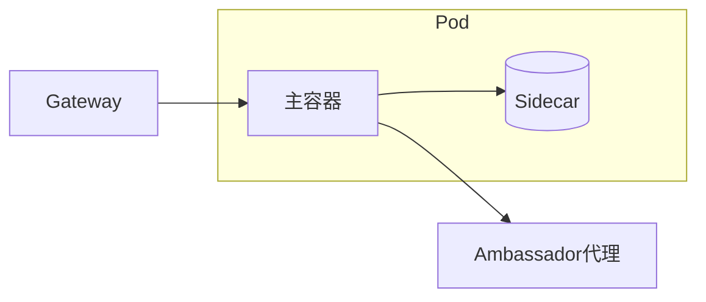

# 云原生与分布式设计模式实战

> 经典 GoF 模式解决面向对象设计，云原生/分布式领域也有自己的"模式语言"：Sidecar、Ambassador、Gateway、CQRS、Saga、Circuit Breaker、Bulkhead 等。它们解决的是"多实例、网络不可靠、弹性伸缩"下的工程问题。

## 1. 部署模式



| 模式 | 作用 |
| --- | --- |
| Sidecar | 辅助能力（日志/代理）与主容器同生命周期 |
| Ambassador | 代表主容器对外通信（出口代理） |
| Adapter | 标准化输出（指标格式转换） |

## 2. 弹性与容错模式

| 模式 | 解决问题 |
| --- | --- |
| 断路器 Circuit Breaker | 防故障级联扩散 |
| 舱壁 Bulkhead | 隔离资源，一处挂不拖全局 |
| 重试+退避 | 瞬时故障自愈 |
| 超时 | 防资源长时间占用 |
| 限流 | 过载保护 |

```python
# 断路器（简化）
def call():
    if breaker.open: raise  # 直接失败
    try: r = do(); breaker.success(); return r
    except: breaker.fail()
```

## 3. 数据模式

- **Saga**：长事务拆成补偿子事务。
- **CQRS**：读写模型分离。
- **Event Sourcing**：状态由事件序列重建。
- **Strangler Fig**：渐进式替换老系统。

## 4. 适用与取舍

- 模式不是银弹，过度引入增加复杂度。
- 先有问题，再选模式；不为用而用。
- 云原生模式多数已在框架/网格中内建。

## 5. 常见坑

| 坑 | 现象 | 对策 |
| --- | --- | --- |
| 断路器误开 | 正常流量被拦 | 阈值合理 |
| 舱壁过小 | 资源浪费 | 按需配置 |
| Saga 补偿漏 | 数据乱 | 补偿完备 |
| 模式堆叠 | 复杂 | 最小必要 |
| 配置缺失 | 不生效 | 默认安全 |

## 6. 面试题

1. Sidecar 与 Ambassador 区别？
2. 断路器如何防止级联故障？
3. Saga 为什么需要补偿？
4. 舱壁模式解决什么？
5. 云原生模式与 GoF 关系？

## 7. 小结

分布式模式 = 部署（Sidecar/Ambassador）+ 容错（断路/舱壁/重试）+ 数据（Saga/CQRS）。核心是"用模式语言把分布式不确定性驯服"，但坚持最小必要。
