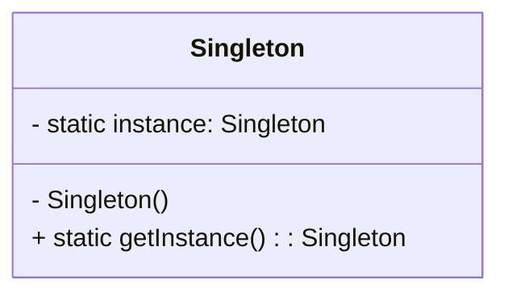

# 单例模式（Singleton）

> 所属分类：**创建型** 　|　 返回：[设计模式分类](../设计模式分类.md)


## 意图
保证一个类只有一个实例，并提供一个全局访问点。

## 结构（类图）


## 示例代码
```java
// 双重检查锁（DCL）+ volatile，线程安全且懒加载
public class Singleton {
    private static volatile Singleton instance;
    private Singleton() {}
    public static Singleton getInstance() {
        if (instance == null) {
            synchronized (Singleton.class) {
                if (instance == null) {
                    instance = new Singleton();
                }
            }
        }
        return instance;
    }
}

// 推荐：基于 enum 的单例（天然防反射、防反序列化破坏）
public enum SingletonEnum {
    INSTANCE;
    public void doSomething() { System.out.println("do"); }
}
```
> 饿汉（类加载即创建）、静态内部类（懒加载且线程安全）也是常用写法。

## 适用场景
- 配置中心、连接池、线程池、日志器、注册表等需全局唯一的资源管理者。
- 需要严格控制共享资源访问（如文件锁、计数器）。

## 与相似模式区别
- 与**静态工具类**：单例可延迟初始化、可被继承（enum 除外）、可实现接口；工具类只是静态方法的集合，无法被多态替换。
- 与**工厂**：单例约束"实例数量=1"，工厂关注"以何种方式产出对象"。
