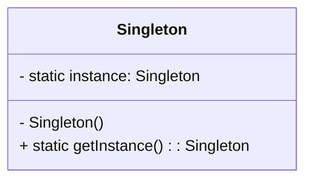

# 单例模式（Singleton）

> 所属分类：**创建型** 　|　 返回：[设计模式分类](../设计模式分类.md)


## 意图
保证一个类只有一个实例，并提供一个全局访问点。

## 结构（类图）


## 示例代码
```java
// 双重检查锁（DCL）+ volatile，线程安全且懒加载
public class Singleton {
    private static volatile Singleton instance;
    private Singleton() {}
    public static Singleton getInstance() {
        if (instance == null) {
            synchronized (Singleton.class) {
                if (instance == null) {
                    instance = new Singleton();
                }
            }
        }
        return instance;
    }
}

// 推荐：基于 enum 的单例（天然防反射、防反序列化破坏）
public enum SingletonEnum {
    INSTANCE;
    public void doSomething() { System.out.println("do"); }
}
```
> 饿汉（类加载即创建）、静态内部类（懒加载且线程安全）也是常用写法。

## 适用场景
- 配置中心、连接池、线程池、日志器、注册表等需全局唯一的资源管理者。
- 需要严格控制共享资源访问（如文件锁、计数器）。

## 与相似模式区别
- 与**静态工具类**：单例可延迟初始化、可被继承（enum 除外）、可实现接口；工具类只是静态方法的集合，无法被多态替换。
- 与**工厂**：单例约束"实例数量=1"，工厂关注"以何种方式产出对象"。

## 不适用场景（反例）

- 需要**多实例**或**有状态且需隔离**的对象（如每次请求一个 Session、一个用户上下文）——强行单例会引入并发共享与隐式耦合。
- 纯粹的工具类（无状态、无生命周期）——用静态方法即可，单例反而增加复杂度与测试负担。
- 会被**并发修改**的"全局可变状态"用单例承载，会成为隐蔽的竞态来源（除非内部做好同步）。

## 在 JDK / Spring / 开源中的真实应用

- **Spring**：`singleton` 是 bean 默认作用域（`DefaultSingletonBeanRegistry` 用 `ConcurrentHashMap` 缓存单例）；`ApplicationContext` 本身即单例。
- **JDK**：`Runtime.getRuntime()`、`Desktop.getDesktop()`、`Logger.getLogger(name)` 均返回进程内唯一实例。
- **MyBatis**：`SqlSessionFactory` 全局单例（重量级，持有一级缓存与配置）。
- **防破坏**：枚举单例天然防反射、防反序列化；DCL 必须加 `volatile` 禁止指令重排。

## 实现要点与常见坑

- **DCL 漏写 `volatile`**：`instance = new Singleton()` 可能发生指令重排，其他线程拿到"半初始化"对象。
- **反射/反序列化破坏**：普通类可通过 `setAccessible(true)` 再建实例；实现 `readResolve()` 或用 enum 规避。
- **ClassLoader 多实例**：不同类加载器加载同一类会各自生成一个实例（OSGi/热部署场景常见）。
- **测试困难**：单例持有全局状态，单测间易相互污染，建议依赖注入可控实例。

## 面试高频追问

1. Q：DCL 为什么要加 volatile？ A：阻止 `instance = new Singleton()` 的『分配内存→初始化→赋值引用』三步重排，避免其他线程读到未初始化完成的对象。
2. Q：单例与静态工具类区别？ A：单例可被延迟初始化、可被继承/实现接口/多态替换；静态工具类只是静态方法集合，无实例语义。
3. Q：enum 单例好在哪？ A：JVM 保证枚举实例唯一，且天然防反射与反序列化攻击，代码最简。
4. Q：Spring 的单例是线程安全的吗？ A：容器保证『实例唯一』，不保证『状态安全』；无状态 bean 安全，有状态需自行同步。
5. Q：如何防止单例被反射破坏？ A：构造器内抛异常（已存在实例时）或用 enum。
6. Q：单例在集群/多 JVM 下还唯一吗？ A：不，单例仅限单 JVM/单 ClassLoader 进程内，分布式需用分布式锁/集中存储。
