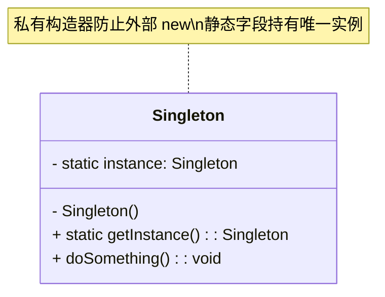

# 单例模式（Singleton）

> 所属分类：**创建型** 　|　 返回：[设计模式分类](../设计模式分类.md)

> **一句话定义**：保证一个类在 JVM（或进程）内**只有一个实例**，并提供一个**全局访问点**。
> **英文**：Singleton Pattern 　|　 **意图（GoF）**：Ensure a class has only one instance, and provide a global point of access to it.

---

## 一、意图与适用边界

单例解决的是**「实例数量」**问题，而不是「如何创建对象」问题（那是工厂/建造者关心的）。它的本质是：

1. **唯一性**：进程内（同一 ClassLoader 下）只允许存在一个对象。
2. **自管理**：类自己负责创建与持有这个实例（而不是交给外部 new）。
3. **全局可达**：通过静态方法（如 `getInstance()`）对外暴露，无需层层传参。

### 什么时候该用

- **真正的全局资源管理者**：连接池、线程池、配置中心、日志器、Metrics 注册表、缓存管理器。
- **重量级对象**：创建成本高（读配置、建连接、加载词典），不希望重复创建。
- **需要统一协调的状态**：如 ID 生成器、计数器、任务调度器。

### 什么时候不该用（反例）

- 仅仅是「静态方法的集合」→ 用工具类即可，单例反而引入生命周期负担。
- 有状态且需要**隔离**的对象（每个请求一个 Session / 用户上下文）→ 强行单例会成为并发竞态源。
- 为了「方便传参」而把对象做成全局单例 → 这是**隐式耦合**，应该用依赖注入。

> 💡 **经验法则**：先问一句「这个『唯一』真的需要吗？」多数「全局配置」其实可改成一个**只读配置对象**注入使用。

---

## 二、结构（类图）



- **私有构造器**：禁止 `new Singleton()`。
- **静态私有字段**：持有唯一实例。
- **静态公有方法**：`getInstance()` 返回该实例，必要时才创建（懒加载）。

---

## 三、六种实现方式（含完整代码）

### 1. 饿汉式（Eager）—— 类加载即创建

```java
public class SingletonEager {
    // 类加载阶段（由 JVM 保证线程安全）就完成实例化
    private static final SingletonEager INSTANCE = new SingletonEager();
    private SingletonEager() {}
    public static SingletonEager getInstance() { return INSTANCE; }
}
```

- ✅ 线程安全（类初始化由 JVM 加锁）。
- ❌ 不支持懒加载，启动即占用（若该单例很重且可能用不到，浪费资源）。
- 适合：实例轻量、一定会被使用。

### 2. 懒汉式（Synchronized 方法）—— 每次加锁

```java
public class SingletonLazySync {
    private static SingletonLazySync instance;
    private SingletonLazySync() {}
    public static synchronized SingletonLazySync getInstance() {
        if (instance == null) instance = new SingletonLazySync();
        return instance;
    }
}
```

- ✅ 懒加载 + 线程安全。
- ❌ **每次调用都加锁**，99% 的调用（实例已存在）无需同步，性能差。
- 实际生产中几乎不用此写法。

### 3. 双重检查锁（DCL）+ volatile —— 经典写法

```java
public class SingletonDCL {
    // 必须是 volatile：禁止指令重排 + 保证可见性
    private static volatile SingletonDCL instance;
    private SingletonDCL() {}

    public static SingletonDCL getInstance() {
        if (instance == null) {                 // 第一次检查（无锁，快速路径）
            synchronized (SingletonDCL.class) {
                if (instance == null) {         // 第二次检查（持锁，防并发重建）
                    instance = new SingletonDCL();
                }
            }
        }
        return instance;
    }
}
```

- ✅ 懒加载 + 仅首次竞争加锁 + 后续无锁。
- ⚠️ **必须 `volatile`**，否则有「半初始化对象」风险（详见第四节）。

### 4. 静态内部类（Holder）—— 推荐写法之一

```java
public class SingletonHolder {
    private SingletonHolder() {}
    private static class Holder {
        static final SingletonHolder INSTANCE = new SingletonHolder();
    }
    public static SingletonHolder getInstance() {
        return Holder.INSTANCE;   // 首次调用才触发 Holder 类加载
    }
}
```

- ✅ 懒加载：**JVM 保证类的初始化是线程安全的**，且只有 `getInstance()` 触发 `Holder` 加载。
- ✅ 无锁、代码简洁、防反射（构造器可手动加判断）。
- 这是**不用 enum 时的最佳选择**。

### 5. 枚举（enum）—— 最强防御（Effective Java 首推）

```java
public enum SingletonEnum {
    INSTANCE;
    public void doSomething() { System.out.println("business logic"); }
}
// 使用：SingletonEnum.INSTANCE.doSomething();
```

- ✅ JVM 保证枚举实例唯一。
- ✅ **天然防反射**：`Constructor.newInstance()` 对枚举直接抛 `IllegalArgumentException`。
- ✅ **天然防反序列化**：枚举序列化只写名字，反序列化用 `Enum.valueOf` 查回已有实例，不会新建。
- ✅ 代码最简。
- ❌ 非懒加载（类加载即创建）；无法继承（enum 不能 extend）。
- 这是 **Joshua Bloch《Effective Java》第 3 条的结论**：「单元素枚举是实现单例的最佳方式」。

### 6. 容器/注册式单例（多例映射）

```java
public class SingletonRegistry {
    private static final Map<String, Object> REGISTRY = new ConcurrentHashMap<>();
    private SingletonRegistry() {}
    @SuppressWarnings("unchecked")
    public static <T> T get(String key, Supplier<T> creator) {
        return (T) REGISTRY.computeIfAbsent(key, k -> creator.get());
    }
}
```

- 用 `ConcurrentHashMap` 管理多个「按 key 区分」的单例（如 Spring `DefaultSingletonBeanRegistry` 的思路）。
- 适合：需要在单例容器中按名称/类型管理多组唯一实例。

### 写法对比总表

| 写法 | 懒加载 | 线程安全 | 防反射 | 防序列化 | 性能 | 评价 |
|------|--------|----------|--------|----------|------|------|
| 饿汉 | 否 | 是 | 否 | 否 | 高 | 简单，启动即占用 |
| 懒汉(sync 方法) | 是 | 是 | 否 | 否 | 低（每次加锁） | 仅教学，别用 |
| DCL(无 volatile) | 是 | **否** | 否 | 否 | 高 | 半初始化风险，**禁用** |
| DCL(+volatile) | 是 | 是 | 否 | 否 | 高 | 经典，但 volatile 易漏 |
| 静态内部类 | 是 | 是 | 否 | 否 | 高 | **推荐（无 enum 时）** |
| enum | 否 | 是 | **是** | **是** | 高 | **最强防御，最简** |

> **选型口诀**：要最强防御用 `enum`；要懒加载且可读性好用「静态内部类」；要手写可控用「DCL+volatile」并务必加 volatile。

---

## 四、深挖：DCL 为什么必须 volatile

`instance = new SingletonDCL();` 在字节码/CPU 层面是**三步**：

```text
1. 分配内存空间          (allocate)
2. 初始化对象            (init: 调用构造器，给字段赋值)
3. 将引用赋给 instance   (assign)
```

由于 **指令重排**（编译器和 CPU 为优化可能把 2、3 重排为 3→2），另一个线程可能在 `instance != null` 时拿到**只完成第 3 步、还没执行第 2 步**的「半初始化对象」——此时对象字段还是默认值（null/0），使用该对象会出难以排查的 NPE/逻辑错误。

`volatile` 在此处提供**两大保证**：
1. **可见性**：一个线程写入 `instance`，其他线程立刻可见。
2. **禁止重排**：在 `volatile` 写之前的操作（对象初始化）不会被重排到写之后 → 其他线程看到 `instance != null` 时，对象一定已初始化完成。

> 历史注脚：**Java 5 之前 `volatile` 语义不完整**，无法阻止该重排，因此老代码普遍用「静态内部类」方案。Java 5 起 `volatile` 遵循 JSR-133 增强语义才安全。

### 反编译视角（简化字节码）

```text
new            // 1. 分配内存
dup
invokespecial  // 2. 调用 <init>
astore         // 3. 赋值引用（volatile 在此处插入内存屏障）
```

---

## 五、深挖：enum 单例为什么防反射与序列化

### 反射为什么打不破 enum

```java
Constructor<SingletonEnum> c = SingletonEnum.class.getDeclaredConstructor();
c.setAccessible(true);
c.newInstance();  // 抛 IllegalArgumentException: "Cannot reflectively create enum objects"
```

JDK 在 `Constructor.newInstance()` 开头就判断：若声明类是 `enum`，**直接抛异常**。这是 JVM 规范层面的硬约束。

### 序列化为什么打不破 enum

- 普通类实现 `Serializable` 后，反序列化会**重新调用构造器创建新对象**（除非实现 `readResolve()` 返回现有实例）——这就是单例被「反序列化破坏」的经典漏洞。
- 枚举的序列化机制：**只写出枚举常量名**（如 `"INSTANCE"`），反序列化时通过 `Enum.valueOf(EnumClass, "INSTANCE")` 从 JVM 已有的枚举表中**查回同一实例**，绝不新建。

> 结论：enum 单例无需写任何防御代码，JVM 替你做了反射与序列化两道防线。

### 普通类如何防反序列化破坏

```java
public class SingletonDCL implements Serializable {
    private static final long serialVersionUID = 1L;
    // 反序列化时 JVM 会调用此方法返回的对象，从而复用现有实例
    private Object readResolve() { return getInstance(); }
}
```

---

## 六、其他语言实现参考

### Go（包级变量天然单例 + sync.Once 懒加载）

```go
package singleton

import "sync"

type singleton struct{ /* ... */ }

var (
    instance *singleton
    once     sync.Once
)

func GetInstance() *singleton {
    once.Do(func() { instance = &singleton{} }) // 线程安全，仅执行一次
    return instance
}
```

Go 的 `sync.Once.Do` 等价于 DCL+volatile 的安全封装，是 Go 中实现懒加载单例的惯用法。

### Python（模块级单例 / __new__ 控制）

```python
class Singleton:
    _instance = None
    def __new__(cls, *args, **kwargs):
        if cls._instance is None:
            cls._instance = super().__new__(cls, *args, **kwargs)
        return cls._instance

# 更 Python 的方式：模块只导入一次，模块级对象本身就是单例
```

Python 中「模块导入」天然是单例（import 只执行一次），多数场景直接用模块级对象即可。

---

## 七、适用场景（再梳理）

- **配置中心**：全局唯一的配置加载与缓存（`ApolloConfig` / `NacosConfig`）。
- **连接池 / 线程池**：数据库连接池、HTTP 客户端池（如 OkHttp 单例）。
- **日志器**：`Logger.getLogger(name)` 进程内唯一。
- **注册表 / 缓存管理器**：如 MyBatis `SqlSessionFactory` 全局单例（重量级，持有一级缓存与配置）。
- **ID / 序列生成器**：雪花算法 `Snowflake` 实例需全局唯一以保证时钟与节点一致。

---

## 八、与相似模式区别

| 对比 | 单例 | 静态工具类 | 工厂方法 | 原型 |
|------|------|-----------|----------|------|
| 关注点 | 实例数量=1 | 方法集合 | 创建哪个子类 | 克隆已有实例 |
| 是否可继承/多态 | 可（enum 除外） | 否 | 是 | 是 |
| 是否懒加载 | 可 | 否（类加载即静态） | 看实现 | 否 |
| 生命周期管理 | 类自管 | 无 | 调用方管 | 调用方管 |

- 与**静态工具类**：单例可延迟初始化、可被继承、可实现接口、可被多态替换；工具类只是静态方法集合，无实例语义。
- 与**工厂**：单例约束「实例数量=1」，工厂关注「以何种方式产出对象」（工厂常配合单例：工厂本身是单例，产出的产品不是）。
- 与**原型**：原型用 `clone()` 复制一个新对象；单例永远返回**同一个**对象。

---

## 九、不适用场景（反例集）

1. **需要多实例**的对象（每次请求一个 Session、一个用户上下文）——强行单例会引入并发共享与隐式耦合。
2. **纯粹无状态工具类**——用静态方法即可，单例增加复杂度与测试负担。
3. **会被并发修改的全局可变状态**——单例会成为隐蔽的竞态来源，除非内部做好同步（如用 `ConcurrentHashMap`、原子类）。
4. **会被并发修改的全局可变状态**——单例会成为隐蔽的竞态来源，除非内部做好同步（如用 `ConcurrentHashMap`、原子类）。
5. **分布式集群环境**——单例仅保证「单 JVM / 单 ClassLoader 进程内」唯一，多节点各自一个实例；跨进程唯一需用分布式锁或集中存储（如 Redis/ZooKeeper 选主）。

---

## 十、在 JDK / Spring / 开源中的真实应用

- **Spring**：`singleton` 是 bean 默认作用域；`DefaultSingletonBeanRegistry` 用 `ConcurrentHashMap` 缓存单例；`ApplicationContext` 本身即单例容器。
- **JDK**：`Runtime.getRuntime()`、`Desktop.getDesktop()`、`Logger.getLogger(name)` 均返回进程内唯一实例。
- **MyBatis**：`SqlSessionFactory` 全局单例（重量级，持有一级缓存与配置）；`ErrorContext` 用 `ThreadLocal`+类加载级单例承载线程内错误上下文。
- **日志框架**：`LoggerFactory.getLogger()` 背后是单例 `LoggerContext` 管理 Logger 实例复用。
- **连接池**：HikariCP `HikariDataSource` 通常作为单例注入，内部维护连接池。

### Spring 单例 vs GoF 单例

| 维度 | GoF 单例 | Spring 单例 |
|------|----------|-------------|
| 唯一性范围 | 类自管，进程内唯一 | 容器（ApplicationContext）内唯一 |
| 创建时机 | 类自己控制 | 容器控制（懒/非懒由配置决定） |
| 是否可代理/注入 | 否 | 是（可被 AOP 代理、可注入依赖） |
| 替换/测试 | 难 mock | 易替换（profile/bean 覆盖） |

> Spring 的「单例」更准确地说是「**容器单例**」——它保证每个容器里该 bean 定义只存在一个共享实例，而非靠私有构造器硬约束。

---

## 十一、实现要点与常见坑

1. **DCL 漏写 `volatile`**：`instance = new X()` 可能重排，其他线程拿到「半初始化」对象。
2. **反射破坏**：普通类可通过 `setAccessible(true)` + `newInstance()` 再建实例；防御方式：构造器内判断「已存在则抛异常」或直接用 enum。
3. **序列化破坏**：未实现 `readResolve()` 的普通类，反序列化会新建对象；实现 `readResolve()` 或用 enum 规避。
4. **ClassLoader 多实例**：同一类被不同 ClassLoader 加载会各自生成一个实例（OSGi / 热部署 / 某些 Web 容器场景常见）。
5. **多 JVM 不唯一**：单例只在单进程内有效，集群部署下各节点独立，需要集中式协调。
6. **测试困难**：单例持有全局可变状态，单测间易相互污染；建议抽接口 + 构造器注入，测试时传入 fake。

### 手写单例的防御性构造器（防反射）

```java
private SingletonDCL() {
    if (instance != null) {  // 已存在实例时拒绝再次创建
        throw new IllegalStateException("Already initialized");
    }
}
```

---

## 十二、生产实践与重构信号

1. **Spring 场景别手写单例**：容器管理单例即可，手写 `getInstance()` 会让 bean 脱离容器生命周期（无法注入依赖、难以单测、无法被 AOP 增强）。
2. **全局状态先问一句**：这个「唯一」真的需要吗？多数「全局配置」其实可注入一个只读配置对象。
3. **重构信号**：`Xxx.getInstance()` 散落多处、且构造逻辑在膨胀 → 考虑改为**依赖注入 + 工厂**，让单例变成「容器单例」。
4. **日志/监控/metrics 单例**：`Logger`、`MetricsRegistry` 用单例合理（内部自带并发安全）。
5. **多实例化测试**：单例难 mock → 引入接口 + 构造器注入，测试传入 fake 实现。
6. **跨线程状态**：单例若持有可变状态且多线程访问，内部必须用线程安全结构（`ConcurrentHashMap`、原子类、`volatile`），否则是隐蔽 bug 温床。

---

## 十三、分布式场景下的「单例」

单例只在单进程内保证唯一。**分布式环境**需要「集群级唯一」时，常见替代方案：

| 需求 | 单进程方案 | 分布式方案 |
|------|-----------|-----------|
| 唯一实例 | 单例 | 主备选主（ZooKeeper/etcd/Raft）、K8s Deployment 单副本 |
| 唯一 ID | `AtomicLong` / Snowflake 单例 | Snowflake（workerId 分配）+ Leaf-segment + UUID |
| 全局锁 | `synchronized` / `ReentrantLock` | Redis `SET NX` / ZooKeeper 临时节点 / 数据库乐观锁 |
| 全局计数器 | 内存计数 | Redis `INCR` / 数据库自增 |

> 一句话：**进程内唯一用单例，跨进程唯一用分布式协调**。

---

## 十四、面试高频追问（20+ 条）

1. Q：DCL 为什么要加 volatile？ A：阻止 `instance = new X()` 的「分配内存→初始化→赋值引用」三步重排，避免其他线程读到未初始化完成的对象。
2. Q：单例与静态工具类区别？ A：单例可被延迟初始化、可被继承/实现接口/多态替换；静态工具类只是静态方法集合，无实例语义。
3. Q：enum 单例好在哪？ A：JVM 保证枚举实例唯一，且天然防反射与反序列化攻击，代码最简。
4. Q：Spring 的单例是线程安全的吗？ A：容器保证「实例唯一」，不保证「状态安全」；无状态 bean 安全，有状态需自行同步。
5. Q：如何防止单例被反射破坏？ A：构造器内抛异常（已存在实例时）或用 enum。
6. Q：单例在集群/多 JVM 下还唯一吗？ A：不，单例仅限单 JVM/单 ClassLoader 进程内，分布式需用分布式锁/集中存储。
7. Q：饿汉和懒汉区别？ A：饿汉类加载即创建（简单、无并发问题，启动慢）；懒汉首次使用才创建（省启动，需处理并发）。
8. Q：静态内部类为什么线程安全？ A：JVM 类加载机制保证 `getInstance` 首次触发类加载时才初始化，且类初始化有锁。
9. Q：序列化会破坏单例吗？ A：会，反序列化会新建实例；实现 `readResolve()` 返回现有单例即可。
10. Q：懒汉 synchronized 加在方法上为什么不好？ A：每次调用都要抢锁，性能差；DCL 只在首次竞争。
11. Q：两个类加载器各加载一次会怎样？ A：各生成一个实例，单例被打破（OSGi/热部署场景要小心）。
12. Q：单例和「静态字段」区别？ A：静态字段也是全局唯一，但单例可控制初始化时机、可继承、可实现接口。
13. Q：为什么 Logger 单例安全？ A：内部已做线程安全的日志写入，多线程并发调用无状态问题。
14. Q：DCL 在 Java 5 之前能用吗？ A：不能，volatile 语义在 Java 5 才被修复（JSR-133）；老代码用静态内部类方案。
15. Q：Spring 单例和 GoF 单例区别？ A：Spring 是「容器管理实例唯一」（可被代理、可注入、可替换）；GoF 是「类自管实例唯一」。
16. Q：如何实现线程内单例？ A：用 `ThreadLocal` 持有实例，每个线程一个，常用于跨方法透传上下文（如日志 traceId、MyBatis `ErrorContext`）。
17. Q：单例模式的缺点？ A：隐藏依赖（调用方不知依赖来源）、不利于单测、有状态单例引发并发问题、违反单一职责。
18. Q：什么时候单例不如依赖注入？ A：需要可测试、可替换、无全局可变状态时，DI 更优。
19. Q：enum 单例能懒加载吗？ A：不能（类加载即创建）；如必须懒加载选静态内部类。
20. Q：单例在 Kotlin/Go 里怎么写？ A：Kotlin 用 `object` 声明即线程安全单例；Go 用 `sync.Once`。
21. Q：单例和享元（Flyweight）区别？ A：享元复用**共享的部分状态**（细粒度对象池），单例是**唯一实例**；享元可有多例（同一类多个共享对象），单例只能有一例。

---

## 十五、速记口诀（Summary）

> **唯一实例全局访，私有构造静态场。**
> **懒汉加锁性能差，DCL 必加 volatile。**
> **内部类 Holder 最稳，enum 防御是王者。**
> **Spring 容器管单例，跨进程要分布式。**

---

## 十六、关联阅读

- 创建型：[工厂方法模式](工厂方法模式.md) · [抽象工厂模式](抽象工厂模式.md) · [建造者模式](建造者模式.md) · [原型模式](原型模式.md)
- 相关机制：[基础知识/并发编程](../基础知识/并发编程.md)（volatile / 类加载 / 指令重排）
- 框架实践：Spring IoC 容器单例注册表 `DefaultSingletonBeanRegistry`
