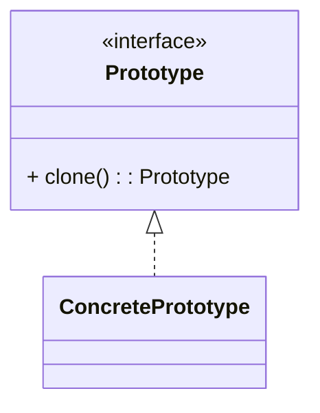

# 原型模式（Prototype）

> 所属分类：**创建型** 　|　 返回：[设计模式分类](../设计模式分类.md)


## 意图
用原型实例指定创建对象的种类，并通过拷贝这些原型创建新对象。

## 结构（类图）


## 示例代码
```java
class Shape implements Cloneable {
    public String type;
    @Override
    protected Shape clone() {
        try { return (Shape) super.clone(); }   // Object.clone() 为浅拷贝
        catch (CloneNotSupportedException e) { throw new RuntimeException(e); }
    }
}
```
> 注意：Java 的 `clone()` 为浅拷贝；含引用字段时建议手动深拷贝，或改用拷贝构造器 / 序列化（如 Kryo、Jackson）。

### 深挖：浅拷贝 vs 深拷贝（Java 三种实现对比）

```java
class Order implements Cloneable {
    List<Item> items;          // 引用字段
    String orderNo;

    // 方式一：浅拷贝（items 共享，改一个影响另一个）
    @Override public Order clone() {
        try { return (Order) super.clone(); }
        catch (CloneNotSupportedException e) { throw new RuntimeException(e); }
    }

    // 方式二：拷贝构造器 + 手动深拷贝（推荐，类型安全）
    public Order(Order o) {
        this.orderNo = o.orderNo;
        this.items = o.items.stream().map(Item::new).toList();   // 逐元素复制
    }

    // 方式三：序列化深拷贝（通用但慢，且要求 Serializable）
    public Order deepCopyBySerialization() throws Exception {
        ByteArrayOutputStream bos = new ByteArrayOutputStream();
        new ObjectOutputStream(bos).writeObject(this);
        return (Order) new ObjectInputStream(new ByteArrayInputStream(bos.toByteArray())).readObject();
    }
}
```

| 方式 | 深拷贝 | 性能 | 类型安全 | 评价 |
|------|--------|------|----------|------|
| `Object.clone()` | 否（需手写） | 快 | 弱（强转） | 经典但设计差 |
| 拷贝构造器 | 可控 | 快 | 强 | **工程推荐** |
| 序列化 | 是 | 慢 | 弱 | 仅原型简单时用 |

## 适用场景
- 对象创建成本高（如从数据库/网络读取后），复制比新建更划算。
- 需要动态增删产品类，或避免与具体产品类耦合的工厂层级。

## 与相似模式区别
- 与**单例**相反：单例限制唯一，原型鼓励复制。
- 与**工厂**：原型通过"自我复制"创建，无需独立的工厂类。

---

## 不适用场景（反例）

- 对象**创建成本极低**且字段少——直接 `new` 比克隆更清晰，原型反而徒增复杂度。
- 对象含**大量循环引用 / 资源句柄（Socket、文件流）**——深拷贝极难正确，易泄漏资源。
- 需要保证**每个副本完全独立生命周期**却忘记深拷贝，导致共享可变子对象引发诡异 Bug。

## 在 JDK / Spring / 开源中的真实应用

- **JDK**：`java.lang.Object.clone()` + `Cloneable` 标记接口；`ArrayList`、`HashMap` 均实现 `clone()`。
- **Spring**：`prototype` 作用域的 bean，每次 `getBean` 返回新实例（常与原型管理器配合）。
- **实战**：游戏/报表中"模板对象 + 克隆"批量生成相似配置对象，避免重复初始化。

## 实现要点与常见坑

- **浅拷贝陷阱**：默认 `Object.clone()` 是浅拷贝，引用类型字段仍共享；改一个副本影响另一个。
- **Cloneable 是空接口**：不重写 `clone()` 会抛 `CloneNotSupportedException`，且 `clone()` 是 `protected`，设计上很别扭。
- **深拷贝成本**：递归拷贝大对象图开销高；可用序列化（实现 `Serializable`）或拷贝构造器替代。
- **与单例冲突**：原型对象不应持有单例可变状态。

## 生产实践与重构信号

1. **真实收益场景**：模板 + 克隆（报表模板、消息模板、表单定义），从 DB 加载一次模板后本地克隆成百上千份，省网络与解析。
2. **重构信号**：重复「读模板 → 改几个字段 → 保存」逻辑 → 封装原型注册表（`Map<String, Prototype>` + clone）。
3. **现代替代**：Java 中优先用**拷贝构造器/工厂 copy()**；Go/Rust 语言层面 `copy`/`clone trait` 更直接，原型模式更多是「思想」。
4. **不可变对象不需要原型**：不可变对象直接复用引用即可，不必拷贝。
5. **注意资源句柄**：含连接/流的对象绝不浅拷贝，否则双关双释放。

## 面试高频追问（15+ 条）

1. Q：浅拷贝与深拷贝区别？ A：浅拷贝只复制对象本身，引用字段仍指向原对象；深拷贝递归复制所有引用对象，彼此独立。
2. Q：Java 的 clone() 有什么坑？ A：Cloneable 是空标记接口、clone() 是 protected、默认浅拷贝，设计饱受诟病，很多项目改用拷贝构造器。
3. Q：如何实现深拷贝？ A：递归 clone、序列化反序列化、或 MapStruct/手动拷贝构造器。
4. Q：原型模式 vs 工厂？ A：原型基于『复制已有实例』，适合构建成本高/相似度高的对象；工厂基于『按条件创建』。
5. Q：Spring prototype bean 被单例注入会怎样？ A：只注入一次（注入时创建），并非每次使用都新实例；需用到 `ObjectProvider`/`ApplicationContext.getBean` 才生效。
6. Q：原型模式适合哪些场景？ A：创建成本高、对象间差异小、需大量相似实例（如游戏实体、配置模板）。
7. Q：ArrayList.clone() 是深拷贝吗？ A：不是，只复制引用数组（elementData 共享），元素对象仍是同一批。
8. Q：为什么 Cloneable 不重写 clone 会抛异常？ A：JVM 在 Object.clone() 里检查对象是否实现 Cloneable，没有则抛 CloneNotSupportedException。
9. Q：原型模式与「对象池」区别？ A：原型=复制创建新对象；对象池=复用已有对象不新建。
10. Q：什么时候用序列化做深拷贝？ A：对象图复杂、一次性场景可接受性能损耗；高频场景用拷贝构造器。
11. Q：原型模式与不可变对象？ A：不可变对象无需拷贝（可共享引用），原型只对可变对象有意义。
12. Q：注册表原型管理器是什么？ A：Map<key, Prototype> 缓存一批原型，按 key clone，避免每类一个工厂。
13. Q：原型模式违反开闭吗？ A：不违反，新增原型类无需改创建代码，注册即可。
14. Q：原型对象的 clone 是否线程安全？ A：clone 创建独立对象本身安全；但原型内部的共享可变状态要先处理好。
15. Q：现代 Java 里原型模式还常用吗？ A：思想常用（copy/factory），但接口级 GoF 写法较少，多被拷贝构造器、record 与 MapStruct 替代。
