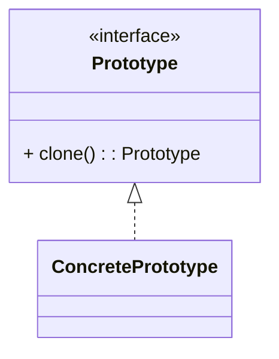

# 原型模式（Prototype）

> 所属分类：**创建型** 　|　 返回：[设计模式分类](../设计模式分类.md)


## 意图
用原型实例指定创建对象的种类，并通过拷贝这些原型创建新对象。

## 结构（类图）


## 示例代码
```java
class Shape implements Cloneable {
    public String type;
    @Override
    protected Shape clone() {
        try { return (Shape) super.clone(); }   // Object.clone() 为浅拷贝
        catch (CloneNotSupportedException e) { throw new RuntimeException(e); }
    }
}
```
> 注意：Java 的 `clone()` 为浅拷贝；含引用字段时建议手动深拷贝，或改用拷贝构造器 / 序列化（如 Kryo、Jackson）。

## 适用场景
- 对象创建成本高（如从数据库/网络读取后），复制比新建更划算。
- 需要动态增删产品类，或避免与具体产品类耦合的工厂层级。

## 与相似模式区别
- 与**单例**相反：单例限制唯一，原型鼓励复制。
- 与**工厂**：原型通过"自我复制"创建，无需独立的工厂类。

---
