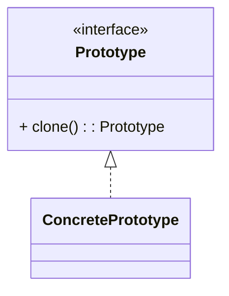

# 原型模式（Prototype）

> 所属分类：**创建型** 　|　 返回：[设计模式分类](../设计模式分类.md)


## 意图
用原型实例指定创建对象的种类，并通过拷贝这些原型创建新对象。

## 结构（类图）


## 示例代码
```java
class Shape implements Cloneable {
    public String type;
    @Override
    protected Shape clone() {
        try { return (Shape) super.clone(); }   // Object.clone() 为浅拷贝
        catch (CloneNotSupportedException e) { throw new RuntimeException(e); }
    }
}
```
> 注意：Java 的 `clone()` 为浅拷贝；含引用字段时建议手动深拷贝，或改用拷贝构造器 / 序列化（如 Kryo、Jackson）。

## 适用场景
- 对象创建成本高（如从数据库/网络读取后），复制比新建更划算。
- 需要动态增删产品类，或避免与具体产品类耦合的工厂层级。

## 与相似模式区别
- 与**单例**相反：单例限制唯一，原型鼓励复制。
- 与**工厂**：原型通过"自我复制"创建，无需独立的工厂类。

---

## 不适用场景（反例）

- 对象**创建成本极低**且字段少——直接 `new` 比克隆更清晰，原型反而徒增复杂度。
- 对象含**大量循环引用 / 资源句柄（Socket、文件流）**——深拷贝极难正确，易泄漏资源。
- 需要保证**每个副本完全独立生命周期**却忘记深拷贝，导致共享可变子对象引发诡异 Bug。

## 在 JDK / Spring / 开源中的真实应用

- **JDK**：`java.lang.Object.clone()` + `Cloneable` 标记接口；`ArrayList`、`HashMap` 均实现 `clone()`。
- **Spring**：`prototype` 作用域的 bean，每次 `getBean` 返回新实例（常与原型管理器配合）。
- **实战**：游戏/报表中"模板对象 + 克隆"批量生成相似配置对象，避免重复初始化。

## 实现要点与常见坑

- **浅拷贝陷阱**：默认 `Object.clone()` 是浅拷贝，引用类型字段仍共享；改一个副本影响另一个。
- **Cloneable 是空接口**：不重写 `clone()` 会抛 `CloneNotSupportedException`，且 `clone()` 是 `protected`，设计上很别扭。
- **深拷贝成本**：递归拷贝大对象图开销高；可用序列化（实现 `Serializable`）或拷贝构造器替代。
- **与单例冲突**：原型对象不应持有单例可变状态。

## 面试高频追问

1. Q：浅拷贝与深拷贝区别？ A：浅拷贝只复制对象本身，引用字段仍指向原对象；深拷贝递归复制所有引用对象，彼此独立。
2. Q：Java 的 clone() 有什么坑？ A：Cloneable 是空标记接口、clone() 是 protected、默认浅拷贝，设计饱受诟病，很多项目改用拷贝构造器。
3. Q：如何实现深拷贝？ A：递归 clone、序列化反序列化、或 MapStruct/手动拷贝构造器。
4. Q：原型模式 vs 工厂？ A：原型基于『复制已有实例』，适合构建成本高/相似度高的对象；工厂基于『按条件创建』。
5. Q：Spring prototype bean 被单例注入会怎样？ A：只注入一次（注入时创建），并非每次使用都新实例；需用到 `ObjectProvider`/`ApplicationContext.getBean` 才生效。
6. Q：原型模式适合哪些场景？ A：创建成本高、对象间差异小、需大量相似实例（如游戏实体、配置模板）。
