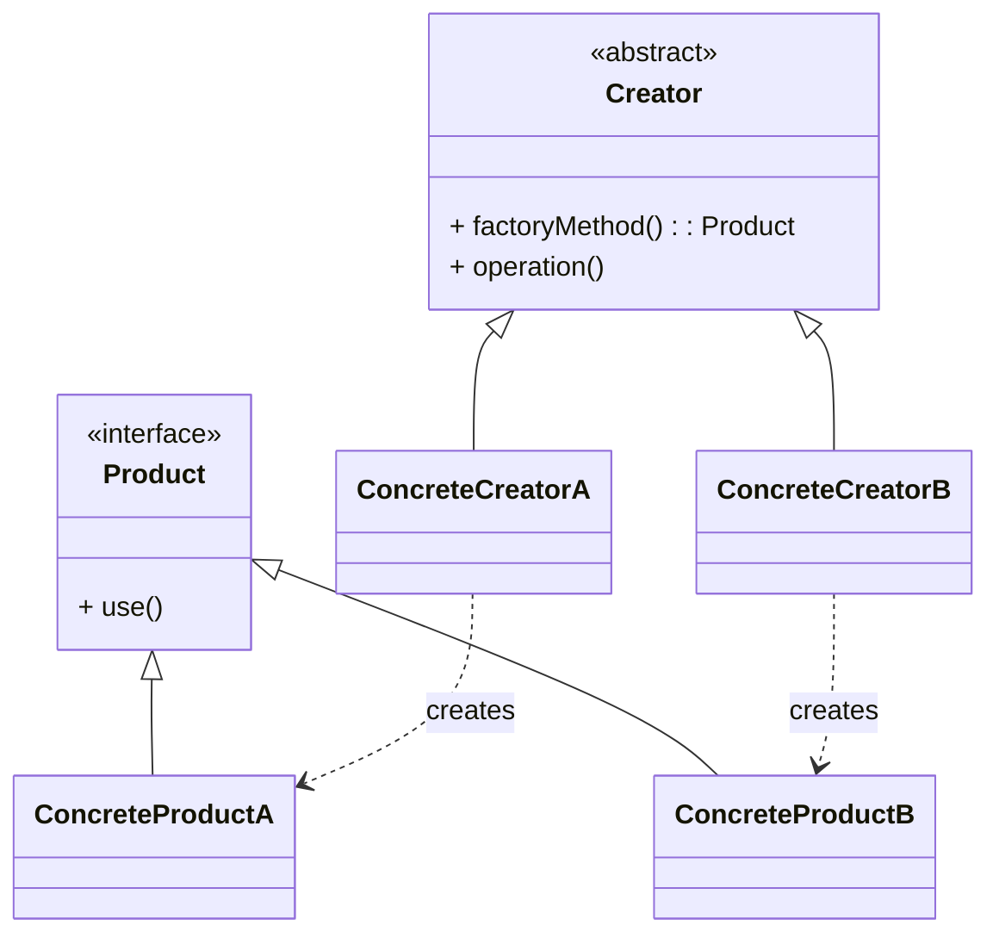

# 工厂方法模式（Factory Method）

> 所属分类：**创建型** 　|　 返回：[设计模式分类](../设计模式分类.md)

> **一句话定义**：定义一个创建对象的接口，让**子类决定实例化哪一个类**，使一个类的实例化延迟到其子类。
> **英文**：Factory Method Pattern 　|　 **意图（GoF）**：Define an interface for creating an object, but let subclasses decide which class to instantiate.

---

## 一、意图与解决的问题

「创建」与「使用」耦合是大多数项目早期的通病：

```java
// 坏味道：调用方直接依赖具体类
Transport t = new Truck();   // 想换 Ship 就得到处改
```

工厂方法把「实例化哪一类」这件事**上移并延迟**给子类决定，调用方只依赖产品抽象（`Transport`）与创建者抽象（`Logistics`），从而：

1. **解耦调用方与具体类**：客户端代码不出现 `new Truck()`，只面向接口编程。
2. **符合开闭原则**：新增产品（如 `Air`）只需新增一类 `Creator`/注册项，不改已有创建逻辑。
3. **统一创建入口**：所有产品创建收敛到 `factoryMethod()`，便于加日志、缓存、权限、监控。

> 💡 **核心思想**：把「new 哪个具体类」的**决策权**交给子类或注册表，而不是硬编码在调用方。

---

## 二、结构（类图）



- **Product**：产品的抽象接口/基类。
- **ConcreteProduct**：具体产品。
- **Creator（抽象创建者）**：声明 `factoryMethod()` 并返回 `Product`；其 `operation()` 等业务方法**调用** `factoryMethod()`。
- **ConcreteCreator**：覆写 `factoryMethod()`，返回具体产品。

> 关键：**Creator 不知道具体产品类**，它通过自己声明的抽象方法间接获得产品——这就是「好莱坞法则：don't call us, we'll call you」。

---

## 三、经典 Java 实现

```java
interface Transport { void deliver(); }
class Truck implements Transport { public void deliver() { System.out.println("公路运输"); } }
class Ship  implements Transport { public void deliver() { System.out.println("海运"); } }

abstract class Logistics {
    // 工厂方法：由子类决定返回哪种 Transport
    public abstract Transport createTransport();

    // 业务方法：只依赖抽象，不关心具体实现
    public void plan() {
        Transport t = createTransport();
        t.deliver();
    }
}

class RoadLogistics extends Logistics {
    public Transport createTransport() { return new Truck(); }
}
class SeaLogistics extends Logistics {
    public Transport createTransport() { return new Ship(); }
}

// 使用：客户端依赖抽象
Logistics logistics = new RoadLogistics();
logistics.plan();   // 公路运输
```

---

## 四、函数式 / 注册表写法（Java 8+）

「创建逻辑」本身就是一种策略，可用 `Map<String, Supplier<T>>` 把「类型→工厂」运行时注册，避免类爆炸：

```java
public class TransportFactory {
    private static final Map<String, Supplier<Transport>> REGISTRY = new HashMap<>();
    static {
        REGISTRY.put("road", Truck::new);
        REGISTRY.put("sea",  Ship::new);
    }
    public static Transport create(String type) {
        Supplier<Transport> f = REGISTRY.get(type);
        if (f == null) throw new IllegalArgumentException("unknown type: " + type);
        return f.get();
    }
    // 运行时可扩展：TransportFactory.register("air", Air::new);
    public static void register(String type, Supplier<Transport> factory) {
        REGISTRY.put(type, factory);
    }
}
```

**三种写法演进对比**：

| 写法 | 扩展方式 | 开闭性 | 类数量 | 评价 |
|------|----------|--------|--------|------|
| 简单工厂（静态 + if/else） | 改源码 | ❌ 违反 | 少 | 教学用，扩展要动代码 |
| 工厂方法（子类覆写） | 加子类 | ✅ | 中（产品+创建者各增） | GoF 经典，结构清晰 |
| 注册表 + Supplier | 运行时 `register` | ✅✅ | 少 | 最贴合 Spring 容器思想 |

> 简单工厂（Simple Factory）**不属于 GoF 23 种模式**，它只是一个「集中判断 + new」的静态方法；当判断分支出现第 2 处、第 3 处散落时，就该升级为工厂方法或注册表。

---

## 五、其他语言实现

### Go（返回接口，不暴露具体类型）

```go
package factory

type Transport interface{ Deliver() string }

type Truck struct{}
func (Truck) Deliver() string { return "road" }

type Ship struct{}
func (Ship) Deliver() string { return "sea" }

// 工厂函数：返回接口，调用方依赖抽象
func NewTransport(kind string) (Transport, error) {
    switch kind {
    case "road": return Truck{}, nil
    case "sea":  return Ship{}, nil
    default:     return nil, fmt.Errorf("unknown: %s", kind)
    }
}
```

### Python（类方法即工厂方法）

```python
from abc import ABC, abstractmethod

class Transport(ABC):
    @abstractmethod
    def deliver(self) -> str: ...

class Truck(Transport):
    def deliver(self) -> str: return "road"

class Logistics(ABC):
    @abstractmethod
    def create_transport(self) -> Transport: ...
    def plan(self) -> str: return self.create_transport().deliver()

class RoadLogistics(Logistics):
    def create_transport(self) -> Transport: return Truck()
```

---

## 六、参数化工厂方法（一个 Creator 多个工厂方法）

有些场景同一创建者需要生产多种产品，可把工厂方法**参数化**：

```java
abstract class DocumentCreator {
    abstract Document create(String type);   // 参数化：根据 type 返回不同子类
    // 或：abstract Letter newLetter(); abstract Resume newResume();
}
```

这是「工厂方法」与「简单工厂」的折中：创建者仍是抽象类，但具体选择逻辑收敛在 `create(String)` 内，配合注册表可进一步解耦。

---

## 七、与模板方法模式的结合

工厂方法经常被**模板方法**当作「可覆写的原语操作」使用：

```java
abstract class Application {
    // 模板方法：固定算法骨架
    public final void run() {
        Product p = createProduct();   // 工厂方法作为「钩子」
        p.init(); p.use(); p.cleanup();
    }
    protected abstract Product createProduct();   // 子类注入具体产品
}
```

这就是框架级套路：框架定流程，应用填产品。Spring 的 `AbstractApplicationContext`、JUnit 的 `Runner` 都大量使用这种「模板方法 + 工厂方法」组合。

---

## 八、适用场景

- 类无法预知它必须创建的对象的类（运行时才知道）。
- 希望将产品创建职责委托给子类，支持扩展新产品而不修改已有代码（符合开闭原则）。
- 框架/库需要把「实例化哪种组件」交给使用者定制（如日志 Appender、序列化器、编解码器）。

---

## 九、与相似模式区别

| 对比 | 工厂方法 | 简单工厂 | 抽象工厂 | 建造者 |
|------|----------|----------|----------|--------|
| 产出 | 一种产品 | 一种（集中判断） | 一组产品族 | 分步装配复杂对象 |
| 扩展方式 | 加子类/注册 | 改源码 | 加产品族实现 | 链式配置 |
| 创建决定权 | 子类 | 静态方法 | 具体工厂 | 调用方逐步配置 |
| 是否 GoF | 是 | 否 | 是 | 是 |

- 与**抽象工厂**：工厂方法只创建**一种**产品；抽象工厂创建**一组相关产品（产品族）**，且内部通常用工厂方法实现每个产品的创建。
- 与**简单工厂**：简单工厂用静态方法 + if/else 选择，不属于 GoF，扩展需改源码。

---

## 十、不适用场景（反例）

- 只有**一种实现**、未来也不会变化 → 直接 `new` 更简单，工厂是过度设计。
- 工厂里堆满 `if/else` 按类型分支 → 这是简单工厂写法，违反开闭，应升级为工厂方法或注册表。
- 产品种类繁多且**互不相干** → 可能需要抽象工厂或 Builder，而非工厂方法。

---

## 十一、在 JDK / Spring / 开源中的真实应用

- **JDK**：`Collection.iterator()` 是工厂方法（`ArrayList` 决定返回 `ArrayList.Itr`，`HashSet` 返回 `KeyIterator`）；`URLStreamHandlerFactory.createURLStreamHandler`；`Documents.newDocumentBuilder()`。
- **Spring**：`FactoryBean.getObject()` 生产复杂 bean；`SqlSessionFactory.openSession()`；`@Bean` 方法本质是「配置类这个 Creator 的工厂方法」。
- **MyBatis**：`SqlSessionFactory` 由 `SqlSessionFactoryBuilder` 构建，再由其生产 `SqlSession`（会话级产品）。
- **Netty**：`Bootstrap.channel(Class)` 内部通过 `ChannelFactory` 创建 `NioSocketChannel`/`EpollSocketChannel`（按平台选）。
- **JDBC**：`DriverManager.getConnection(url)` 是「注册表 + 工厂」——各驱动 `registerDriver` 注册，`getConnection` 按 URL 协议选驱动工厂。

---

## 十二、实现要点与常见坑

1. **与简单工厂混淆**：简单工厂用一个静态方法 + switch 决定产品，违背开闭（加产品要改代码）；工厂方法把决策下放给子类。
2. **产品与工厂一一对应爆炸**：每加一个产品就要加一个工厂类，类数量膨胀。缓解：注册表 / `@Bean` 自动装配。
3. **忘记返回抽象类型**：工厂方法应返回产品接口/抽象类，调用方依赖抽象而非具体类（依赖倒置）。
4. **Creator 依赖具体产品**：若 `Creator.operation()` 里又 `new` 了具体类，工厂方法就白写了——所有实例化必须走 `factoryMethod()`。

---

## 十三、生产实践与重构信号

1. **重构信号**：`switch (type) { case A: new A(); case B: new B(); }` 出现第二处 → 抽工厂方法；出现第三处 → 升级注册表/Spring 注入。
2. **配合依赖注入**：Spring 中把「工厂方法」写成 `@Bean` 方法，`@Qualifier` 按名取不同实现，替代手写工厂类。
3. **可测试性**：工厂方法返回抽象，单测可注入 mock 产品；这也是依赖倒置的落地。
4. **分层纪律**：工厂只负责「生产」，不负责「策略选择以外的业务」，别把业务逻辑塞进工厂。
5. **性能**：工厂方法每次 `new` 新品；若产品创建昂贵且可复用，工厂内部可加**缓存**（如 `ConcurrentHashMap` 缓存实例，变成「带缓存的工厂」）。

---

## 十四、反模式与踩坑案例

### 案例：工厂里写业务

```java
// 反模式：工厂承担了本该在 Service 的逻辑
class OrderFactory {
    Order create(OrderReq req) {
        Order o = new Order();
        o.setAmount(req.amount());
        if (req.amount() > 10000) o.setNeedReview(true);  // 业务规则泄漏进工厂
        return o;
    }
}
```

**修正**：工厂只负责组装对象结构，校验/业务规则交给领域服务。

### 案例：返回具体类型导致调用方耦合

```java
// 调用方被迫依赖具体类，工厂白写
Truck t = (Truck) factory.create();   // 强转破坏抽象
```

**修正**：`create()` 返回 `Transport`，调用方只用 `Transport` 接口方法。

---

## 十五、面试高频追问（20+ 条）

1. Q：工厂方法 vs 简单工厂？ A：简单工厂集中判断、违反开闭；工厂方法把「实例化哪类」延迟到子类，符合开闭原则。
2. Q：JDK 里工厂方法的例子？ A：Collection.iterator()、Iterable 的实现各自决定 Iterator 类型。
3. Q：工厂方法解决了什么问题？ A：将对象创建与使用解耦，让子类决定实例化哪个类，消除对具体类的依赖。
4. Q：工厂方法与抽象工厂区别？ A：工厂方法产一个产品；抽象工厂产「产品族」（一组相关产品）。
5. Q：Spring 的 FactoryBean 是工厂方法吗？ A：FactoryBean.getObject() 即工厂方法思想，用于生产复杂/有状态的 bean。
6. Q：何时不该用工厂方法？ A：产品唯一且稳定、无需解耦创建与使用时，直接 new 更直接。
7. Q：工厂方法一定用继承吗？ A：不一定，可用注册表 + Supplier 函数式实现，Spring 的依赖注入就是它的变体。
8. Q：「开闭原则」在这里怎么体现？ A：新增产品只需新增子类/注册项，不改已有创建代码。
9. Q：简单工厂怎么演化成工厂方法？ A：把 if/else 分支拆成子类覆写 factoryMethod，判断逻辑上移给调用方。
10. Q：工厂方法能用在测试里吗？ A：能，用工厂返回 mock 产品，隔离依赖，配合依赖注入。
11. Q：工厂方法 vs 建造者？ A：工厂一步产出一个产品；建造者多步装配复杂对象。
12. Q：为什么不直接 new？ A：new 让调用方依赖具体类，改实现要改所有调用点；工厂收敛创建逻辑。
13. Q：产品与工厂数量膨胀怎么办？ A：用注册表/枚举 + 工厂函数映射，或 Spring 自动装配按类型注入。
14. Q：工厂方法返回什么类型？ A：返回产品接口/抽象类（依赖倒置），调用方不感知具体实现。
15. Q：JDBC 的 DriverManager 是什么模式？ A：注册表 + 工厂（registerDriver 注册，getConnection 按 URL 选驱动）。
16. Q：工厂方法在框架里怎么用？ A：模板方法 + 工厂方法组合：框架定流程（模板方法），子类通过工厂方法注入产品。
17. Q：工厂方法能带缓存吗？ A：能，内部用 Map 缓存昂贵产品，变成「带缓存的工厂」。
18. Q：Go 里怎么实现工厂方法？ A：返回接口类型 `Transport`，用 `switch kind` 或 `map[string]func()` 注册。
19. Q：工厂方法和依赖注入谁更好？ A：DI 是更通用的「控制权反转」；工厂方法适合「按子类决定产品」的场景，二者常结合（DI 注入工厂）。
20. Q：一个 Creator 能有多个工厂方法吗？ A：能，参数化工厂方法（一个 create(type) 或一组 newXxx()）可在同一创建者内产出多种相关产品。

---

## 十六、速记口诀（Summary）

> **创建解耦靠工厂，抽象接口返产品。**
> **子类覆写定类型，开闭扩展不改动。**
> **简单工厂集中判，注册表格最灵动。**
> **框架模板配工厂，流程不变产品换。**

---

## 十七、关联阅读

- 创建型：[抽象工厂模式](抽象工厂模式.md) · [建造者模式](建造者模式.md) · [单例模式](单例模式.md) · [原型模式](原型模式.md)
- 行为型：[模板方法模式](../行为型/模板方法模式.md)（工厂方法的经典搭档）
- 相关机制：[基础知识/并发编程](../基础知识/并发编程.md)（工厂内缓存的线程安全）
- 框架实践：Spring `FactoryBean`、`@Bean` 方法即工厂方法落地
