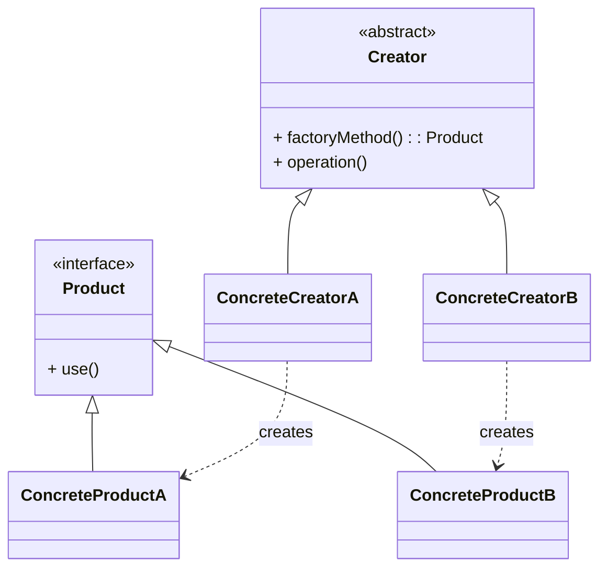

# 工厂方法模式（Factory Method）

> 所属分类：**创建型** 　|　 返回：[设计模式分类](../设计模式分类.md)


## 意图
定义一个创建对象的接口，让子类决定实例化哪一个类，使一个类的实例化延迟到其子类。

## 结构（类图）


## 示例代码
```java
interface Transport { void deliver(); }
class Truck implements Transport { public void deliver() { System.out.println("公路运输"); } }
class Ship implements Transport { public void deliver() { System.out.println("海运"); } }

abstract class Logistics {
    public abstract Transport createTransport();   // 工厂方法
    public void plan() { createTransport().deliver(); }
}
class RoadLogistics extends Logistics {
    public Transport createTransport() { return new Truck(); }
}
class SeaLogistics extends Logistics {
    public Transport createTransport() { return new Ship(); }
}
```

### 深挖：函数式写法（Java 8+，工厂即函数映射）

```java
// 「创建逻辑」本身就是策略：用 Map<String, Supplier<T>> 注册工厂方法
public class TransportFactory {
    private static final Map<String, Supplier<Transport>> REGISTRY = new HashMap<>();
    static {
        REGISTRY.put("road", Truck::new);
        REGISTRY.put("sea", Ship::new);
    }
    public static Transport create(String type) {
        return REGISTRY.getOrDefault(type, () -> { throw new IllegalArgumentException(type); }).get();
    }
}
```
> 对比：**简单工厂**是「集中 if/else」；**工厂方法**是「子类覆写」；**注册表 + Supplier** 是「运行时注册」——三者演进，注册表版最贴合 Spring 的 bean 工厂思想（按名称查工厂）。

## 适用场景
- 类无法预知它必须创建的对象的类。
- 希望将产品创建职责委托给子类，支持扩展新产品而不修改已有代码（符合开闭原则）。

## 与相似模式区别
- 与**抽象工厂**：工厂方法只创建**一种**产品；抽象工厂创建**一组相关产品（产品族）**。
- 与**简单工厂**：简单工厂用静态方法 + if/else 选择，不属于 GoF 23 种模式，扩展需改源码。

## 不适用场景（反例）

- 只有**一种实现**、未来也不会变化——直接 `new` 更简单，工厂是过度设计。
- 工厂里堆满 `if/else` 按类型分支——这是简单工厂写法，违反开闭原则，应升级为工厂方法或注册表。
- 产品种类繁多且无关——可能需要抽象工厂或 Builder 而非工厂方法。

## 在 JDK / Spring / 开源中的真实应用

- **JDK**：`Collection.iterator()` 是工厂方法（子类决定返回哪种 `Iterator`）；`URLStreamHandlerFactory.createURLStreamHandler`。
- **Spring**：`FactoryBean.getObject()` 生产复杂 bean；`SqlSessionFactory.openSession()`。
- **MyBatis**：`SqlSessionFactory` 用 `SqlSessionFactoryBuilder` 构建，再由其生产 `SqlSession`。
- **Netty**：`ChannelFactory`/`Bootstrap.channel()` 创建通道（Nio/Epoll 按平台选）。

## 实现要点与常见坑

- **与简单工厂混淆**：简单工厂用一个静态方法 + switch 决定产品，违背开闭（加产品要改代码）；工厂方法把决策下放给子类。
- **产品与工厂一一对应爆炸**：每加一个产品就要加一个工厂类，类数量膨胀。
- **忘记返回抽象类型**：工厂方法应返回产品接口/抽象类，调用方依赖抽象而非具体类。

## 生产实践与重构信号

1. **重构信号**：`switch (type) { case A: new A(); case B: new B(); }` 出现第二处 → 抽工厂方法；出现第三处 → 升级注册表/Spring 注入。
2. **配合依赖注入**：Spring 中把「工厂方法」写成 `@Bean` 方法，`@Qualifier` 按名取不同实现，替代手写工厂类。
3. **可测试性**：工厂方法返回抽象，单测可注入 mock 产品；这也是依赖倒置的落地。
4. **分层纪律**：工厂只负责「生产」，不负责「策略选择以外的业务」，别把业务逻辑塞进工厂。

## 面试高频追问（15+ 条）

1. Q：工厂方法 vs 简单工厂？ A：简单工厂集中判断、违反开闭；工厂方法把『实例化哪类』延迟到子类，符合开闭原则。
2. Q：JDK 里工厂方法的例子？ A：Collection.iterator()、Iterable 的实现各自决定 Iterator 类型。
3. Q：工厂方法解决了什么问题？ A：将对象创建与使用解耦，让子类决定实例化哪个类，消除对具体类的依赖。
4. Q：工厂方法与抽象工厂区别？ A：工厂方法产一个产品；抽象工厂产『产品族』（一组相关产品）。
5. Q：Spring 的 FactoryBean 是工厂方法吗？ A：FactoryBean.getObject() 即工厂方法思想，用于生产复杂/有状态的 bean。
6. Q：何时不该用工厂方法？ A：产品唯一且稳定、无需解耦创建与使用时，直接 new 更直接。
7. Q：工厂方法一定用继承吗？ A：不一定，可用注册表 + Supplier 函数式实现，Spring 的依赖注入就是它的变体。
8. Q：『开闭原则』在这里怎么体现？ A：新增产品只需新增子类/注册项，不改已有创建代码。
9. Q：简单工厂怎么演化成工厂方法？ A：把 if/else 分支拆成子类覆写 factoryMethod，判断逻辑上移给调用方。
10. Q：工厂方法能用在测试里吗？ A：能，用工厂返回 mock 产品，隔离依赖，配合依赖注入。
11. Q：工厂方法 vs 建造者？ A：工厂一步产出一个产品；建造者多步装配复杂对象。
12. Q：为什么不直接 new？ A：new 让调用方依赖具体类，改实现要改所有调用点；工厂收敛创建逻辑。
13. Q：产品与工厂数量膨胀怎么办？ A：用注册表/枚举 + 工厂函数映射，或 Spring 自动装配按类型注入。
14. Q：工厂方法返回什么类型？ A：返回产品接口/抽象类（依赖倒置），调用方不感知具体实现。
15. Q：JDBC 的 DriverManager 是什么模式？ A：注册表 + 工厂（registerDriver 注册，getConnection 按 URL 选驱动）。
