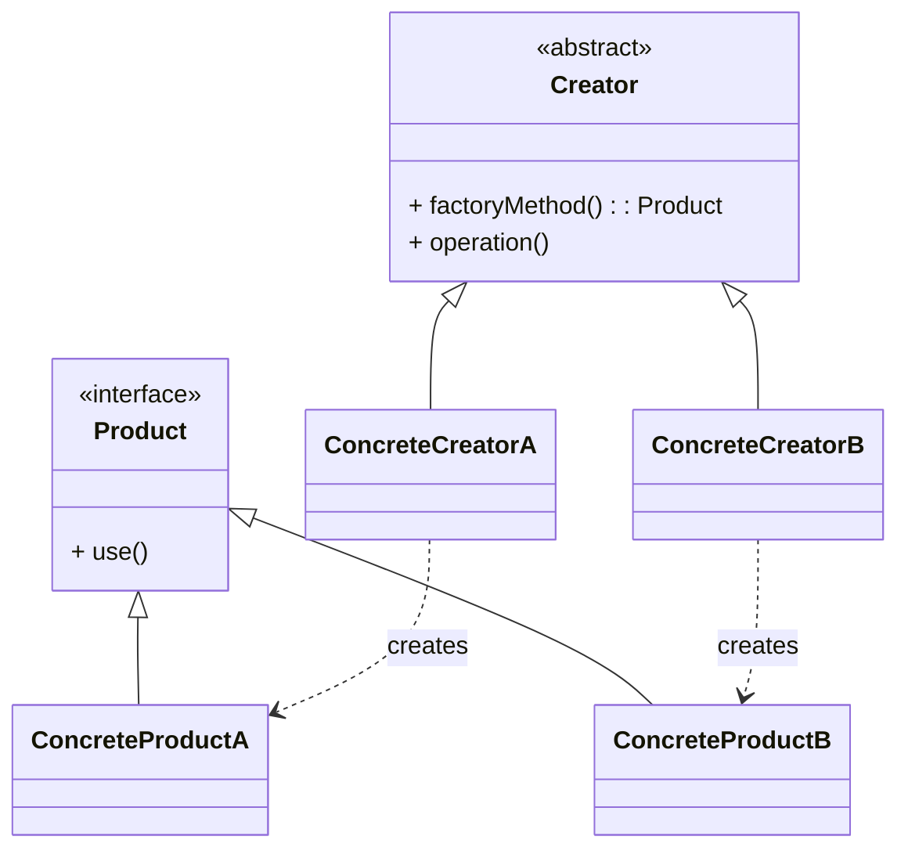

# 工厂方法模式（Factory Method）

> 所属分类：**创建型** 　|　 返回：[设计模式分类](../设计模式分类.md)


## 意图
定义一个创建对象的接口，让子类决定实例化哪一个类，使一个类的实例化延迟到其子类。

## 结构（类图）


## 示例代码
```java
interface Transport { void deliver(); }
class Truck implements Transport { public void deliver() { System.out.println("公路运输"); } }
class Ship implements Transport { public void deliver() { System.out.println("海运"); } }

abstract class Logistics {
    public abstract Transport createTransport();   // 工厂方法
    public void plan() { createTransport().deliver(); }
}
class RoadLogistics extends Logistics {
    public Transport createTransport() { return new Truck(); }
}
class SeaLogistics extends Logistics {
    public Transport createTransport() { return new Ship(); }
}
```

## 适用场景
- 类无法预知它必须创建的对象的类。
- 希望将产品创建职责委托给子类，支持扩展新产品而不修改已有代码（符合开闭原则）。

## 与相似模式区别
- 与**抽象工厂**：工厂方法只创建**一种**产品；抽象工厂创建**一组相关产品（产品族）**。
- 与**简单工厂**：简单工厂用静态方法 + if/else 选择，不属于 GoF 23 种模式，扩展需改源码。

## 不适用场景（反例）

- 只有**一种实现**、未来也不会变化——直接 `new` 更简单，工厂是过度设计。
- 工厂里堆满 `if/else` 按类型分支——这是简单工厂写法，违反开闭原则，应升级为工厂方法或注册表。
- 产品种类繁多且无关——可能需要抽象工厂或 Builder 而非工厂方法。

## 在 JDK / Spring / 开源中的真实应用

- **JDK**：`Collection.iterator()` 是工厂方法（子类决定返回哪种 `Iterator`）；`URLStreamHandlerFactory.createURLStreamHandler`。
- **Spring**：`FactoryBean.getObject()` 生产复杂 bean；`SqlSessionFactory.openSession()`。
- **MyBatis**：`SqlSessionFactory` 用 `SqlSessionFactoryBuilder` 构建，再由其生产 `SqlSession`。

## 实现要点与常见坑

- **与简单工厂混淆**：简单工厂用一个静态方法 + switch 决定产品，违背开闭（加产品要改代码）；工厂方法把决策下放给子类。
- **产品与工厂一一对应爆炸**：每加一个产品就要加一个工厂类，类数量膨胀。
- **忘记返回抽象类型**：工厂方法应返回产品接口/抽象类，调用方依赖抽象而非具体类。

## 面试高频追问

1. Q：工厂方法 vs 简单工厂？ A：简单工厂集中判断、违反开闭；工厂方法把『实例化哪类』延迟到子类，符合开闭原则。
2. Q：JDK 里工厂方法的例子？ A：Collection.iterator()、Iterable 的实现各自决定 Iterator 类型。
3. Q：工厂方法解决了什么问题？ A：将对象创建与使用解耦，让子类决定实例化哪个类，消除对具体类的依赖。
4. Q：工厂方法与抽象工厂区别？ A：工厂方法产一个产品；抽象工厂产『产品族』（一组相关产品）。
5. Q：Spring 的 FactoryBean 是工厂方法吗？ A：FactoryBean.getObject() 即工厂方法思想，用于生产复杂/有状态的 bean。
6. Q：何时不该用工厂方法？ A：产品唯一且稳定、无需解耦创建与使用时，直接 new 更直接。
