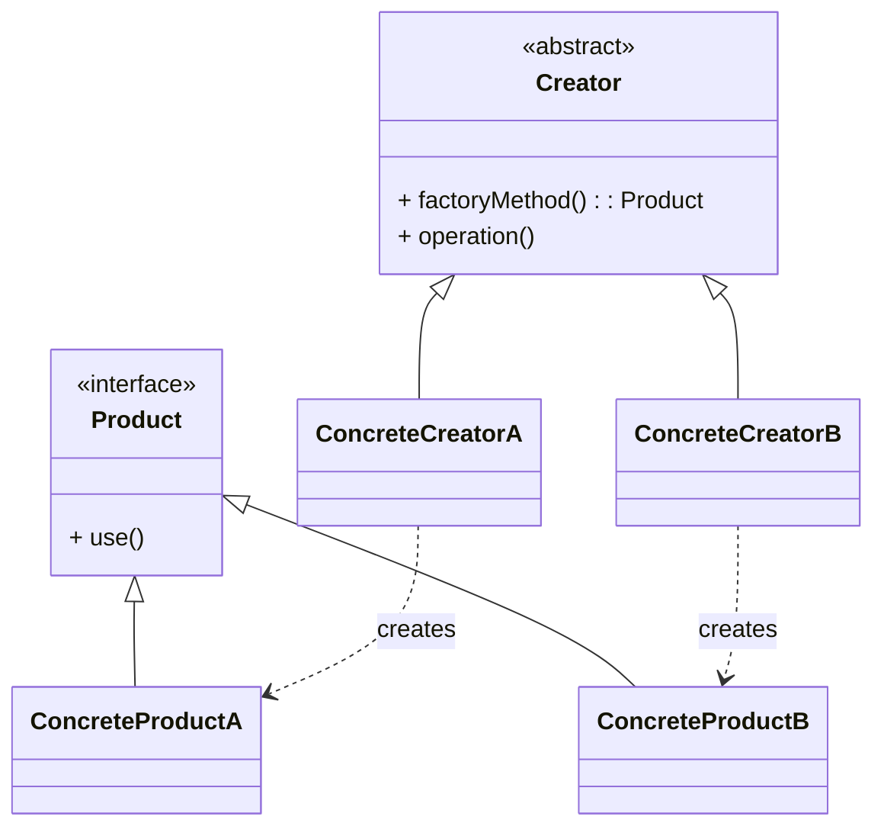

# 工厂方法模式（Factory Method）

> 所属分类：**创建型** 　|　 返回：[设计模式分类](../设计模式分类.md)


## 意图
定义一个创建对象的接口，让子类决定实例化哪一个类，使一个类的实例化延迟到其子类。

## 结构（类图）


## 示例代码
```java
interface Transport { void deliver(); }
class Truck implements Transport { public void deliver() { System.out.println("公路运输"); } }
class Ship implements Transport { public void deliver() { System.out.println("海运"); } }

abstract class Logistics {
    public abstract Transport createTransport();   // 工厂方法
    public void plan() { createTransport().deliver(); }
}
class RoadLogistics extends Logistics {
    public Transport createTransport() { return new Truck(); }
}
class SeaLogistics extends Logistics {
    public Transport createTransport() { return new Ship(); }
}
```

## 适用场景
- 类无法预知它必须创建的对象的类。
- 希望将产品创建职责委托给子类，支持扩展新产品而不修改已有代码（符合开闭原则）。

## 与相似模式区别
- 与**抽象工厂**：工厂方法只创建**一种**产品；抽象工厂创建**一组相关产品（产品族）**。
- 与**简单工厂**：简单工厂用静态方法 + if/else 选择，不属于 GoF 23 种模式，扩展需改源码。
