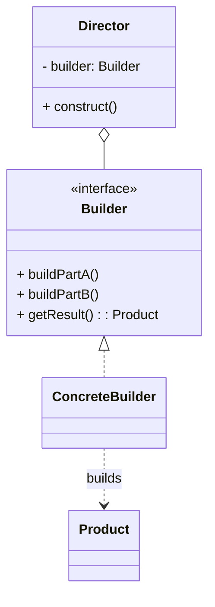

# 建造者模式（Builder）

> 所属分类：**创建型** 　|　 返回：[设计模式分类](../设计模式分类.md)


## 意图
将一个复杂对象的构建与其表示分离，使得同样的构建过程可以创建不同的表示。

## 结构（类图）


## 示例代码
```java
class Computer {
    private String cpu; private String ram; private String disk;
    // setter 省略
}
// 流式建造者（最常用写法，可省略 Director）
class ComputerBuilder {
    private Computer c = new Computer();
    public ComputerBuilder cpu(String cpu) { c.setCpu(cpu); return this; }
    public ComputerBuilder ram(String ram) { c.setRam(ram); return this; }
    public ComputerBuilder disk(String disk) { c.setDisk(disk); return this; }
    public Computer build() { return c; }
}
// 使用：Computer pc = new ComputerBuilder().cpu("i9").ram("32G").disk("1T").build();
```

## 适用场景
- 创建包含多个部件、且创建步骤/顺序易变的复杂对象（SQL 构造器、HTTP 请求构造器、文档生成器、Lombok `@Builder`）。
- 需要屏蔽客户端对内部装配细节的了解。

## 与相似模式区别
- 与**抽象工厂**：建造者侧重**分步构建单个复杂对象**；抽象工厂侧重**一次性获取一组配套产品**。
- 与**工厂方法**：工厂方法一步产出对象；建造者多步产出。

## 不适用场景（反例）

- 对象只有**两三个必填字段**、无可选参数——直接构造器或 setter 更省事。
- 为了"链式"而链式，但所有参数都必填且简单——徒增样板代码。
- 与**不可变对象**冲突时未冻结：若构建中途被并发修改，需保证 builder 线程安全或明确不支持并发构建。

## 在 JDK / Spring / 开源中的真实应用

- **JDK**：`StringBuilder`/`StringBuffer`（经典 builder）、`HttpClient.newBuilder()`、`ProcessBuilder`、`Locale.Builder`。
- **Guava**：`CacheBuilder.newBuilder()`。`Lombok`：`@Builder` 自动生成建造者。
- **Spring**：`BeanDefinitionBuilder`、`UriComponentsBuilder`。

## 实现要点与常见坑

- **必填项校验缺失**：应在 `build()` 中校验必填参数，否则运行期才暴露 NPE。
- **Builder 复用**：同一 builder 多次 `build()` 若字段可变会共享引用，建议 `build()` 后不再复用或返回全新对象。
- **与构造器重叠**：字段很多时 builder 很长，但仍优于「 telescoping constructor（重叠构造器）」地狱。
- **与不可变**：Builder 通常用于构造不可变对象（字段 final，build 时赋值）。

## 面试高频追问

1. Q：Builder 解决了什么痛点？ A：替代『重叠构造器』和『JavaBean  setters 导致的对象构造中间态不一致』，兼顾可读与不可变。
2. Q：Builder 与工厂方法区别？ A：Builder 专注『多参数、分步、可选』地构造复杂对象；工厂方法专注『决定实例化哪个子类』。
3. Q：为什么 build() 要做参数校验？ A：把不变量校验前置到构造完成点，避免拿到半成品对象。
4. Q：Lombok @Builder 原理？ A：编译期为类生成内部 Builder 类与全参构造器。
5. Q：StringBuilder 为什么快？ A：可变字符数组，避免 String 拼接产生大量中间对象。
6. Q：Builder 能构建不可变对象吗？ A：能，典型用法：字段 final，build() 一次性赋值，之后不可改。
