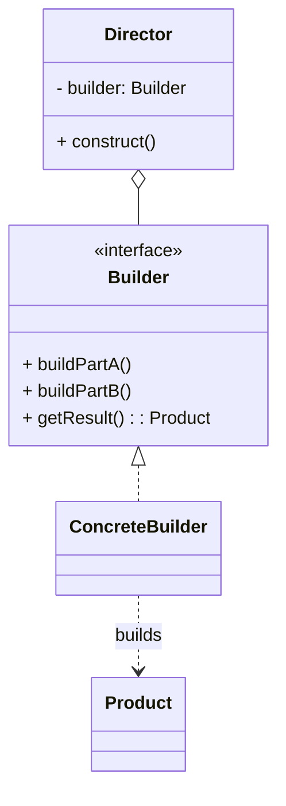

# 建造者模式（Builder）

> 所属分类：**创建型** 　|　 返回：[设计模式分类](../设计模式分类.md)


## 意图
将一个复杂对象的构建与其表示分离，使得同样的构建过程可以创建不同的表示。

## 结构（类图）


## 示例代码
```java
class Computer {
    private String cpu; private String ram; private String disk;
    // setter 省略
}
// 流式建造者（最常用写法，可省略 Director）
class ComputerBuilder {
    private Computer c = new Computer();
    public ComputerBuilder cpu(String cpu) { c.setCpu(cpu); return this; }
    public ComputerBuilder ram(String ram) { c.setRam(ram); return this; }
    public ComputerBuilder disk(String disk) { c.setDisk(disk); return this; }
    public Computer build() { return c; }
}
// 使用：Computer pc = new ComputerBuilder().cpu("i9").ram("32G").disk("1T").build();
```

## 适用场景
- 创建包含多个部件、且创建步骤/顺序易变的复杂对象（SQL 构造器、HTTP 请求构造器、文档生成器、Lombok `@Builder`）。
- 需要屏蔽客户端对内部装配细节的了解。

## 与相似模式区别
- 与**抽象工厂**：建造者侧重**分步构建单个复杂对象**；抽象工厂侧重**一次性获取一组配套产品**。
- 与**工厂方法**：工厂方法一步产出对象；建造者多步产出。
