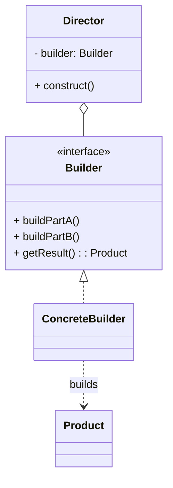

# 建造者模式（Builder）

> 所属分类：**创建型** 　|　 返回：[设计模式分类](../设计模式分类.md)

> **一句话定义**：将**复杂对象的构建**与其**表示**分离，使得同样的构建过程可以创建不同的表示。
> **英文**：Builder Pattern 　|　 **意图（GoF）**：Separate the construction of a complex object from its representation so that the same construction process can create different representations.

---

## 一、意图与解决的问题

当对象有很多字段（尤其**必填 + 大量可选**），常见写法有两大痛点：

1. **重叠构造器（telescoping constructor）**：`new Computer(cpu)` / `new Computer(cpu, ram)` / `new Computer(cpu, ram, disk)`… 参数组合指数膨胀，调用方极易传错顺序。
2. **JavaBean + setter**：字段分步 set，但对象在「构造完成前」处于**不一致的中间态**，且无法做成不可变对象，并发/复用场景有风险。

建造者用「流式 API 分步骤装配」，最后 `build()` 一次性产出**不可变、已校验、状态完整**的对象。

> 💡 核心思想：**把「怎么一步步拼」和「拼出来是什么」解耦**；同一个建造过程（同一套步骤）可产出不同表示（不同产品）。

---

## 二、结构（类图）



- **Builder（抽象）**：声明各 `buildPartX()` 与 `getResult()`。
- **ConcreteBuilder**：实现装配逻辑，持有最终产品。
- **Director（指挥者）**：编排 `build` 步骤的**顺序**（可选，流式建造者常省略它）。
- **Product**：被构建的复杂对象。

---

## 三、经典 Java 实现（流式建造者）

```java
class Computer {
    private String cpu; private String ram; private String disk;
    // setter 省略
}
// 流式建造者（最常用写法，可省略 Director）
class ComputerBuilder {
    private Computer c = new Computer();
    public ComputerBuilder cpu(String cpu) { c.setCpu(cpu); return this; }
    public ComputerBuilder ram(String ram) { c.setRam(ram); return this; }
    public ComputerBuilder disk(String disk) { c.setDisk(disk); return this; }
    public Computer build() { return c; }
}
// 使用：Computer pc = new ComputerBuilder().cpu("i9").ram("32G").disk("1T").build();
```

---

## 四、不可变对象 + build() 校验（工程级写法）

```java
// 目标对象不可变：字段 final，构造器包级私有
public final class HttpClientConfig {
    private final int connectTimeout;      // 毫秒
    private final int maxConnections;
    private final boolean retry;

    private HttpClientConfig(Builder b) {
        this.connectTimeout = b.connectTimeout;
        this.maxConnections = b.maxConnections;
        this.retry = b.retry;
    }

    public static final class Builder {
        private int connectTimeout = 3000;    // 默认值
        private int maxConnections = 100;
        private boolean retry = false;

        public Builder connectTimeout(int v) { connectTimeout = v; return this; }
        public Builder maxConnections(int v) { maxConnections = v; return this; }
        public Builder retry(boolean v) { retry = v; return this; }

        public HttpClientConfig build() {
            if (connectTimeout <= 0 || maxConnections <= 0)
                throw new IllegalArgumentException("非法配置参数");   // 不变量前置校验
            return new HttpClientConfig(this);
        }
    }
}
```

> 与「构造器 + setter」的区别：构造器参数顺序易错、必填可选项不清晰；setter 产生「中间态对象」（并发/复用场景有风险）；Builder 兼顾**不可变 + 可选参数 + 可读性 + 校验**。

---

## 五、与 Director 配合（固定装配流程）

```java
class MealDirector {
    public Meal constructBurger(MealBuilder b) {
        return b.addBun().addPatty().addSauce().build();  // 固定步骤顺序
    }
}
```

经典 GoF 写法保留 `Director`，把所有 `buildPart` 的**顺序**收敛到这里；现代流式 Builder 常把 `Director` 省略，由调用方链式决定顺序（更灵活）。**二者的取舍**：要强制固定流程用 Director，要灵活可选省略 Director。

---

## 六、其他语言实现

### Go（链式配置结构）

```go
type ServerConfig struct {
    Addr    string
    Timeout int
}
type Builder struct { cfg ServerConfig }
func (b *Builder) Addr(a string) *Builder { b.cfg.Addr = a; return b }
func (b *Builder) Timeout(t int) *Builder { b.cfg.Timeout = t; return b }
func (b *Builder) Build() ServerConfig { return b.cfg }
```

### Kotlin（原生 `apply` + 命名参数先天友好）

```kotlin
data class HttpClientConfig(val connectTimeout: Int = 3000, val maxConnections: Int = 100)
// Kotlin 命名参数 + 默认值已很大程度替代 Builder，但复杂构建仍可用 builder lambda
fun httpClient(block: HttpClientConfig.Builder.() -> Unit) = HttpClientConfig.Builder().apply(block).build()
```

---

## 七、适用场景

- 创建包含多个部件、且创建步骤/顺序易变的复杂对象（SQL 构造器、HTTP 请求构造器、文档生成器、Lombok `@Builder`）。
- 需要屏蔽客户端对内部装配细节的了解。
- 对象字段多、可选参数多，且希望产出**不可变对象**（build 后不可改）。

---

## 八、与相似模式区别

| 对比 | 建造者 | 抽象工厂 | 工厂方法 |
|------|--------|----------|----------|
| 产出 | 一个复杂对象的多种表示 | 一组配套产品 | 单一产品 |
| 关注 | 分步装配过程 | 产品族获取 | 决定实例化哪个子类 |
| 典型 API | 链式 `build()` | `createX()` 一组 | 单方法返回 |

- 与**抽象工厂**：建造者侧重**分步构建单个复杂对象**；抽象工厂侧重**一次性获取一组配套产品**。
- 与**工厂方法**：工厂方法一步产出对象；建造者多步产出。

---

## 九、不适用场景（反例）

- 对象只有**两三个必填字段**、无可选参数 → 直接构造器或 setter 更省事。
- 为了「链式」而链式，但所有参数都必填且简单 → 徒增样板代码。
- 与**不可变对象**冲突时未冻结：若构建中途被并发修改，需保证 builder 线程安全或明确不支持并发构建。

---

## 十、在 JDK / Spring / 开源中的真实应用

- **JDK**：`StringBuilder`/`StringBuffer`（经典 builder）、`HttpClient.newBuilder()`、`ProcessBuilder`、`Locale.Builder`。
- **Guava**：`CacheBuilder.newBuilder()`。`Lombok`：`@Builder` 自动生成建造者。
- **Spring**：`BeanDefinitionBuilder`、`UriComponentsBuilder`。
- **Netty**：`ServerBootstrap` 链式配置（group/channel/childHandler）。
- **MyBatis**：`SqlSessionFactoryBuilder` 用 `build(Configuration)` 产出工厂；`XMLConfigBuilder` 分步解析 XML 构建配置。

---

## 十一、实现要点与常见坑

1. **必填项校验缺失**：应在 `build()` 中校验必填参数，否则运行期才暴露 NPE。
2. **Builder 复用**：同一 builder 多次 `build()` 若字段可变会共享引用，建议 `build()` 后不再复用或返回全新对象。
3. **与构造器重叠**：字段很多时 builder 很长，但仍优于「telescoping constructor（重叠构造器）」地狱。
4. **与不可变**：Builder 通常用于构造不可变对象（字段 final，build 时赋值）。

---

## 十二、生产实践与重构信号

1. **重构信号**：构造器参数 ≥5 个或出现多个重载构造器（telescoping）→ 换 Builder；字段还在涨 → 反思聚合设计。
2. **默认值语义**：builder 字段给默认值，`build()` 校验——「可选参数 + 安全默认」是配置类标准做法。
3. **与 Lombok**：`@Builder` 生成静态内部 Builder；注意其 `build()` 无校验钩子，复杂校验仍需手写。
4. **Java 记录（record）**：record + 私有构造器 + 静态 builder 是 JDK17+ 的现代化写法。
5. **线程安全**：builder 不应跨线程共享；每个线程各自 builder。

---

## 十三、反模式案例

### 案例：Builder 做成了可变共享

```java
Builder b = new Builder().cpu("i9").ram("32G");
Computer c1 = b.build();
b.ram("64G");           // 复用 builder 改字段
Computer c2 = b.build(); // 若 build() 共享内部引用，c1 可能被影响
```

**修正**：`build()` 返回**全新 Product**（从 builder 拷贝值），且不在 build 后复用 builder，或让 builder 明确不支持并发/复用修改。

---

## 十四、面试高频追问（20+ 条）

1. Q：Builder 解决了什么痛点？ A：替代「重叠构造器」和「JavaBean setters 导致的对象构造中间态不一致」，兼顾可读与不可变。
2. Q：Builder 与工厂方法区别？ A：Builder 专注「多参数、分步、可选」地构造复杂对象；工厂方法专注「决定实例化哪个子类」。
3. Q：为什么 build() 要做参数校验？ A：把不变量校验前置到构造完成点，避免拿到半成品对象。
4. Q：Lombok @Builder 原理？ A：编译期为类生成内部 Builder 类与全参构造器。
5. Q：StringBuilder 为什么快？ A：可变字符数组，避免 String 拼接产生大量中间对象。
6. Q：Builder 能构建不可变对象吗？ A：能，典型用法：字段 final，build() 一次性赋值，之后不可改。
7. Q：Builder 与抽象工厂区别？ A：抽象工厂「一次给一组配套产品」；Builder「一步步装配一个复杂对象」。
8. Q：什么时候不该用 Builder？ A：字段少且必填，直接构造器更简单；为链式而链式是过度设计。
9. Q：Builder 的线程安全性？ A：非线程安全；不应跨线程共享 builder 实例。
10. Q：build() 里校验失败怎么办？ A：抛 IllegalArgumentException，把「不变量」控制在对象出生时刻。
11. Q：JDK 哪些类用了 Builder？ A：HttpClient、ProcessBuilder、StringBuilder、Locale.Builder 等。
12. Q：Builder 支持分层构建吗？ A：支持：步骤序列可复用（Director 或模板方法编排 build 步骤）。
13. Q：Builder vs 构造器重载？ A：重载随参数数量组合爆炸且难读；Builder 每个参数语义清晰。
14. Q：record + Builder 怎么组合？ A：record 提供紧凑数据类，静态 Builder 提供可选参数构建。
15. Q：Builder 与「对象池」冲突吗？ A：冲突，对象池要求对象可复用可变；Builder 面向不可变，二选一。
16. Q：为什么流式 Builder 常省略 Director？ A：链式调用已隐含步骤顺序，省去 Director 更灵活；需强制固定流程才保留 Director。
17. Q：Builder 和 DTO 构造？ A：请求/配置 DTO 字段多时，Builder 比全参构造器可读性高得多，是主流写法。
18. Q：Go 里如何实现 Builder？ A：用返回 `*Builder` 的链式方法累积配置，`Build()` 返回最终 struct。
19. Q：Builder 可以返回不同子类吗？ A：可以——多态 Builder（抽象 Builder 的不同实现产出不同 Product 子类），这正是 GoF 的「不同表示」。
20. Q：Builder 与 Adapter 会被混淆吗？ A：不会，Builder 是创建型（造对象），Adapter 是结构型（改接口），职责完全不同。

---

## 十五、速记口诀（Summary）

> **复杂对象分步装，链式返回自身样。**
> **build 校验防半成，final 字段可不变。**
> **重叠构造参数炸，setter 中间态危险。**
> **Lombok 一键生成，配置类里最常见。**

---

## 十六、关联阅读

- 创建型：[工厂方法模式](工厂方法模式.md) · [抽象工厂模式](抽象工厂模式.md) · [原型模式](原型模式.md)
- 相关机制：[基础知识/并发编程](../基础知识/并发编程.md)（不可变对象与线程安全）
- 框架实践：Lombok `@Builder`、Spring `UriComponentsBuilder`、Netty `ServerBootstrap`
