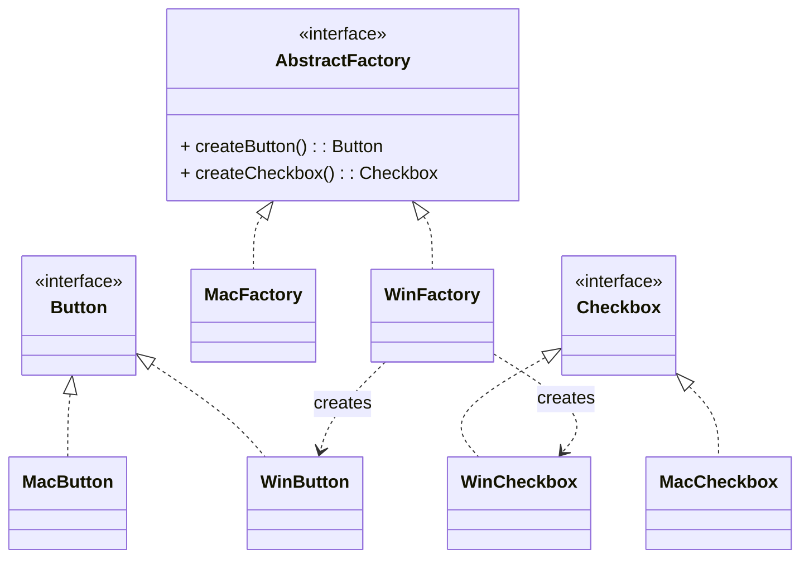

# 抽象工厂模式（Abstract Factory）

> 所属分类：**创建型** 　|　 返回：[设计模式分类](../设计模式分类.md)


## 意图
提供一个创建一系列相关或相互依赖对象的接口，而无需指定它们具体的类。

## 结构（类图）


## 示例代码
```java
interface GUIFactory {
    Button createButton();
    Checkbox createCheckbox();
}
class WinFactory implements GUIFactory {
    public Button createButton() { return new WinButton(); }
    public Checkbox createCheckbox() { return new WinCheckbox(); }
}
class MacFactory implements GUIFactory {
    public Button createButton() { return new MacButton(); }
    public Checkbox createCheckbox() { return new MacCheckbox(); }
}
// 客户端只依赖 GUIFactory 与 Button/Checkbox 抽象
```

## 适用场景
- 系统要独立于产品创建、组合方式。
- 强调**产品之间必须配套使用**（同一风格 UI、同一数据库驱动族）。

## 与相似模式区别
- 与**工厂方法**：抽象工厂通常**组合多个工厂方法**，产出一组产品；工厂方法只产出一个。
- 与**建造者**：抽象工厂关注"生产什么产品"，建造者关注"如何一步步装配一个复杂产品"。
