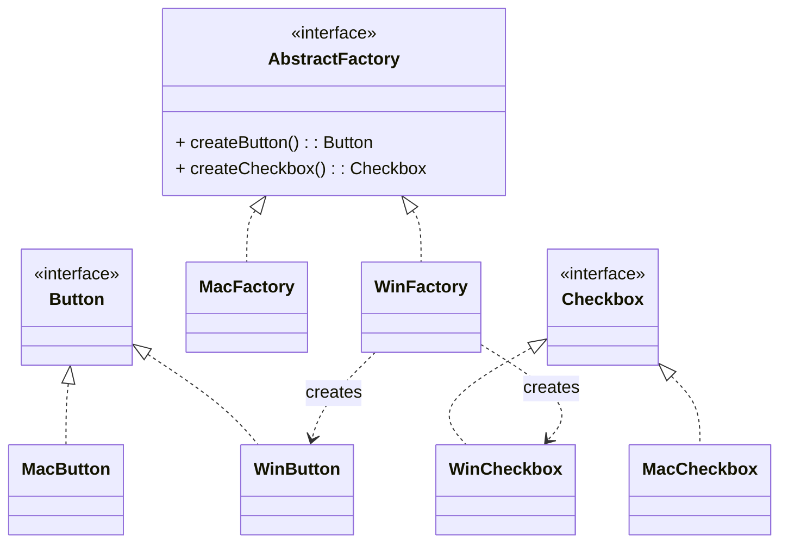
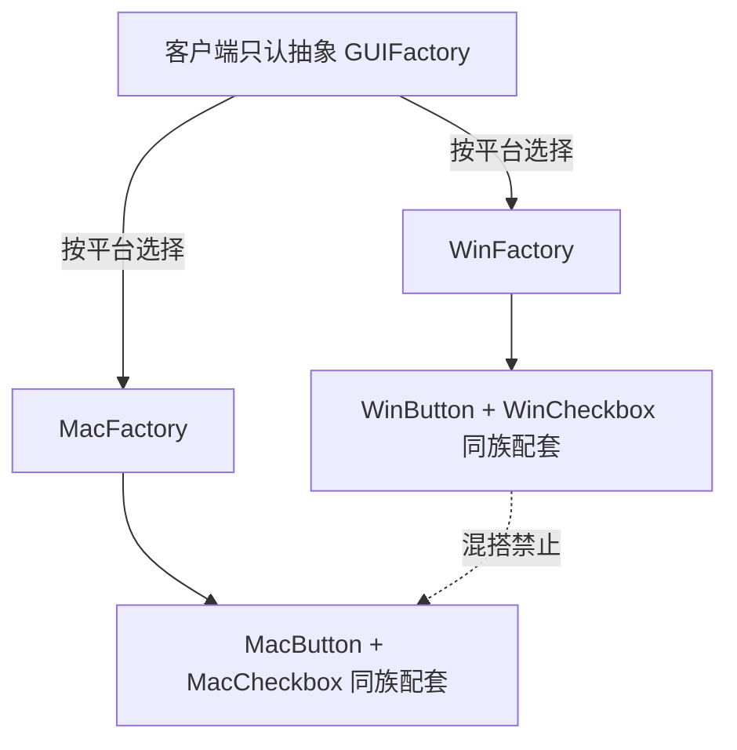

# 抽象工厂模式（Abstract Factory）

> 所属分类：**创建型** 　|　 返回：[设计模式分类](../设计模式分类.md)

> **一句话定义**：提供一个创建**一系列相关或相互依赖对象**的接口，而无需指定它们具体的类。
> **英文**：Abstract Factory Pattern 　|　 **意图（GoF）**：Provide an interface for creating families of related or dependent objects without specifying their concrete classes.

---

## 一、意图与解决的问题

当系统需要**一组互相配套的产品**时（如跨平台 UI 的按钮+复选框、跨数据库的 Connection+Statement、跨云厂商的存储+计算 SDK），核心痛点是：

1. **产品族一致性**：同一套产品必须「同族配套」，不能出现「Windows 按钮 + Mac 复选框」的混搭 Bug。
2. **客户端与具体类解耦**：业务代码只依赖抽象工厂与抽象产品，切换整套实现时无需改业务。
3. **约束由工厂保证**：工厂负责保证产出的产品彼此兼容——这个「约束」不该散落在业务代码里。

> 💡 **核心思想**：工厂方法解决「**一个产品**由谁创建」，抽象工厂解决「**一组产品**如何配套创建」。

---

## 二、结构（类图）



- **AbstractFactory**：声明一组「创建产品」的方法（每种产品一个工厂方法）。
- **ConcreteFactory（Win/Mac）**：实现这些方法，返回**同族**的具体产品。
- **AbstractProduct（Button/Checkbox）**：每种产品的抽象。
- **ConcreteProduct（Win/Mac 各产品）**：同族产品保证行为兼容。

---

## 三、经典 Java 实现

```java
interface GUIFactory {
    Button createButton();
    Checkbox createCheckbox();
}
class WinFactory implements GUIFactory {
    public Button createButton() { return new WinButton(); }
    public Checkbox createCheckbox() { return new WinCheckbox(); }
}
class MacFactory implements GUIFactory {
    public Button createButton() { return new MacButton(); }
    public Checkbox createCheckbox() { return new MacCheckbox(); }
}
// 客户端只依赖 GUIFactory 与 Button/Checkbox 抽象
class Application {
    private final GUIFactory factory;
    Application(GUIFactory f) { this.factory = f; }
    void render() {
        Button b = factory.createButton();
        Checkbox c = factory.createCheckbox();
        b.paint(); c.paint();
    }
}
```

客户端构造时选定一个工厂（如 `new Application(new MacFactory())`），之后所有产品都来自同族，杜绝混搭。

---

## 四、产品族一致性——「不要混搭」的工程约束



- 抽象工厂的核心价值是**保证产品族配套**：同一工厂产出的按钮与复选框风格一致、行为兼容。
- 反面教训：客户端分别从两个工厂取产品 → 出现「Windows 按钮 + Mac 复选框」的混搭 Bug，且难以定位。
- 工程做法：把「选哪个工厂」收敛到**唯一入口**（配置中心 / 平台判断 / Spring `@Qualifier`），禁止业务代码自选工厂。

---

## 五、Go 实现示例（返回接口族）

```go
package factory

type Button interface{ Paint() string }
type Checkbox interface{ Paint() string }

type WinButton struct{}
func (WinButton) Paint() string { return "WinButton" }
type MacButton struct{}
func (MacButton) Paint() string { return "MacButton" }

type GUIFactory interface {
    CreateButton() Button
    CreateCheckbox() Checkbox
}
type WinFactory struct{}
func (WinFactory) CreateButton() Button  { return WinButton{} }
func (WinFactory) CreateCheckbox() Checkbox { return WinCheckbox{} }
```

Go 中同样通过返回接口来隐藏具体类型，调用方只持有 `GUIFactory`。

---

## 六、产品族 vs 产品等级（必考题）

这是理解抽象工厂的关键二维模型：

| 维度 | 含义 | 例子 |
|------|------|------|
| **产品族（Family）** | 互相关联、需配套使用的一组产品 | Windows 整套 UI（WinButton+WinCheckbox）；AWS 全套 SDK |
| **产品等级（Level）** | 同类产品的不同实现 | Button 的 Win/Mac 两种实现 |

- 抽象工厂擅长：**产品族稳定、产品等级易变**（加一套新平台/新云厂商只需加一个 ConcreteFactory）。
- 抽象工厂短板：**产品等级稳定、产品种类易变**——每加一种产品（如 `createSlider()`）要改所有工厂接口，违反开闭。

> 决策口诀：**横扩族（新平台）用抽象工厂；纵加类（新产品种类）用工厂方法 + 注册表**。

---

## 七、适用场景

- 系统要独立于产品创建、组合方式。
- 强调**产品之间必须配套使用**（同一风格 UI、同一数据库驱动族、同一云厂商 SDK 族）。
- 需要运行时切换一整套实现（如测试用内存版、生产用真实版；或按租户切换存储方案）。

---

## 八、与相似模式区别

| 对比 | 抽象工厂 | 工厂方法 | 建造者 |
|------|----------|----------|--------|
| 产出 | 一组产品（产品族） | 单一产品 | 分步装配单个复杂对象 |
| 内部实现 | 通常组合多个工厂方法 | 单一工厂方法 | 不使用工厂方法 |
| 创建决定权 | 具体工厂对象 | 子类 | 调用方逐步配置 |

- 与**工厂方法**：抽象工厂通常**组合多个工厂方法**，产出一组产品；工厂方法只产出一个。
- 与**建造者**：抽象工厂关注「生产什么产品（一组）」，建造者关注「如何一步步装配一个复杂产品」。

---

## 九、不适用场景（反例）

- 只生产**单一产品**（无产品族）→ 用工厂方法即可，抽象工厂是杀鸡用牛刀。
- 产品等级**极不稳定**、频繁新增产品种类 → 每加一种产品要改所有工厂接口，违背开闭（这是抽象工厂的结构性短板）。
- 产品间**无约束关系**（如颜色与形状无关）→ 强行抽象工厂反而制造虚假耦合。

---

## 十、在 JDK / Spring / 开源中的真实应用

- **JDK**：`DocumentBuilderFactory.newInstance()` 返回具体工厂，再产 `DocumentBuilder`/`Document`（XML 解析产品族）；`TransformerFactory`。
- **JDBC**：`Connection` 是工厂，产 `Statement`/`PreparedStatement`/`CallableStatement`（同族 SQL 执行对象）——业务代码只见 `java.sql` 接口。
- **Spring**：`ListableBeanFactory` 体系按环境产出一致的一组 bean 定义/实例；`@Configuration` 配合 `@Profile` 可切换整族 bean。
- **MyBatis**：`Environment`（数据源 + 事务工厂）是一个产品族；`Configuration` 内各类工厂配套。
- **云厂商 SDK**：AWS/GCP/Azure 各自提供一套「存储+计算+消息」SDK 族，业务层依赖抽象接口、运行时注入具体云工厂，是抽象工厂的典型落地。

---

## 十一、实现要点与常见坑

1. **产品族扩展困难**：新增一种产品（如加 `UpdateCommand`）要让所有具体工厂都实现它，破坏开闭原则。缓解：用反射/配置动态加载产品，或在工厂内用注册表。
2. **与工厂方法混用**：抽象工厂内部通常用工厂方法实现每个产品的创建（二者是合作关系，不是替代）。
3. **产品兼容性依赖约定**：工厂负责保证同一工厂产出的产品「互相适配」，调用方不应混用不同工厂的产品。
4. **接口膨胀**：产品种类多时，抽象工厂接口会变长；可按产品族拆分多个小工厂接口（接口隔离）。

---

## 十二、生产实践与重构信号

1. **适用模板**：「跨环境/跨平台一套配套实现」——云厂商 SDK 抽象、多租户存储方案、多支付渠道（渠道各自提供订单/退款/对账一族能力）。
2. **重构信号**：出现 `if (platform == A) { aButton + aCheckbox } else { bButton + bCheckbox }` 成对散落 → 抽抽象工厂。
3. **结合 Spring**：把具体工厂注册为 `@Bean`，`@Qualifier`/`@Primary` 决定用哪族，天然实现「客户端只依赖抽象」。
4. **演进路径**：产品族稳定、产品等级常变 → 抽象工厂合适；产品等级稳定、产品族常变 → 工厂方法 + 注册表更优。
5. **测试替身**：用抽象工厂注入内存版产品族（如 `InMemoryDbFactory`），可对整个业务层做无外部依赖的集成测试。

---

## 十三、反模式案例

### 案例：业务代码自选产品导致混搭

```java
// 反模式：从两个工厂各取一个，破坏配套约束
Button b = new WinFactory().createButton();
Checkbox c = new MacFactory().createCheckbox();  // 混搭！风格/行为不兼容
```

**修正**：工厂由统一入口选定并注入，业务层只持有 `GUIFactory`，所有产品都来自同一实例。

---

## 十四、面试高频追问（20+ 条）

1. Q：抽象工厂 vs 工厂方法？ A：抽象工厂产出「相互关联的产品族」，工厂方法产出单一产品并延迟给子类。
2. Q：抽象工厂的缺点？ A：新增产品种类需改所有工厂接口，违反开闭原则；适合产品族稳定、产品等级易变的场景。
3. Q：JDK 中抽象工厂例子？ A：DocumentBuilderFactory 产出一组 XML 解析相关对象。
4. Q：什么场景用抽象工厂？ A：需要保证一组产品彼此兼容（如跨数据库、跨 OS 的 UI 套件）。
5. Q：抽象工厂内部如何创建产品？ A：通常由每个具体工厂用工厂方法实现具体产品的创建。
6. Q：如何缓解抽象工厂「加产品难」？ A：用反射/配置文件动态加载产品，或在工厂内用注册表避免改接口。
7. Q：产品族与产品等级是什么？ A：产品族=互相配套的一组（如 Windows 整套 UI）；产品等级=同类产品不同实现（Button 的 Win/Mac）。
8. Q：抽象工厂一定优于工厂方法吗？ A：不一定；无产品族时用工厂方法更轻，抽象工厂增加接口数量与耦合。
9. Q：JDBC 怎么体现抽象工厂？ A：Connection 按驱动返回对应 Statement 实现族，业务代码只见 java.sql 接口。
10. Q：抽象工厂与「配置驱动」关系？ A：选择具体工厂常由配置/环境决定，配合 Spring Profile 或配置中心切换。
11. Q：能混用两个工厂的产品吗？ A：不能，破坏配套一致性；应由唯一入口选工厂。
12. Q：抽象工厂怎么测？ A：注入 mock 工厂族，验证「客户端只依赖抽象」的契约。
13. Q：与建造者的分工？ A：抽象工厂说「造哪一组」，建造者说「一个复杂对象怎么一步步造」。
14. Q：Spring 里怎么实现抽象工厂？ A：每族一个 @Configuration + @Bean 工厂方法，@Qualifier 选择族。
15. Q：抽象工厂在分布式/多租户里？ A：租户级存储/渠道适配（每租户一族实现），由租户上下文选工厂。
16. Q：抽象工厂和依赖注入关系？ A：DI 容器天然是「工厂的工厂」；抽象工厂接口可注册为 bean，运行时按条件注入具体族。
17. Q：产品族很多时接口很胖怎么办？ A：按产品族拆成多个小工厂接口（接口隔离原则），或改用注册表按需获取。
18. Q：抽象工厂适合微服务吗？ A：适合「多实现可替换」的组件（如多支付/多存储适配层）；不适合跨服务的远程调用编排。
19. Q：抽象工厂能返回单例吗？ A：能，具体工厂内部可缓存产品实例（如连接池），把"创建"与"复用"结合。
20. Q：Go/Python 里抽象工厂怎么写？ A：Go 用接口返回产品族、用 struct 实现工厂；Python 用 ABC 定义抽象工厂与产品。

---

## 十五、速记口诀（Summary）

> **一组产品一工厂，族内配套不可乱。**
> **横扩新平台加厂，纵加新产品犯难。**
> **JDBC与XML工厂，接口背后藏实现。**
> **唯一入口选工厂，业务只认抽象面。**

---

## 十六、关联阅读

- 创建型：[工厂方法模式](工厂方法模式.md) · [建造者模式](建造者模式.md) · [单例模式](单例模式.md)
- 行为型：[策略模式](../行为型/策略模式.md)（常与抽象工厂配合切换整族行为）
- 框架实践：Spring `@Configuration` + `@Profile` 实现产品族切换
