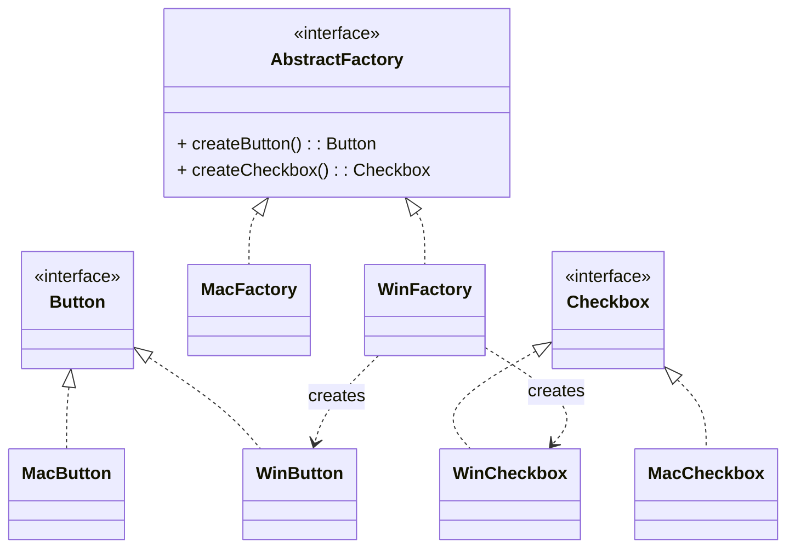

# 抽象工厂模式（Abstract Factory）

> 所属分类：**创建型** 　|　 返回：[设计模式分类](../设计模式分类.md)


## 意图
提供一个创建一系列相关或相互依赖对象的接口，而无需指定它们具体的类。

## 结构（类图）


## 示例代码
```java
interface GUIFactory {
    Button createButton();
    Checkbox createCheckbox();
}
class WinFactory implements GUIFactory {
    public Button createButton() { return new WinButton(); }
    public Checkbox createCheckbox() { return new WinCheckbox(); }
}
class MacFactory implements GUIFactory {
    public Button createButton() { return new MacButton(); }
    public Checkbox createCheckbox() { return new MacCheckbox(); }
}
// 客户端只依赖 GUIFactory 与 Button/Checkbox 抽象
```

## 适用场景
- 系统要独立于产品创建、组合方式。
- 强调**产品之间必须配套使用**（同一风格 UI、同一数据库驱动族）。

## 与相似模式区别
- 与**工厂方法**：抽象工厂通常**组合多个工厂方法**，产出一组产品；工厂方法只产出一个。
- 与**建造者**：抽象工厂关注"生产什么产品"，建造者关注"如何一步步装配一个复杂产品"。

## 不适用场景（反例）

- 只生产**单一产品**（无产品族）——用工厂方法即可，抽象工厂是杀鸡用牛刀。
- 产品等级**极不稳定**、频繁新增产品种类——每加一种产品要改所有工厂接口，违背开闭（这是抽象工厂的结构性短板）。
- 产品间**无约束关系**（如颜色与形状无关）——强行抽象工厂反而制造虚假耦合。

## 在 JDK / Spring / 开源中的真实应用

- **JDK**：`DocumentBuilderFactory.newInstance()` 返回具体工厂，再产 `DocumentBuilder`/`Document`（ XML 解析产品族）；`TransformerFactory`。
- **JDBC**：`Connection` 是工厂，产 `Statement`/`PreparedStatement`/`CallableStatement`（同族 SQL 执行对象）。
- **Spring**：`ListableBeanFactory` 体系按环境产出一致的一组 bean 定义/实例。

## 实现要点与常见坑

- **产品族扩展困难**：新增一种产品（如加 `UpdateCommand`）要让所有具体工厂都实现它，破坏开闭原则。
- **与工厂方法混用**：抽象工厂内部通常用工厂方法实现每个产品的创建。
- **产品兼容性依赖约定**：工厂负责保证同一工厂产出的产品『互相适配』，调用方不应混用不同工厂的产品。

## 面试高频追问

1. Q：抽象工厂 vs 工厂方法？ A：抽象工厂产出『相互关联的产品族』，工厂方法产出单一产品并延迟给子类。
2. Q：抽象工厂的缺点？ A：新增产品种类需改所有工厂接口，违反开闭原则；适合产品族稳定、产品等级易变的场景。
3. Q：JDK 中抽象工厂例子？ A：DocumentBuilderFactory 产出一组 XML 解析相关对象。
4. Q：什么场景用抽象工厂？ A：需要保证一组产品彼此兼容（如跨数据库、跨 OS 的 UI 套件）。
5. Q：抽象工厂内部如何创建产品？ A：通常由每个具体工厂用工厂方法实现具体产品的创建。
6. Q：如何缓解抽象工厂『加产品难』？ A：用反射/配置文件动态加载产品，或在工厂内用注册表避免改接口。
