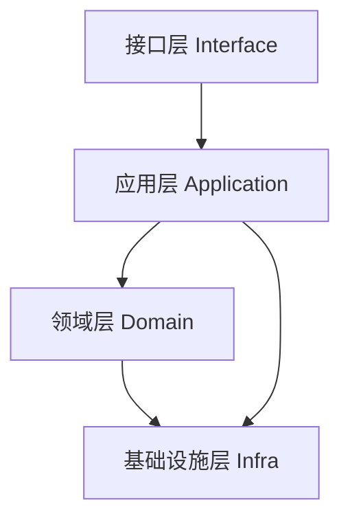
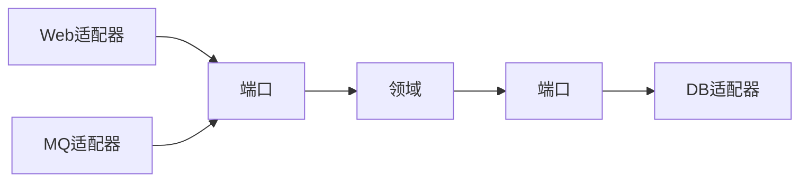

# 架构型模式与 DDD 结合实战

> 设计模式不只用于类级别，架构级也有"模式"。将架构模式（分层、六边形、整洁、CQRS、事件驱动）与 DDD 战术模式结合，能构建可演进、可测试的复杂业务系统。本文讲清结合方式。

## 1. 从类模式到架构模式

| 层级 | 模式 |
| --- | --- |
| 类/对象 | GoF 23 种 |
| 模块 | 分层、模块化 |
| 架构 | 六边形、整洁、CQRS、事件驱动 |

架构模式约束"代码如何分层与依赖"，DDD 提供"领域建模语言"，两者互补。

## 2. 分层架构 + DDD

经典四层：

- 领域层：实体、值对象、领域服务、仓储接口（不依赖实现）。
- 应用层：用例编排，事务边界，无业务规则。
- 基础设施层：实现仓储、消息、外部调用。

依赖方向：内层不依赖外层（依赖倒置）。

## 3. 六边形（端口适配器）

- 领域在中心，端口（Port）定义契约，适配器（Adapter）接外部。
- 数据库、Web、消息都是适配器，领域不感知。

## 4. 整洁架构（Clean）

同心圆：实体→用例→接口适配器→框架。依赖指向圆心。

- 业务规则不依赖框架、数据库、UI。
- 测试时可用内存实现替换基础设施。

## 5. DDD 战术模式落地

| 模式 | 在架构中的位置 |
| --- | --- |
| 实体/值对象 | 领域层核心 |
| 聚合根 | 一致性边界，仓储按聚合 root |
| 领域服务 | 跨实体逻辑 |
| 领域事件 | 跨聚合/跨服务通知 |
| 仓储接口 | 领域层定义，基础设施实现 |
| 工厂 | 复杂对象创建 |

## 6. CQRS + DDD

- 写侧：聚合处理命令，保证不变量。
- 读侧：投影生成查询模型。
- 领域事件驱动读模型更新（最终一致）。

## 7. 事件驱动 + DDD

- 聚合产生领域事件（如 `OrderPaid`）。
- 事件发布到总线，触发其他上下文（库存、通知）。
- 限界上下文通过事件解耦（上下文映射之"发布-订阅"）。

## 8. 反模式

| 反模式 | 现象 | 对策 |
| --- | --- | --- |
| 贫血模型 | Entity 只有 getter/setter | 行为进领域 |
| 上帝服务 | 应用层写满业务 | 下沉领域 |
| 仓储泄露 | 应用层拼 SQL | 领域定接口 |
| 依赖外泄 | 领域依赖框架 | 依赖倒置 |

## 9. 落地节奏

1. 事件风暴识别限界上下文与聚合。
2. 选架构模式（六边形/整洁）。
3. 实现领域层（实体/值/聚合/领域事件）。
4. 基础设施实现仓储与端口。
5. 应用层编排用例，接入 CQRS/事件。

## 10. 面试题

1. 六边形架构的核心思想？
2. 整洁架构依赖方向？
3. DDD 贫血模型是什么？
4. 仓储接口为何定义在领域层？
5. CQRS 与 DDD 如何结合？

## 11. 小结

架构模式管"结构与依赖"，DDD 管"领域建模"，二者结合能支撑复杂业务演进。核心是依赖倒置、领域为中心、端口隔离外部、事件驱动解耦上下文。避免贫血模型与上帝服务是关键。
