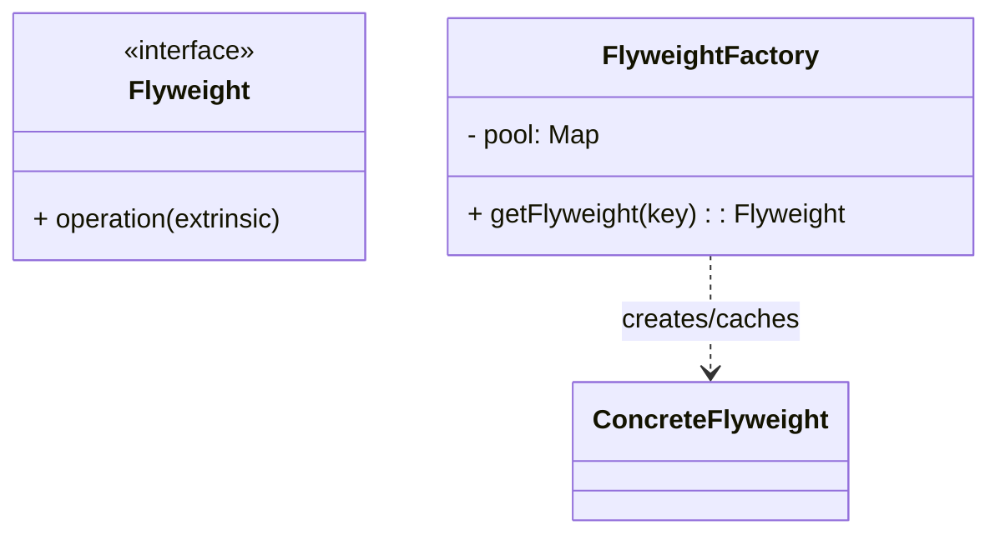

# 享元模式（Flyweight）

> 所属分类：**结构型** 　|　 返回：[设计模式分类](../设计模式分类.md)


## 意图
运用共享技术有效地支持大量细粒度对象的复用，从而节约内存。

## 结构（类图）


## 示例代码
```java
class TreeType {                 // 内部状态（可共享，不随场景变化）
    String name, color;
    void draw(int x, int y) { /* 使用 x,y 外部状态 */ }
}
class TreeFactory {
    private static Map<String, TreeType> pool = new HashMap<>();
    static TreeType get(String name, String color) {
        return pool.computeIfAbsent(name + color, k -> new TreeType(name, color));
    }
}
```

## 适用场景
- 存在大量相似对象、且对象可拆分为**内部状态（共享）**与**外部状态（不共享）**。
- 如字符渲染、游戏粒子、连接池、线程池。

## 与相似模式区别
- 与**单例**：享元是**多个可共享实例的池**；单例是**唯一实例**。
- 与**对象池**：思想相通；对象池强调"借还"生命周期管理，享元强调"按 key 复用"。

---

## 不适用场景（反例）

- 对象**很小、数量不多**——享元的状态管理与工厂维护成本高于收益。
- 对象**几乎全是有状态且各不相同**——可共享的内部状态极少，享元无意义。
- 共享可变状态——若享元对象被多线程修改且未隔离，会造成数据错乱。

## 在 JDK / Spring / 开源中的真实应用

- **JDK**：`String` 常量池；`Integer.valueOf(-128~127)` 缓存；`Boolean`/`Byte` 缓存；线程池复用 `Worker` 线程。
- **实战**：文本编辑器字符样式对象池、棋盘棋子、连接池（连接是可变享元，需配合状态复位）。

## 实现要点与常见坑

- **区分内/外部状态**：内部状态（可共享，如字符编码）放入享元；外部状态（如字符位置）由调用方传入。
- **线程安全**：共享享元若有可变内部状态，需同步或改为不可变。
- **池化 ≠ 纯享元**：对象池（连接池）借出/归还需重置状态，否则串数据。

## 面试高频追问

1. Q：享元解决了什么？ A：通过共享大量细粒度对象减少内存占用，核心是复用『内部状态』。
2. Q：内部状态与外部状态？ A：内部状态可共享、与上下文无关；外部状态随场景变化、由客户端传入。
3. Q：JDK 中享元例子？ A：String 常量池、Integer 缓存、线程池。
4. Q：享元与对象池区别？ A：享元强调『不可变共享』；对象池强调『可借还复用』且需重置可变状态。
5. Q：什么时候不该用享元？ A：对象数量少或几乎不可共享时，维护成本不划算。
6. Q：享元如何保证线程安全？ A：让享元不可变，或仅共享无状态部分。
