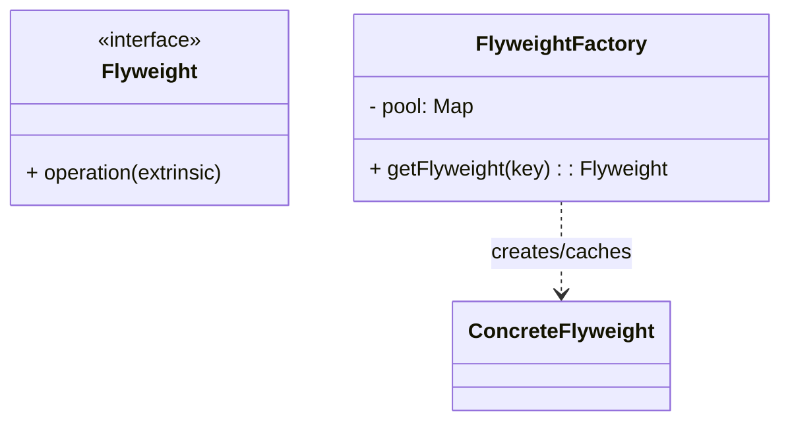

# 享元模式（Flyweight）

> 所属分类：**结构型** 　|　 返回：[设计模式分类](../设计模式分类.md)


## 意图
运用共享技术有效地支持大量细粒度对象的复用，从而节约内存。

## 结构（类图）


## 示例代码
```java
class TreeType {                 // 内部状态（可共享，不随场景变化）
    String name, color;
    void draw(int x, int y) { /* 使用 x,y 外部状态 */ }
}
class TreeFactory {
    private static Map<String, TreeType> pool = new HashMap<>();
    static TreeType get(String name, String color) {
        return pool.computeIfAbsent(name + color, k -> new TreeType(name, color));
    }
}
```

## 适用场景
- 存在大量相似对象、且对象可拆分为**内部状态（共享）**与**外部状态（不共享）**。
- 如字符渲染、游戏粒子、连接池、线程池。

## 与相似模式区别
- 与**单例**：享元是**多个可共享实例的池**；单例是**唯一实例**。
- 与**对象池**：思想相通；对象池强调"借还"生命周期管理，享元强调"按 key 复用"。

---
