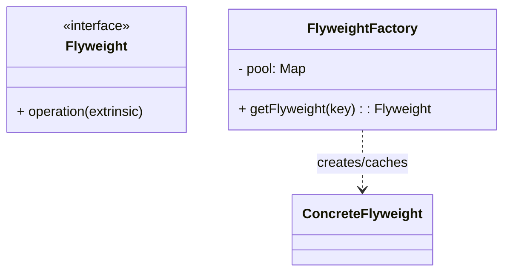

# 享元模式（Flyweight）

> 所属分类：**结构型** 　|　 返回：[设计模式分类](../设计模式分类.md)


## 意图
运用共享技术有效地支持大量细粒度对象的复用，从而节约内存。

## 结构（类图）


## 示例代码
```java
class TreeType {                 // 内部状态（可共享，不随场景变化）
    String name, color;
    void draw(int x, int y) { /* 使用 x,y 外部状态 */ }
}
class TreeFactory {
    private static Map<String, TreeType> pool = new HashMap<>();
    static TreeType get(String name, String color) {
        return pool.computeIfAbsent(name + color, k -> new TreeType(name, color));
    }
}
```

### 深挖：内部状态 vs 外部状态（享元的核心分界线）

| 状态 | 特征 | 存放位置 |
|------|------|----------|
| **内部状态**（Intrinsic） | 可共享、与上下文无关（树的种类/颜色、字符字体） | 享元对象内 |
| **外部状态**（Extrinsic） | 随场景变化（树的位置 x/y、字符在文档的位置） | 调用方传入 |

```java
// 正确用法：享元只存内部状态，外部状态由方法参数传入
tree.draw(100, 200);          // 100,200 是外部状态
tree.draw(300, 150);          // 同一个享元对象，位置不同
```
> **收益量化**：10 万棵树只有 2 种类型 → 之前 10 万对象，现在 2 个享元 + 10 万个轻量坐标引用，内存下降几个数量级。

## 适用场景
- 存在大量相似对象、且对象可拆分为**内部状态（共享）**与**外部状态（不共享）**。
- 如字符渲染、游戏粒子、连接池、线程池。

## 与相似模式区别
- 与**单例**：享元是**多个可共享实例的池**；单例是**唯一实例**。
- 与**对象池**：思想相通；对象池强调"借还"生命周期管理，享元强调"按 key 复用"。

---

## 不适用场景（反例）

- 对象**很小、数量不多**——享元的状态管理与工厂维护成本高于收益。
- 对象**几乎全是有状态且各不相同**——可共享的内部状态极少，享元无意义。
- 共享可变状态——若享元对象被多线程修改且未隔离，会造成数据错乱。

## 在 JDK / Spring / 开源中的真实应用

- **JDK**：`String` 常量池；`Integer.valueOf(-128~127)` 缓存；`Boolean`/`Byte` 缓存；线程池复用 `Worker` 线程。
- **实战**：文本编辑器字符样式对象池、棋盘棋子、连接池（连接是可变享元，需配合状态复位）。
- **MySQL**：InnoDB buffer pool 的页对象复用；**Kafka** 内存池的缓冲区复用（见 源码系列/Kafka源码.md）。

## 实现要点与常见坑

- **区分内/外部状态**：内部状态（可共享，如字符编码）放入享元；外部状态（如字符位置）由调用方传入。
- **线程安全**：共享享元若有可变内部状态，需同步或改为不可变。
- **池化 ≠ 纯享元**：对象池（连接池）借出/归还需重置状态，否则串数据。
- **误把外部状态塞进享元**：两个调用互相覆盖状态 → 数据错乱的隐蔽 Bug。

## 生产实践与重构信号

1. **重构信号**：GC 频繁、对象数量百万级且大量重复内容 → 提取内部状态做享元/缓存。
2. **连接池/线程池/内存池**：本质是「对象复用」的享元实践（Kafka 内存池、Netty 池化 ByteBuf）。
3. **缓存 vs 享元**：享元保证『同 key 同对象』（== 可判等）；缓存允许『内容等价即可』。
4. **不可变优先**：享元内部状态尽量不可变（final），天然线程安全。

## 面试高频追问（15+ 条）

1. Q：享元解决了什么？ A：通过共享大量细粒度对象减少内存占用，核心是复用『内部状态』。
2. Q：内部状态与外部状态？ A：内部状态可共享、与上下文无关；外部状态随场景变化、由客户端传入。
3. Q：JDK 中享元例子？ A：String 常量池、Integer 缓存、线程池。
4. Q：享元与对象池区别？ A：享元强调『不可变共享』；对象池强调『可借还复用』且需重置可变状态。
5. Q：什么时候不该用享元？ A：对象数量少或几乎不可共享时，维护成本不划算。
6. Q：享元如何保证线程安全？ A：让享元不可变，或仅共享无状态部分。
7. Q：Integer.valueOf 缓存范围？ A：-128~127（可调），超出才 new；面试常考 == 陷阱。
8. Q：享元和单例区别？ A：单例只有一个实例；享元按 key 可以有多个共享实例。
9. Q：享元工厂怎么实现？ A：Map<key, Flyweight> + computeIfAbsent；key 由内部状态构成。
10. Q：享元能处理『可变共享状态』吗？ A：能但危险：需同步或状态隔离，通常改不可变设计。
11. Q：字符编辑器怎么用享元？ A：字符对象共享字体/样式（内部），位置/颜色（外部）由文档持有。
12. Q：Kafka 内存池是享元吗？ A：是池化复用：固定 16KB 块池，避免频繁分配 GC（见 源码系列/Kafka源码.md）。
13. Q：享元 vs 缓存区别？ A：享元强调对象共享与身份等价；缓存允许副本存在，不保证同引用。
14. Q：享元的收益怎么衡量？ A：内存减少比例 ≈ 1 - (共享对象数/总对象数)，配合压测对比 GC 与内存。
15. Q：String 常量池怎么用享元？ A：编译期/`intern()` 复用常量池中的字符串对象。
