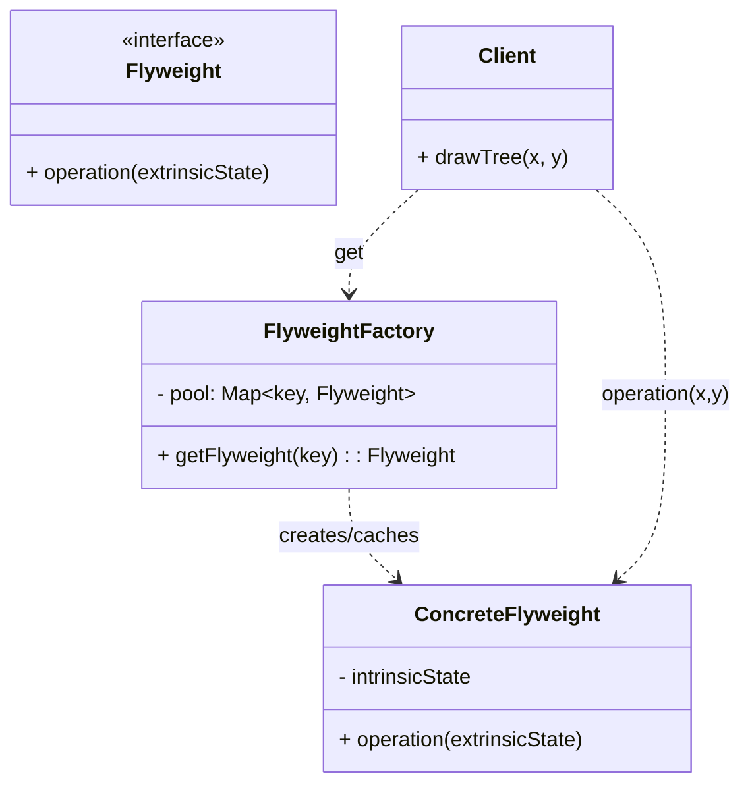

# 享元模式（Flyweight）

> 所属分类：**结构型** 　|　 返回：[设计模式分类](../设计模式分类.md)

> **一句话定义**：用「共享」复用大量细粒度对象，把可变的「外部状态」与可共享的「内部状态」分离，从而把内存占用从 O(N) 压到 O(唯一内部状态数)。

## 意图

运用共享技术有效地支持大量细粒度对象的复用，从而节约内存。当系统中存在成千上万「几乎一样、只有少量差异」的对象时，享元是降低内存与 GC 压力的标准解法。

## 结构（类图）



## 示例代码（基础形态）

```java
// 内部状态（可共享，不随场景变化）-> 享元对象自身持有
class TreeType {
    final String name;
    final String color;
    TreeType(String name, String color) { this.name = name; this.color = color; }
    void draw(int x, int y) {
        System.out.println("在(" + x + "," + y + ")画一棵" + color + "的" + name);
    }
}
// 享元工厂：按 key 缓存，保证「同 key 同对象」
class TreeFactory {
    private static final Map<String, TreeType> POOL = new HashMap<>();
    static TreeType get(String name, String color) {
        return POOL.computeIfAbsent(name + "@" + color,
                k -> new TreeType(name, color));
    }
}
// 使用时：10 万棵树只持有 10 万个「坐标（外部状态）」+ 极少数 TreeType（享元）
TreeFactory.get("杨树", "绿").draw(100, 200);
TreeFactory.get("杨树", "绿").draw(300, 150);   // 复用同一个 TreeType 对象
```

### 深挖：内部状态 vs 外部状态（享元的核心分界线）

| 状态 | 特征 | 存放位置 | 示例 |
|------|------|----------|------|
| **内部状态**（Intrinsic） | 可共享、与上下文无关、不可变最佳 | 享元对象内 | 树的种类/颜色、字符字体、连接配置 |
| **外部状态**（Extrinsic） | 随场景变化、每个调用方不同 | 调用方传入 / 轻量对象持有 | 树的坐标 x/y、字符在文档的位置 |

> **设计纪律**：享元对象一旦持有内部状态，应尽量 `final` 不可变，否则多线程共享会被改写。外部状态永远由方法参数或调用方持有，**绝不塞进享元**。

```java
// 正确用法：享元只存内部状态，外部状态由方法参数传入
TreeType t = TreeFactory.get("杨树", "绿");
t.draw(100, 200);   // 100,200 是外部状态
t.draw(300, 150);   // 同一个享元对象，位置不同
```

### 深挖：JDK 中的享元——用代码验证「==」

```java
// Integer 缓存：默认 -128~127 走享元，超出才 new
Integer a = Integer.valueOf(127);
Integer b = Integer.valueOf(127);
System.out.println(a == b);          // true（同一享元）
Integer c = Integer.valueOf(128);
Integer d = Integer.valueOf(128);
System.out.println(c == d);          // false（超出缓存，分别 new）

// String 常量池：字面量 / intern() 复用同一对象
String s1 = "abc";
String s2 = "abc";
System.out.println(s1 == s2);        // true
String s3 = new String("abc").intern();
System.out.println(s1 == s3);        // true
```

> 面试常考点：`Integer ==` 的缓存陷阱、`String` 常量池与 `new String()` 的区别，本质都是享元。

### 深挖：享元 vs 对象池 vs 单例（极易混淆）

| 模式 | 共享粒度 | 状态要求 | 生命周期 | 典型 |
|------|----------|----------|----------|------|
| 享元 | 多个可共享实例的**池** | 内部状态不可变 | 长期缓存、不归还 | String 池、Integer 缓存 |
| 对象池 | 多个可复用实例的**池** | **可变**，借出需重置 | 借/还（borrow/return） | 连接池、线程池、内存池 |
| 单例 | **唯一**实例 | 任意 | 全局唯一 | 配置中心、Logger |

> 一句话记忆：**享元是「按 key 复用不可变对象」；对象池是「借还可变对象并复位」；单例是「全局独一份」。**

## 适用场景

- 存在大量相似对象、且对象可拆分为**内部状态（共享）**与**外部状态（不共享）**。
- 对象数量级大（万级+），内存/GC 已成为瓶颈。
- 典型：字符渲染、游戏粒子/树木/子弹、连接池、线程池、内存池、棋盘棋子。

## 与相似模式区别

- 与**单例**：享元是**多个可共享实例的池**；单例是**唯一实例**。
- 与**对象池**：思想相通；对象池强调"借还"生命周期管理（可变状态需复位），享元强调"按 key 复用"（不可变）。
- 与**原型**：原型是「克隆出新对象」，享元是「复用已有对象」，方向相反。

## 不适用场景（反例）

- 对象**很小、数量不多**——享元的状态管理与工厂维护成本高于收益。
- 对象**几乎全是有状态且各不相同**——可共享的内部状态极少，享元无意义。
- 共享可变状态——若享元对象被多线程修改且未隔离，会造成数据错乱。

## 在 JDK / Spring / 开源中的真实应用

- **JDK**：`String` 常量池；`Integer.valueOf(-128~127)` 缓存；`Boolean`/`Byte`/`Character` 缓存；线程池复用 `Worker` 线程。
- **Netty**：`PooledByteBufAllocator` 池化 `ByteBuf`，基于 `PoolArena` 的细粒度内存块复用（本质是带对象池思想的享元）。
- **Kafka**：`BufferPool` 固定 16KB 内存块池化复用，避免高频分配导致 GC（见 源码系列/Kafka源码.md）。
- **实战**：文本编辑器字符样式对象池、棋盘棋子、数据库连接池（连接是可变享元，需配合状态复位）。

## 实现要点与常见坑

- **区分内/外部状态**：内部状态（可共享，如字符编码）放入享元；外部状态（如字符位置）由调用方传入。
- **线程安全**：共享享元若有可变内部状态，需同步或改为不可变（final）。
- **池化 ≠ 纯享元**：对象池（连接池）借出/归还需重置状态，否则串数据。
- **误把外部状态塞进享元**：两个调用互相覆盖状态 → 数据错乱的隐蔽 Bug。

## 生产实践与重构信号

1. **重构信号**：GC 频繁、对象数量百万级且大量重复内容 → 提取内部状态做享元/缓存。
2. **连接池/线程池/内存池**：本质是「对象复用」的享元实践（Kafka 内存池、Netty 池化 ByteBuf）。
3. **缓存 vs 享元**：享元保证『同 key 同对象』（`==` 可判等）；缓存允许『内容等价即可』（如 Caffeine 存值副本）。
4. **不可变优先**：享元内部状态尽量不可变（final），天然线程安全。
5. **度量收益**：内存下降比例 ≈ `1 - 共享对象数/总对象数`；上线前用压测对比 GC 次数与堆占用。

## 面试高频追问（20+ 条）

1. Q：享元解决了什么？ A：通过共享大量细粒度对象减少内存占用，核心是复用『内部状态』。
2. Q：内部状态与外部状态？ A：内部状态可共享、与上下文无关；外部状态随场景变化、由客户端传入。
3. Q：JDK 中享元例子？ A：String 常量池、Integer 缓存、线程池、Boolean/Byte 缓存。
4. Q：享元与对象池区别？ A：享元强调『不可变共享』；对象池强调『可借还复用』且需重置可变状态。
5. Q：什么时候不该用享元？ A：对象数量少或几乎不可共享时，维护成本不划算。
6. Q：享元如何保证线程安全？ A：让享元不可变，或仅共享无状态部分。
7. Q：Integer.valueOf 缓存范围？ A：默认 -128~127（上限可由 `-XX:AutoBoxCacheMax` 调整），超出才 new。
8. Q：享元和单例区别？ A：单例只有一个实例；享元按 key 可以有多个共享实例。
9. Q：享元工厂怎么实现？ A：Map<key, Flyweight> + computeIfAbsent；key 由内部状态构成。
10. Q：享元能处理『可变共享状态』吗？ A：能但危险：需同步或状态隔离，通常改不可变设计。
11. Q：字符编辑器怎么用享元？ A：字符对象共享字体/样式（内部），位置/颜色（外部）由文档持有。
12. Q：Kafka 内存池是享元吗？ A：是池化复用：固定 16KB 块池，避免频繁分配 GC。
13. Q：享元 vs 缓存区别？ A：享元强调对象共享与身份等价；缓存允许副本存在，不保证同引用。
14. Q：享元的收益怎么衡量？ A：内存减少比例 ≈ 1 - (共享对象数/总对象数)，配合压测对比 GC 与内存。
15. Q：String 常量池怎么用享元？ A：编译期/`intern()` 复用常量池中的字符串对象。
16. Q：Netty 的 ByteBuf 池化算享元吗？ A：是享元+对象池结合：PoolArena 管理内存块复用，借出需释放。
17. Q：享元会导致内存泄漏吗？ A：不会直接泄漏，但工厂的 Map 若无限增长需设上限/弱引用。
18. Q：享元模式符合哪些设计原则？ A：复用（减少对象数）、单一职责（内外状态分离）、开闭（新增内部状态类型无需改调用方）。
19. Q：外部状态放哪最合适？ A：放调用方局部变量或轻量「上下文对象」，不要塞回享元。
20. Q：享元适合缓存图片吗？ A：适合——图片的像素数据是内部状态（共享），绘制位置是外部状态。

## 速记口诀

> **「内部共享不可变，外部传入不沾边；工厂按 key 取对象，万棵树木只几棵。」**
> 享元 ≠ 单例（多实例池）≠ 对象池（可变借还）；记清三者边界，面试不踩坑。
