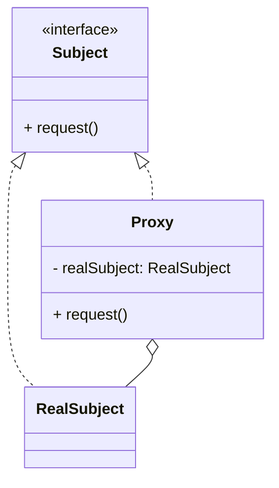

# 代理模式（Proxy）

> 所属分类：**结构型** 　|　 返回：[设计模式分类](../设计模式分类.md)


## 意图
为其他对象提供一种代理以控制对这个对象的访问。

## 结构（类图）


## 示例代码
```java
interface Service { void request(); }
class RealService implements Service { public void request() { System.out.println("真实服务"); } }
class ProxyService implements Service {
    private RealService real;
    public void request() {
        if (real == null) real = new RealService(); // 虚拟代理：懒加载
        System.out.println("前置增强");
        real.request();
        System.out.println("后置增强");
    }
}
```
> JDK 动态代理（`java.lang.reflect.Proxy`）与 CGLIB 可消除静态代理"类爆炸"问题，是 Spring AOP 的底层基础。

### 深挖：JDK 动态代理 vs CGLIB 完整对比

| 维度 | JDK 动态代理 | CGLIB |
|------|-------------|-------|
| 原理 | 接口 + `Proxy.newProxyInstance` 生成代理类 | 继承 + 字节码生成子类（ASM） |
| 前提 | **目标必须实现接口** | 无需接口，代理类本身即可 |
| 机制 | `InvocationHandler.invoke()` 统一分发 | `MethodInterceptor.intercept()` + 生成子类覆写 |
| 限制 | 无接口无法代理 | **final 类 / final 方法不可代理** |
| 性能 | 反射分发，略慢 | 生成子类直接调用，略快 |
| Spring 默认 | 有接口时默认 JDK | 无接口 / `proxyTargetClass=true` 时 CGLIB |

```java
// JDK 动态代理（模板）
Service proxy = (Service) Proxy.newProxyInstance(
    Service.class.getClassLoader(),
    new Class[]{Service.class},
    (p, method, args) -> {
        System.out.println("前置");
        Object r = method.invoke(new RealService(), args);   // 反射调用
        System.out.println("后置");
        return r;
    });
```

## 适用场景
- 远程代理（RPC/RMI）、虚拟代理（懒加载大对象）、保护代理（权限控制）、缓存代理、AOP 增强。

## 与相似模式区别
- 与**装饰器**：代理通常在构造时确定被代理对象、偏访问控制；装饰器在运行时叠加、偏功能增强。
- 与**适配器**：代理接口与被代理对象通常一致；适配器改变接口。

## 不适用场景（反例）

- 仅仅为了"加一层"而无任何横切逻辑（日志/鉴权/缓存/远程）——直接调用更清晰。
- 代理与真实对象**接口不一致**却强行代理——应改用适配器。
- 在简单项目里过早引入动态代理框架——会增加调试与理解成本。

## 在 JDK / Spring / 开源中的真实应用

- **JDK**：`java.lang.reflect.Proxy` + `InvocationHandler` 动态代理；RMI 的远程 Stub 即代理。
- **Spring AOP**：默认 JDK 动态代理（有接口）或 CGLIB（无接口/类代理）实现事务、缓存、鉴权。
- **MyBatis**：Mapper 接口由动态代理生成实现；**Retrofit** 同理。
- **Feign/Dubbo**：接口声明式远程调用，运行时生成代理发起 RPC。

## 实现要点与常见坑

- **JDK 代理只能代理接口**：类无接口需用 CGLIB（生成子类，final 类/方法不可代理）。
- **代理链过长**：多层代理嵌套导致调用栈深、性能与排查困难。
- **equals/hashCode**：动态代理生成的对象 `equals` 比较易出意外，需谨慎重写。
- **目标对象 this 调用不触发代理**：Spring 中同类内方法互调会绕过 AOP 代理。

## 生产实践与重构信号

1. **自调用问题（高频坑）**：`@Transactional` 方法在同类内被 `this.xxx()` 调用 → 事务失效。解法：注入自身（self-injection）、拆类、`AopContext.currentProxy()`。
2. **MyBatis Mapper 为何是接口？** 动态代理生成实现类，SQL 绑定在注解/XML——「接口即契约，代理即实现」。
3. **性能**：代理方法调用有反射/拦截开销，高频热点方法慎用多层代理。
4. **调试技巧**：代理对象的类名带 `$Proxy` / `EnhancerByCGLIB`，日志里认得出。
5. **与 AOP 的边界**：事务、缓存、限流、审计用 AOP 代理统一落地，业务代码零侵入。

## 面试高频追问（15+ 条）

1. Q：JDK 动态代理与 CGLIB 区别？ A：JDK 代理基于接口+反射；CGLIB 基于继承+字节码生成，final 类不可代理。
2. Q：静态代理 vs 动态代理？ A：静态代理手写代理类，数量多时膨胀；动态代理运行时生成，更灵活。
3. Q：Spring AOP 何时用 CGLIB？ A：目标类无接口、或代理的是类（非接口方法）时。
4. Q：代理模式 vs 装饰器？ A：代理控制访问（常替代原对象）；装饰器增强功能且可叠加，二者都实现同一接口。
5. Q：为什么 Spring 同方法内调用不经过代理？ A：调用走 this 而非代理对象，解决可用 self-injection/AopContext。
6. Q：代理模式典型应用？ A：远程代理、虚拟代理（懒加载）、保护代理（鉴权）、智能引用（引用计数）。
7. Q：JDK 动态代理的原理？ A：Proxy.newProxyInstance 生成实现接口的代理类，方法调用转发给 InvocationHandler.invoke。
8. Q：CGLIB 为什么不能代理 final 类？ A：它靠生成子类覆写方法，final 类/方法无法继承覆写。
9. Q：Spring 事务为什么会失效（代理视角）？ A：private 方法、同类自调用、final 方法都绕过了代理。
10. Q：MyBatis 的 Mapper 是怎么实现的？ A：MapperProxy 动态代理：方法调用 → 解析 SQL → 执行 → 映射结果。
11. Q：代理和「静态代理」谁好？ A：动态代理通用、免手写；静态代理直观但类爆炸，适合少量固定代理。
12. Q：代理模式适合什么？ A：横切关注点（日志、事务、鉴权、缓存、远程调用、懒加载）。
13. Q：RPC 代理（Feign）怎么工作？ A：接口 + 注解声明，代理把方法调用编码成 HTTP 请求发远端。
14. Q：动态代理性能损耗在哪？ A：反射调用、拦截器链、代理对象方法间接调用。
15. Q：如何判断 Spring 用的是 JDK 还是 CGLIB？ A：默认有接口用 JDK；无接口或 proxyTargetClass=true 用 CGLIB。
