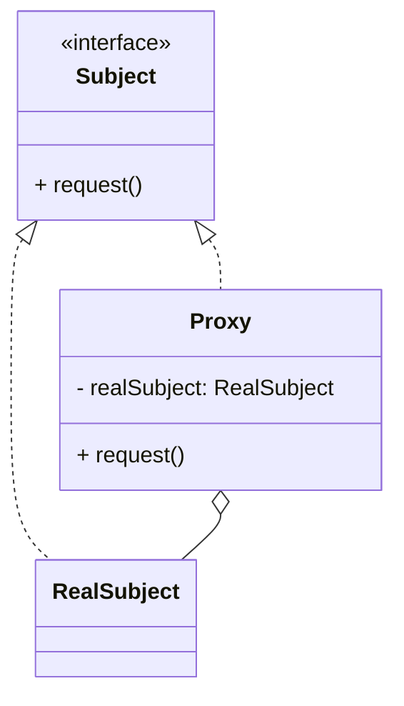

# 代理模式（Proxy）

> 所属分类：**结构型** 　|　 返回：[设计模式分类](../设计模式分类.md)


## 意图
为其他对象提供一种代理以控制对这个对象的访问。

## 结构（类图）


## 示例代码
```java
interface Service { void request(); }
class RealService implements Service { public void request() { System.out.println("真实服务"); } }
class ProxyService implements Service {
    private RealService real;
    public void request() {
        if (real == null) real = new RealService(); // 虚拟代理：懒加载
        System.out.println("前置增强");
        real.request();
        System.out.println("后置增强");
    }
}
```
> JDK 动态代理（`java.lang.reflect.Proxy`）与 CGLIB 可消除静态代理"类爆炸"问题，是 Spring AOP 的底层基础。

## 适用场景
- 远程代理（RPC/RMI）、虚拟代理（懒加载大对象）、保护代理（权限控制）、缓存代理、AOP 增强。

## 与相似模式区别
- 与**装饰器**：代理通常在构造时确定被代理对象、偏访问控制；装饰器在运行时叠加、偏功能增强。
- 与**适配器**：代理接口与被代理对象通常一致；适配器改变接口。
