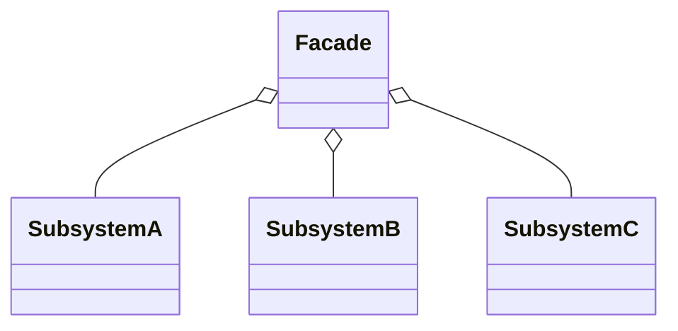

# 外观模式（Facade）

> 所属分类：**结构型** 　|　 返回：[设计模式分类](../设计模式分类.md)


## 意图
为子系统中的一组接口提供一个一致的（高层）界面，使子系统更容易使用。

## 结构（类图）


## 示例代码
```java
class CPU { void freeze(){} void execute(){} }
class Memory { void load(){} }
class ComputerFacade {                       // 外观：封装启动细节
    private CPU cpu = new CPU();
    private Memory mem = new Memory();
    public void start() { cpu.freeze(); mem.load(); cpu.execute(); }
}
```

## 适用场景
- 复杂库/框架对外暴露精简 API；分层架构中上层只依赖下层外观。
- 希望降低模块耦合、集中调用顺序与权限控制。

## 与相似模式区别
- 与**适配器**：外观是**多对一**的简化封装；适配器是**一对一**接口转换。
- 与**中介者**：外观单向封装子系统；中介者双向协调多个同事对象。
