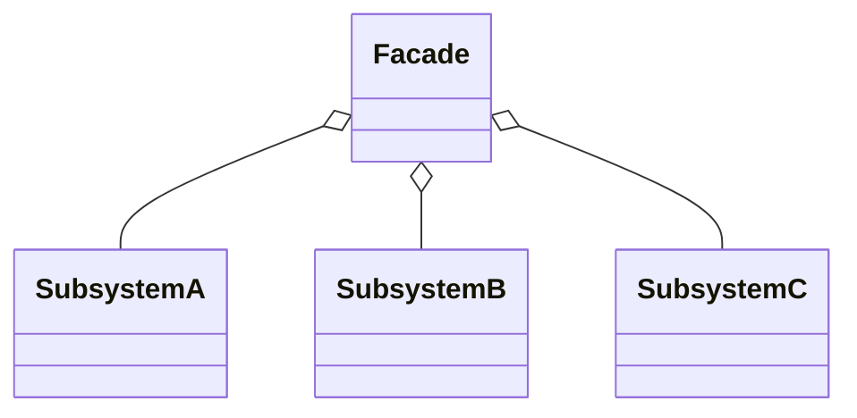
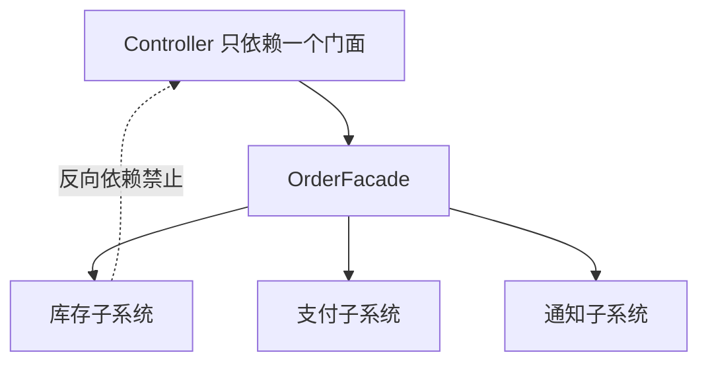

# 外观模式（Facade）

> 所属分类：**结构型** 　|　 返回：[设计模式分类](../设计模式分类.md)

> **一句话定义**：为子系统中的一组接口提供一个**一致的（高层）界面**，使子系统更容易使用。
> **英文**：Facade Pattern 　|　 **意图（GoF）**：Provide a unified interface to a set of interfaces in a subsystem. Facade defines a higher-level interface that makes the subsystem easier to use.

---

## 一、意图与解决的问题

当一个子系统内部有十几个类、调用顺序还带「先 A 再 B 再 C，失败要回滚」这种编排时，调用方（Controller / 其他模块）会被迫「了解子系统内部细节」，导致：

1. **调用方与子系统强耦合**：子系统一改内部类名/方法，所有调用点跟着改。
2. **重复编排**：「锁库存 → 扣款 → 发消息 → 记日志」这串顺序散落 N 处，改一处漏九处。
3. **缺乏统一入口**：没有一处能「一眼看懂一个完整用例」的地方。

外观（门面）在子系统之上包一层**高层 API**，调用方只认门面，子系统的复杂度被挡在门面之后。

> 💡 核心思想：**封装复杂度、收敛调用入口**。门面不新增功能，只是「好用的统一入口」。

---

## 二、结构（类图）



- **Facade（门面）**：持有子系统对象，提供高层方法（如 `placeOrder()`），内部编排子系统调用。
- **SubsystemA/B/C**：实现具体功能，不知道门面存在（单向依赖，禁止反向）。

---

## 三、经典 Java 实现

```java
class CPU { void freeze(){} void execute(){} }
class Memory { void load(){} }
class ComputerFacade {                       // 外观：封装启动细节
    private CPU cpu = new CPU();
    private Memory mem = new Memory();
    public void start() { cpu.freeze(); mem.load(); cpu.execute(); }
}
```

调用方只需 `new ComputerFacade().start()`，完全不知道 CPU/Memory 的存在。

---

## 四、门面的「分层」价值——三层架构中的外观



- **调用方只认识门面**：一次下单要「锁库存 → 扣款 → 发消息 → 记日志」，门面按固定顺序编排，业务侧一个方法搞定。
- **解耦价值**：子系统怎么改（换库存实现、加风控步骤），调用方零感知。
- **与中介者的区别**：外观是**单向**（外部 → 子系统）；中介者**双向**协调（同事 ↔ 同事）。

---

## 五、其他语言实现

### Go（组合子系统，暴露高层方法）

```go
type OrderFacade struct {
    inventory *Inventory
    payment   *Payment
    notify    *Notifier
}
func (f *OrderFacade) PlaceOrder(o Order) error {
    if err := f.inventory.Lock(o); err != nil { return err }
    if err := f.payment.Charge(o); err != nil { f.inventory.Unlock(o); return err }
    f.notify.Send(o)
    return nil
}
```

### Python（门面就是「聚合对象的高层方法」）

```python
class HomeTheaterFacade:
    def __init__(self, amp, dvd, lights):
        self.amp, self.dvd, self.lights = amp, dvd, lights
    def watch_movie(self):
        self.lights.dim(); self.amp.on(); self.dvd.play()
```

---

## 六、多门面 vs 「上帝门面」

门面**应按调用方视角拆分**，而不是把所有子系统方法平铺到一个大类：

| 写法 | 做法 | 评价 |
|------|------|------|
| 上帝门面 | 一个 `SystemFacade` 透传所有子系统所有方法 | ❌ 膨胀成 God Object，改一处全变 |
| 用例门面 | `OrderFacade.placeOrder()`、`UserFacade.register()` | ✅ 按业务用例组织，高内聚 |
| 多视角门面 | 用户门面 / 运营门面 / 开放 API 门面 | ✅ 不同调用方给不同精简面 |

> 经验：**门面方法按「用例」组织，不按「子系统方法」透传**。

---

## 七、与相似模式区别

| 对比 | 外观 | 适配器 | 中介者 | 代理 |
|------|------|--------|--------|------|
| 目的 | 简化复杂子系统入口 | 接口转换兼容 | 对象间双向协调 | 控制访问/增强 |
| 关系 | 多对一封装 | 一对一转换 | 多对多协调 | 一对一包装 |
| 方向 | 单向（外→子） | 单向 | 双向 | 单向 |

- 与**适配器**：外观是**多对一**的简化封装；适配器是**一对一**接口转换。
- 与**中介者**：外观单向封装子系统；中介者双向协调多个同事对象（同事间不直接通信，都找中介者）。

---

## 八、适用场景

- 复杂库/框架对外暴露精简 API；分层架构中上层只依赖下层外观。
- 希望降低模块耦合、集中调用顺序与权限控制。
- 为遗留系统提供干净接口，屏蔽其内部混乱。

---

## 九、不适用场景（反例）

- 子系统本来就只有一个类、调用很简单 → 门面反而多一层间接。
- 门面变成**上帝对象**，把所有子系统方法都透传一遍 → 应有选择地暴露「高频用例」。
- 为「统一」而把**本应独立演进的子系统**强绑在一个门面上 → 会造成门面频繁改动。

---

## 十、在 JDK / Spring / 开源中的真实应用

- **JDK**：`Class` 是对 JVM 内部复杂结构的门面；`SLF4J` 是日志门面（背后 Logback/Log4j2）。
- **Spring**：`JdbcTemplate` 封装了连接获取/异常转换/资源释放；`DispatcherServlet` 是 MVC 的总门面；`RestTemplate`/`WebClient` 对 HTTP 调用做了门面封装。
- **MyBatis**：`SqlSession` 门面，封装 Executor/StatementHandler 等复杂协作。
- **云 SDK**：`AWS SDK` 的客户端类是对底层 HTTP/签名/重试的封装门面。

---

## 十一、实现要点与常见坑

1. **门面不应包含业务规则**：只做「编排调用」，业务逻辑留在子系统。
2. **不要反向依赖**：门面依赖子系统，子系统不应知道门面存在，避免循环依赖。
3. **可保留直接入口**：门面之外仍允许高级用户直接调子系统做精细控制（「门面 + 直达」双通道）。
4. **事务边界**：门面方法常成为事务边界（如 `@Transactional` 放在 `placeOrder()`），注意别把长耗时 IO 包进同一事务。

---

## 十二、生产实践与重构信号

1. **重构信号**：Controller/Service 里出现「先 A 再 B 再 C」且多处分叉 → 收敛成一个门面方法。
2. **门面即「应用服务」**：DDD 中 Application Service 就是领域层之上的门面——编排用例。
3. **防上帝对象**：门面方法按「用例」组织（placeOrder/cancelOrder），不按「子系统方法」透传。
4. **性能注意**：门面本身只是编排，别把长事务/重逻辑塞进门面方法。
5. **API 网关即系统级门面**：微服务里网关统一鉴权/路由/限流，本质就是跨服务的门面。

---

## 十三、反模式案例

### 案例：门面成上帝对象

```java
// 反模式：把所有子系统方法都透传，门面膨胀
class GodFacade {
    void lockInventory(){}
    void unlockInventory(){}
    void charge(){}
    void refund(){}
    void sendSms(){}
    void sendPush(){}
    void saveLog(){}
    // ... 50 个透传方法
}
```

**修正**：拆成 `OrderFacade`（placeOrder/cancelOrder）、`PaymentFacade`（charge/refund）等用例门面。

---

## 十四、面试高频追问（20+ 条）

1. Q：外观模式解决什么？ A：为复杂子系统提供统一简单入口，降低调用方耦合与理解成本。
2. Q：外观 vs 中介者？ A：外观是单向「封装子系统供外部用」；中介者是双向「协调多个同事对象互相通信」。
3. Q：SLF4J 是外观模式？ A：是，它定义了统一日志 API，背后适配不同日志实现。
4. Q：门面会不会变成反模式？ A：当门面膨胀成上帝对象、或强耦合本应独立子系统时。
5. Q：外观能否替代子系统的良好设计？ A：不能，门面只是入口封装，子系统自身仍需清晰。
6. Q：何时用外观？ A：调用方需频繁组合多个子系统步骤、或需为遗留系统提供干净接口时。
7. Q：外观与适配器区别？ A：外观「多对一」简化封装；适配器「一对一」接口转换。
8. Q：门面里能放业务逻辑吗？ A：只做编排，业务规则应在领域层；否则门面变「上帝类」。
9. Q：DDD 中门面对应什么？ A：Application Service（应用服务）——用例编排、事务边界。
10. Q：门面与「分层」什么关系？ A：上层只依赖门面（接口），下层实现可替换，符合依赖倒置。
11. Q：DispatcherServlet 为什么是门面？ A：封装了 HandlerMapping/HandlerAdapter/视图解析等一整套 MVC 协作。
12. Q：门面影响性能吗？ A：仅一次间接调用，可忽略；真正影响性能的是编排里的长事务/重 IO。
13. Q：可以多个门面吗？ A：可以，按「调用方视角」拆（用户门面/订单门面），比上帝门面好。
14. Q：门面怎么测试？ A：mock 子系统，验证门面的编排顺序与异常处理。
15. Q：门面与「API 网关」类比？ A：微服务架构里网关就是系统级门面——统一鉴权、路由、限流。
16. Q：门面要不要暴露所有子系统方法？ A：不要，只暴露高频用例，避免上帝门面。
17. Q：Go/Python 里门面怎么写？ A：就是把子系统对象组合进一个高层结构体/类，暴露聚合方法。
18. Q：门面和接口（interface）区别？ A：接口定义契约，门面是「已实现的聚合调用」；门面常基于接口组合子系统。
19. Q：门面能否嵌套？ A：能，复杂系统可分层门面（子系统自带门面，再被上层门面编排）。
20. Q：门面与 Facade 在整洁架构的位置？ A：属「接口适配器层」，把内层用例暴露给外层（UI/API）。

---

## 十五、速记口诀（Summary）

> **复杂子系统藏门后，高层接口统一收。**
> **编排顺序归一门，改底层时调用休。**
> **上帝门面是反例，用例拆分高内聚。**
> **SLF4J 与 JdbcTpl，皆是门面好范式。**

---

## 十六、关联阅读

- 结构型：[适配器模式](适配器模式.md) · [代理模式](代理模式.md) · [中介者模式](../行为型/中介者模式.md)
- 架构实践：DDD 应用服务（Application Service）、API 网关
- 框架：Spring `JdbcTemplate`、`DispatcherServlet`、SLF4J
