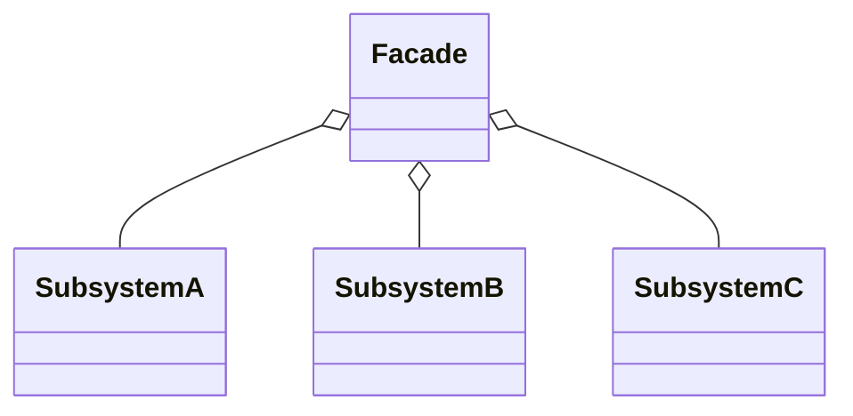
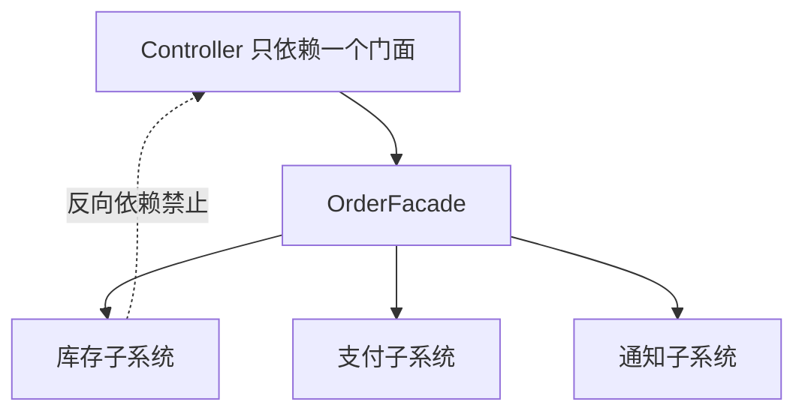

# 外观模式（Facade）

> 所属分类：**结构型** 　|　 返回：[设计模式分类](../设计模式分类.md)


## 意图
为子系统中的一组接口提供一个一致的（高层）界面，使子系统更容易使用。

## 结构（类图）


## 示例代码
```java
class CPU { void freeze(){} void execute(){} }
class Memory { void load(){} }
class ComputerFacade {                       // 外观：封装启动细节
    private CPU cpu = new CPU();
    private Memory mem = new Memory();
    public void start() { cpu.freeze(); mem.load(); cpu.execute(); }
}
```

### 深挖：门面的「分层」价值——三层架构中的外观



- **调用方只认识门面**：一次下单要「锁库存 → 扣款 → 发消息 → 记日志」，门面按固定顺序编排，业务侧一个方法搞定。
- **解耦价值**：子系统怎么改（换库存实现、加风控步骤），调用方零感知。
- **与中介者的区别**：外观是**单向**（外部 → 子系统）；中介者**双向**协调（同事 ↔ 同事）。

## 适用场景
- 复杂库/框架对外暴露精简 API；分层架构中上层只依赖下层外观。
- 希望降低模块耦合、集中调用顺序与权限控制。

## 与相似模式区别
- 与**适配器**：外观是**多对一**的简化封装；适配器是**一对一**接口转换。
- 与**中介者**：外观单向封装子系统；中介者双向协调多个同事对象。

## 不适用场景（反例）

- 子系统本来就只有一个类、调用很简单——门面反而多一层间接。
- 门面变成**上帝对象**，把所有子系统方法都透传一遍——应有选择地暴露『高频用例』。
- 为"统一"而把**本应独立演进的子系统**强绑在一个门面上——会造成门面频繁改动。

## 在 JDK / Spring / 开源中的真实应用

- **JDK**：`Class` 是对 JVM 内部复杂结构的门面；`SLF4J` 是日志门面（背后 Logback/Log4j2）。
- **Spring**：`JdbcTemplate` 封装了连接获取/异常转换/资源释放；`DispatcherServlet` 是 MVC 的总门面。
- **MyBatis**：`SqlSession` 门面，封装 Executor/StatementHandler 等复杂协作。
- **云 SDK**：`AWS SDK` 的客户端类是对底层 HTTP/签名/重试的封装门面。

## 实现要点与常见坑

- **门面不应包含业务规则**：只做『编排调用』，业务逻辑留在子系统。
- **不要反向依赖**：门面依赖子系统，子系统不应知道门面存在，避免循环依赖。
- **可保留直接入口**：门面之外仍允许高级用户直接调子系统做精细控制。

## 生产实践与重构信号

1. **重构信号**：Controller/Service 里出现「先 A 再 B 再 C」且多处分叉 → 收敛成一个门面方法。
2. **门面即「应用服务」**：DDD 中 Application Service 就是领域层之上的门面——编排用例。
3. **防上帝对象**：门面方法按「用例」组织（placeOrder/cancelOrder），不按「子系统方法」透传。
4. **性能注意**：门面本身只是编排，别把长事务/重逻辑塞进门面方法。

## 面试高频追问（15+ 条）

1. Q：外观模式解决什么？ A：为复杂子系统提供统一简单入口，降低调用方耦合与理解成本。
2. Q：外观 vs 中介者？ A：外观是单向『封装子系统供外部用』；中介者是双向『协调多个同事对象互相通信』。
3. Q：SLF4J 是外观模式？ A：是，它定义了统一日志 API，背后适配不同日志实现。
4. Q：门面会不会变成反模式？ A：当门面膨胀成上帝对象、或强耦合本应独立子系统时。
5. Q：外观能否替代子系统的良好设计？ A：不能，门面只是入口封装，子系统自身仍需清晰。
6. Q：何时用外观？ A：调用方需频繁组合多个子系统步骤、或需为遗留系统提供干净接口时。
7. Q：外观与适配器区别？ A：外观『多对一』简化封装；适配器『一对一』接口转换。
8. Q：门面里能放业务逻辑吗？ A：只做编排，业务规则应在领域层；否则门面变『上帝类』。
9. Q：DDD 中门面对应什么？ A：Application Service（应用服务）——用例编排、事务边界。
10. Q：门面与「分层」什么关系？ A：上层只依赖门面（接口），下层实现可替换，符合依赖倒置。
11. Q：DispatcherServlet 为什么是门面？ A：封装了 HandlerMapping/HandlerAdapter/视图解析等一整套 MVC 协作。
12. Q：门面影响性能吗？ A：仅一次间接调用，可忽略；真正影响性能的是编排里的长事务/重 IO。
13. Q：可以多个门面吗？ A：可以，按『调用方视角』拆（用户门面/订单门面），比上帝门面好。
14. Q：门面怎么测试？ A：mock 子系统，验证门面的编排顺序与异常处理。
15. Q：门面与「API 网关」类比？ A：微服务架构里网关就是系统级门面——统一鉴权、路由、限流。
