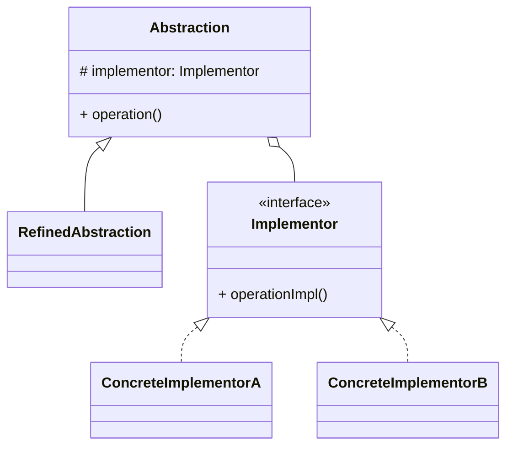

# 桥接模式（Bridge）

> 所属分类：**结构型** 　|　 返回：[设计模式分类](../设计模式分类.md)


## 意图
将抽象部分与其实现部分分离，使它们都可以独立地变化。

## 结构（类图）


## 示例代码
```java
interface DrawAPI { void draw(int x, int y); }            // 实现维度
class RedDraw implements DrawAPI { public void draw(int x, int y){ System.out.println("红点"); } }
class BlueDraw implements DrawAPI { public void draw(int x, int y){ System.out.println("蓝点"); } }

abstract class Shape {                                    // 抽象维度
    protected DrawAPI api;
    public Shape(DrawAPI api) { this.api = api; }
    public abstract void draw();
}
class Circle extends Shape {
    public Circle(DrawAPI api) { super(api); }
    public void draw() { api.draw(0, 0); }
}
```

## 适用场景
- 一个类存在两个（或多个）独立变化维度（形状×颜色、消息类型×发送渠道）。
- 避免"类爆炸"（维度乘积式继承，如 m×n 个子类）。

## 与相似模式区别
- 与**适配器**：桥接是**预先设计**解耦；适配器是事后**兼容**已有接口。
- 与**策略**：桥接结构上类似，但桥接关注结构维度拆分，策略关注算法可替换。
