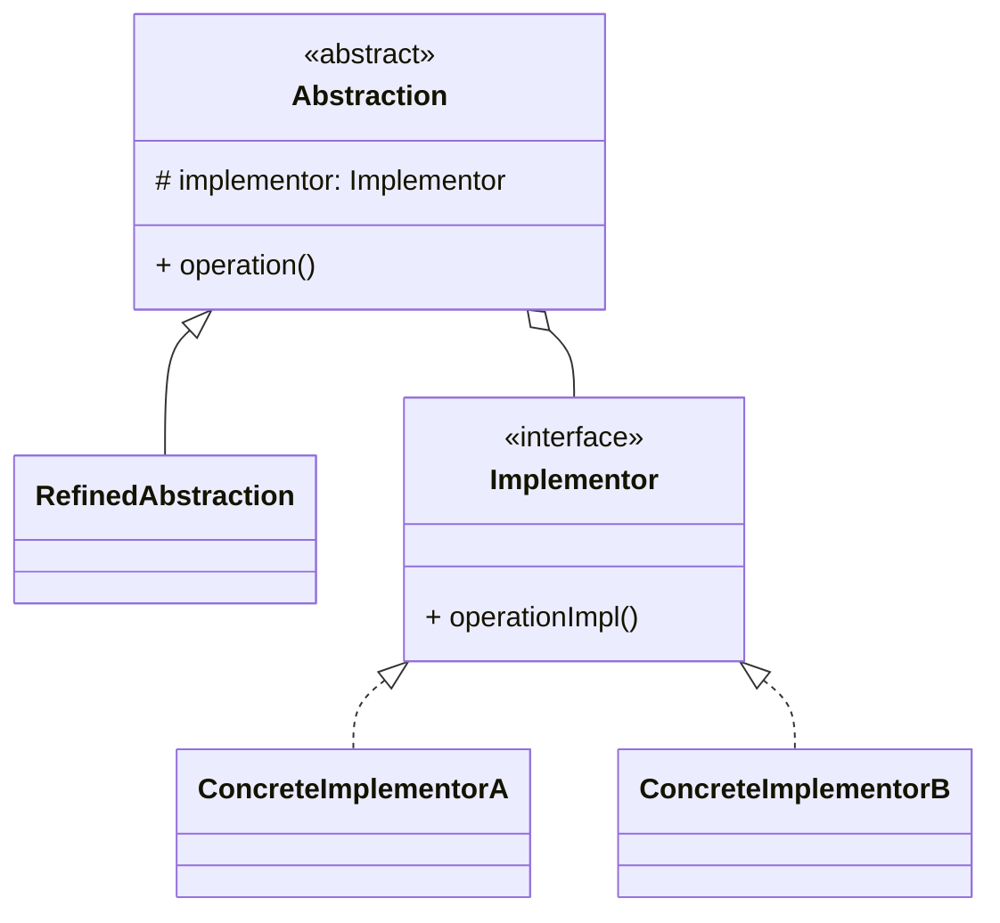

# 桥接模式（Bridge）

> 所属分类：**结构型** 　|　 返回：[设计模式分类](../设计模式分类.md)

> **一句话定义**：将「抽象」与「实现」两个**独立变化的维度**解耦，使二者可以各自扩展而不互相牵制——本质是「组合优于继承」的经典落地。

## 意图

将抽象部分与其实现部分分离，使它们都可以独立地变化。桥接模式的目的是把「会变化的维度」抽出来，用组合（has-a）代替继承（is-a），从而避免类爆炸。

GoF 原话：*Decouple an abstraction from its implementation so that the two can vary independently.*

## 结构（类图）



## 示例代码

```java
interface DrawAPI { void draw(int x, int y); }            // 实现维度
class RedDraw implements DrawAPI { public void draw(int x, int y){ System.out.println("红点@" + x + "," + y); } }
class BlueDraw implements DrawAPI { public void draw(int x, int y){ System.out.println("蓝点@" + x + "," + y); } }

abstract class Shape {                                    // 抽象维度
    protected DrawAPI api;
    public Shape(DrawAPI api) { this.api = api; }
    public abstract void draw();
}
class Circle extends Shape {
    private int x, y;
    public Circle(int x, int y, DrawAPI api) { super(api); this.x = x; this.y = y; }
    public void draw() { api.draw(x, y); }
}
// 使用：两个维度自由组合，新增颜色/形状互不干扰
new Circle(10, 20, new RedDraw()).draw();
```

### 深挖：双维度组合为什么不用继承（类爆炸推导）

```
两个独立维度：消息类型（短信/邮件/推送 = 3 种）× 发送渠道（阿里云/腾讯云 = 2 种）

继承方案：需要 3 × 2 = 6 个具体类（SmsAliyunSender、EmailAliyunSender、...）
每加一种类型 → 加 2 个类；每加一个渠道 → 加 3 个类。总类数 = m × n。

桥接方案：类型维度 3 个类 + 渠道维度 2 个类 = 5 个类。
每加维度成员 → 只加 1 个类。总类数 = m + n。
```

> 判断口诀：**「两个维度将来都会独立扩展」→ 桥接；「只有一个会变」→ 继承/策略即可**。

### 深挖：与策略、适配器、抽象工厂的边界

| 模式 | 解耦的维度 | 关注点 |
|------|-----------|--------|
| 桥接 | 抽象 × 实现（结构维度） | 长期、编译期就分离 |
| 策略 | 算法可替换 | 运行期选算法 |
| 适配器 | 已有不兼容接口 | 事后兼容补救 |
| 抽象工厂 | 产品族创建 | 创建一组相关对象 |

### 深挖：多维度桥接的「桥中桥」结构

当维度超过两个（如 形状×颜色×渲染引擎），可用桥接嵌套：抽象持有「次级桥接的抽象」。

```java
// 抽象维度 A 持有抽象维度 B（也是接口），形成桥接树
abstract class Shape {
    protected Renderer renderer;   // Renderer 自身又是一个桥接（实现维度）
    Shape(Renderer r){ this.renderer = r; }
}
// 注意：维度 > 2 时应反思是否真需要全部正交，否则考虑组合/配置化
```

> 经验：**桥接通常解决 ≤2 个正交维度的结构解耦**；维度再多，优先考虑用配置/规则引擎而不是硬桥接。

## 适用场景

- 一个类存在两个（或多个）独立变化维度（形状×颜色、消息类型×发送渠道、平台×功能）。
- 避免"类爆炸"（维度乘积式继承，如 m×n 个子类）。

## 与相似模式区别

- 与**适配器**：桥接是**预先设计**解耦；适配器是事后**兼容**已有接口。
- 与**策略**：桥接结构上类似，但桥接关注结构维度拆分，策略关注算法可替换。
- 与**抽象工厂**：工厂负责「创建实现维度对象」，桥接负责「把实现注入抽象」；二者常搭档。

## 不适用场景（反例）

- 只有**一个维度会变化**——两个维度都固定时，桥接是过度抽象。
- 两个维度**强耦合、不可能独立变化**——强行桥接反而割裂内聚。
- 维度组合极少且稳定——继承即可表达，无需运行期绑定。
- 团队对业务维度理解不清——过早桥接会制造难以理解的间接层。

## 在 JDK / Spring / 开源中的真实应用

- **JDK JDBC**：`Driver`（实现层）与 `Connection`/`Statement`（抽象层）解耦，换数据库只需换 Driver。
- **日志体系**：SLF4J（抽象）桥接 Logback/Log4j2（实现）；**AWT** 的 Peer 体系（平台实现与组件抽象分离）。
- **实战**：消息通知（抽象：短信/邮件/推送 × 实现：阿里云/腾讯云渠道）。
- **数据库驱动**：MySQL/PostgreSQL/Oracle 驱动实现统一 JDBC 接口——换库零改码。
- **跨端 UI 框架**：组件（抽象）与渲染后端（实现，Skia/Metal）分离，跨平台零改组件代码。

## 实现要点与常见坑

- **正确识别两个独立维度**：常见误区是把『类型』当维度，应是『会变且正交』的维度（如功能×平台）。
- **抽象层持有实现层引用**：通过构造器注入 `Implementor`，运行期可换实现。
- **与适配器区别**：桥接在设计期就分离维度；适配器在期后补救接口不兼容。
- **避免过度桥接**：维度固定或只有一个会变的场景，桥接是过度设计，直接用继承/策略。
- **可测试性**：抽象与实现可分别单测，给实现注入 mock 即可验证抽象逻辑。

## 生产实践与重构信号

1. **重构信号**：类名形如 `SmsAliyun`、`EmailAliyun`、`SmsTencent`……「A × B」命名爆炸 → 拆桥接。
2. **典型工程落地**：渠道/平台/存储抽象（支付渠道 × 账务、消息 × 云厂商、存储 × 加密方案）。
3. **Spring 中的桥接**：`@Qualifier` 选择实现 + 抽象服务注入，天然是桥接结构。
4. **不要为对称而桥接**：只有「消息」一种类型但换渠道 → 策略/适配器即可。
5. **配合抽象工厂**：用工厂方法创建实现维度对象，避免调用方直接 `new ConcreteImplementor`。

## 反模式案例

### 案例：用继承硬撑双维度导致类爆炸

```java
// 反模式：消息类型 × 渠道 直接用继承
class SmsSender {}
class SmsAliyunSender extends SmsSender {}
class SmsTencentSender extends SmsSender {}
class EmailAliyunSender extends EmailSender {}
// ... 每加一个渠道要新增所有类型类
```

**修正**：`Notification`（抽象）持有 `ChannelSender`（实现），类型与渠道各自扩展，新增渠道只加一个类。

### 案例：把稳定维度也桥接出去

```java
// 反模式：日志格式永远只有一种，却也抽成 Implementor 注入
abstract class Service { Logger logger; ... }
```

**修正**：稳定不变的东西不要桥接，只在真正会独立变化的维度上做桥接。

## 面试高频追问（30 条）

1. Q：桥接解决什么？ A：把『抽象』与『实现』两个独立变化维度解耦，避免类爆炸（维度乘积）。
2. Q：桥接与适配器区别？ A：桥接是设计期就分离维度（预防）；适配器是事后衔接不兼容接口（补救）。
3. Q：桥接与策略区别？ A：桥接的两个维度是『结构/平台』层面的长期解耦；策略是算法替换，偏行为。
4. Q：JDBC 哪里体现了桥接？ A：Driver 是实现，Connection/Statement 是抽象，换数据库只换 Driver。
5. Q：什么时候不该用桥接？ A：只有一个维度变化、或维度组合稳定且少时，继承更简单。
6. Q：桥接的典型结构？ A：Abstraction 持有 Implementor 引用，RefinedAbstraction 与 ConcreteImplementor 各自扩展。
7. Q：桥接与继承的本质区别？ A：继承是『类型层次』（is-a）；桥接把实现作为『成员』（has-a）注入，运行期可换。
8. Q：如何判断两个维度是否正交？ A：一个维度的变化不影响另一个维度的接口，即可独立演进。
9. Q：SLF4J 为什么既是门面又是桥接？ A：对外是门面（统一 API），对内是桥接（抽象绑定实现，实现可换）。
10. Q：桥接和组合（composition）什么关系？ A：桥接是「组合优于继承」的经典落地。
11. Q：多维度（3 个）还能用桥接吗？ A：可以链式组合，但维度过多应反思设计，通常 ≤2 个正交维度。
12. Q：桥接性能有损耗吗？ A：仅一次接口间接调用，可忽略；换取的是扩展性。
13. Q：消息系统怎么用桥接？ A：Notification（抽象）持有 ChannelSender（实现），短信/邮件/推送各一个实现。
14. Q：桥接怎么测试？ A：抽象维度与实现维度可分别测试，注入 mock 实现验证交互。
15. Q：桥接与依赖注入的关系？ A：构造器注入实现正是桥接的工程化写法。
16. Q：桥接模式符合哪些原则？ A：组合优于继承、开闭原则（维度各自扩展）、单一职责。
17. Q：抽象维度一定要是 abstract 类吗？ A：不一定，可以是接口 + 持有实现引用；视是否需要默认行为而定。
18. Q：桥接会导致接口过多吗？ A：适度，关键是只抽「会变」的维度，不要为稳定维度建桥。
19. Q：抽象工厂与桥接如何配合？ A：工厂负责创建实现维度对象，桥接负责把实现注入抽象。
20. Q：桥接在 UI 框架的应用？ A：UI 组件（抽象）与渲染后端（实现，如 Skia/Metal）分离，跨平台零改组件代码。
21. Q：桥接能在运行期切换实现吗？ A：能，持有 Implementor 引用，运行期重新赋值即可热切换。
22. Q：桥接与模板方法区别？ A：桥接解耦结构维度；模板方法固定算法骨架、把步骤延迟到子类。
23. Q：重构到桥接的第一步？ A：找出命名形如「A×B」的类，把 B 抽成接口，A 持有它。
24. Q：桥接会增加调用延迟吗？ A：一次虚方法分发，纳秒级，对业务无感。
25. Q：桥接适合微服务吗？ A：适合，客户端（抽象）与具体 provider（实现）通过接口解耦，provider 可插拔。
26. Q：桥接与防腐层（ACL）关系？ A：防腐层用适配器隔离外部，桥接用组合解耦内部维度，二者可组合。
27. Q：如何命名桥接的两个维度？ A：抽象维度用业务概念（Notification），实现维度用能力概念（ChannelSender）。
28. Q：桥接能否与装饰器组合？ A：能，实现维度对象本身再被装饰器增强，双层灵活。
29. Q：桥接在支付系统怎么用？ A：支付能力（抽象：收单/退款）桥接到具体通道（微信/支付宝/银联）。
30. Q：桥接的致命误用是什么？ A：把稳定维度也抽成桥，制造无意义的间接层，降低可读性。

## 速记口诀

> **「两个维度各自变，组合注入不靠继承；m×n 变 m+n，类爆炸从此不再见。」**
> 桥接 vs 适配器：前者预防（设计期），后者补救（事后）。

## 关联阅读

- 结构型：[适配器模式](适配器模式.md) · [策略模式](../行为型/策略模式.md)
- 框架源码：JDBC `DriverManager`/`Connection`、SLF4J + Logback
