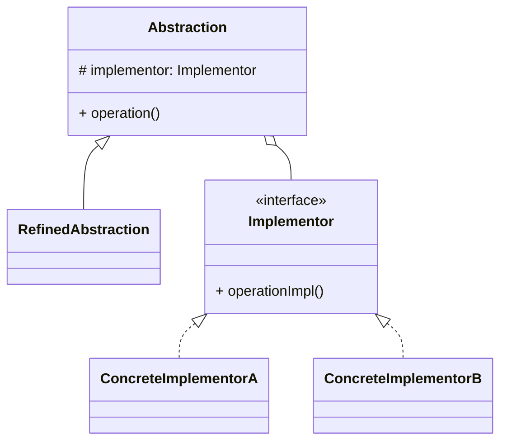

# 桥接模式（Bridge）

> 所属分类：**结构型** 　|　 返回：[设计模式分类](../设计模式分类.md)


## 意图
将抽象部分与其实现部分分离，使它们都可以独立地变化。

## 结构（类图）


## 示例代码
```java
interface DrawAPI { void draw(int x, int y); }            // 实现维度
class RedDraw implements DrawAPI { public void draw(int x, int y){ System.out.println("红点"); } }
class BlueDraw implements DrawAPI { public void draw(int x, int y){ System.out.println("蓝点"); } }

abstract class Shape {                                    // 抽象维度
    protected DrawAPI api;
    public Shape(DrawAPI api) { this.api = api; }
    public abstract void draw();
}
class Circle extends Shape {
    public Circle(DrawAPI api) { super(api); }
    public void draw() { api.draw(0, 0); }
}
```

## 适用场景
- 一个类存在两个（或多个）独立变化维度（形状×颜色、消息类型×发送渠道）。
- 避免"类爆炸"（维度乘积式继承，如 m×n 个子类）。

## 与相似模式区别
- 与**适配器**：桥接是**预先设计**解耦；适配器是事后**兼容**已有接口。
- 与**策略**：桥接结构上类似，但桥接关注结构维度拆分，策略关注算法可替换。

## 不适用场景（反例）

- 只有**一个维度会变化**——两个维度都固定时，桥接是过度抽象。
- 两个维度**强耦合、不可能独立变化**——强行桥接反而割裂内聚。
- 维度组合极少且稳定——继承即可表达，无需运行期绑定。

## 在 JDK / Spring / 开源中的真实应用

- **JDK JDBC**：`Driver`（实现层）与 `Connection`/`Statement`（抽象层）解耦，换数据库只需换 Driver。
- **日志**：SLF4J（抽象）桥接 Logback/Log4j2（实现）；**AWT** 的 Peer 体系（平台实现与组件抽象分离）。
- **实战**：消息通知（抽象：短信/邮件/推送 × 实现：阿里云/腾讯云渠道）。

## 实现要点与常见坑

- **正确识别两个独立维度**：常见误区是把『类型』当维度，应是『会变且正交』的维度（如功能×平台）。
- **抽象层持有实现层引用**：通过构造器注入 `Implementor`，运行期可换实现。
- **与适配器区别**：桥接在设计期就分离维度；适配器在期后补救接口不兼容。

## 面试高频追问

1. Q：桥接解决什么？ A：把『抽象』与『实现』两个独立变化维度解耦，避免类爆炸（维度乘积）。
2. Q：桥接与适配器区别？ A：桥接是设计期就分离维度（预防）；适配器是事后衔接不兼容接口（补救）。
3. Q：桥接与策略区别？ A：桥接的两个维度是『结构/平台』层面的长期解耦；策略是算法替换，偏行为。
4. Q：JDBC 哪里体现了桥接？ A：Driver 是实现，Connection/Statement 是抽象，换数据库只换 Driver。
5. Q：什么时候不该用桥接？ A：只有一个维度变化、或维度组合稳定且少时，继承更简单。
6. Q：桥接的典型结构？ A：Abstraction 持有 Implementor 引用，RefinedAbstraction 与 ConcreteImplementor 各自扩展。
