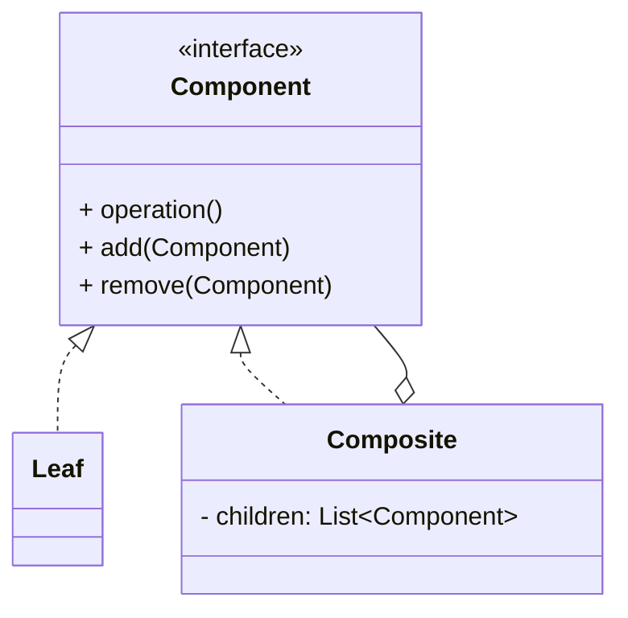

# 组合模式（Composite）

> 所属分类：**结构型** 　|　 返回：[设计模式分类](../设计模式分类.md)


## 意图
将对象组合成树形结构以表示"部分-整体"的层次结构，使得用户对单个对象和组合对象的使用具有一致性。

## 结构（类图）


## 示例代码
```java
interface FileSystemNode { int getSize(); }
class File implements FileSystemNode {
    private int size;
    public File(int size) { this.size = size; }
    public int getSize() { return size; }
}
class Directory implements FileSystemNode {
    private List<FileSystemNode> children = new ArrayList<>();
    public void add(FileSystemNode n) { children.add(n); }
    public int getSize() { return children.stream().mapToInt(FileSystemNode::getSize).sum(); }
}
```

## 适用场景
- 文件系统、组织架构、菜单、DOM、UI 容器等树形结构。
- 希望客户端统一处理叶子节点与容器节点。

## 与相似模式区别
- 与**装饰器**：组合强调**树形聚合**；装饰器强调**层层包裹增强**。
- 与**享元**：组合管理结构，享元优化内存。
