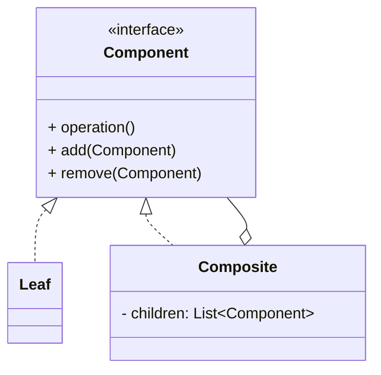

# 组合模式（Composite）

> 所属分类：**结构型** 　|　 返回：[设计模式分类](../设计模式分类.md)


## 意图
将对象组合成树形结构以表示"部分-整体"的层次结构，使得用户对单个对象和组合对象的使用具有一致性。

## 结构（类图）


## 示例代码
```java
interface FileSystemNode { int getSize(); }
class File implements FileSystemNode {
    private int size;
    public File(int size) { this.size = size; }
    public int getSize() { return size; }
}
class Directory implements FileSystemNode {
    private List<FileSystemNode> children = new ArrayList<>();
    public void add(FileSystemNode n) { children.add(n); }
    public int getSize() { return children.stream().mapToInt(FileSystemNode::getSize).sum(); }
}
```

## 适用场景
- 文件系统、组织架构、菜单、DOM、UI 容器等树形结构。
- 希望客户端统一处理叶子节点与容器节点。

## 与相似模式区别
- 与**装饰器**：组合强调**树形聚合**；装饰器强调**层层包裹增强**。
- 与**享元**：组合管理结构，享元优化内存。

## 不适用场景（反例）

- 对象**没有树形/部分-整体结构**——强行组合无意义。
- 叶子与容器**行为差异巨大**且无法统一接口——会出现『类型判断 if (isLeaf)』，违背透明性。
- 树极深且频繁遍历——递归组合可能栈溢出，需考虑迭代遍历。

## 在 JDK / Spring / 开源中的真实应用

- **JDK**：AWT/Swing 的 `Component`/`Container`；`java.nio.file.Path` 的路径树。
- **MyBatis**：`SqlNode` 组合（`<if>/<where>/<foreach>` 都是节点，可嵌套组合成动态 SQL）。
- **Spring**：`CompositeIterator`、视图解析链。

## 实现要点与常见坑

- **透明式 vs 安全式**：透明式叶子也有 `add()`（抛异常或空实现）；安全式叶子不暴露 `add()`（调用方需判类型）。
- **子节点反向引用父节点**：为回溯需存 parent，但要注意内存与序列化。
- **遍历与修改并发**：遍历组合树时若并发增删子节点，需同步或快照。

## 面试高频追问

1. Q：组合模式解决什么？ A：让客户端统一处理『单个对象』和『对象组合（树）』，无需区分叶子与容器。
2. Q：透明式与安全式区别？ A：透明式所有节点都有相同接口（叶子 add 抛异常）；安全式叶子不提供 add（需类型判断）。
3. Q：MyBatis 哪里用了组合？ A：SqlNode 把 `<if>/<foreach>` 等做成可嵌套组合的节点。
4. Q：组合模式适合什么数据？ A：菜单、文件目录、UI 组件树、AST、组织架构等部分-整体结构。
5. Q：组合模式缺点？ A：限制组件类型较困难，叶子被迫实现它不需要的方法（透明式）。
6. Q：如何避免组合模式递归爆栈？ A：极深树用显式栈做迭代遍历，或限制深度。
