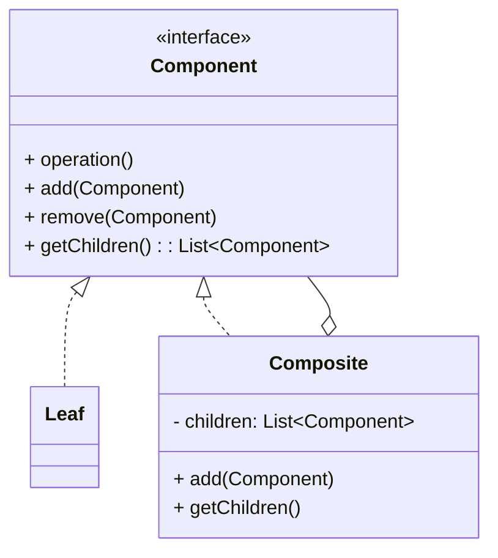

# 组合模式（Composite）

> 所属分类：**结构型** 　|　 返回：[设计模式分类](../设计模式分类.md)

> **一句话定义**：把对象组合成**树形「部分-整体」结构**，让客户端可以**一视同仁**地对待单个对象和组合对象——递归聚合，统一处理。

## 意图

将对象组合成树形结构以表示"部分-整体"的层次结构，使得用户对单个对象和组合对象的使用具有一致性。

## 结构（类图）



## 示例代码

```java
interface FileSystemNode { int getSize(); }
class File implements FileSystemNode {
    private int size;
    public File(int size) { this.size = size; }
    public int getSize() { return size; }
}
class Directory implements FileSystemNode {
    private List<FileSystemNode> children = new ArrayList<>();
    public void add(FileSystemNode n) { children.add(n); }
    public int getSize() { return children.stream().mapToInt(FileSystemNode::getSize).sum(); }
}
// 客户端：对文件与目录一视同仁
FileSystemNode root = new Directory();
root.add(new File(10));
root.add(new File(20));
System.out.println(root.getSize());   // 30，无需关心是文件还是目录
```

### 深挖：递归求和的本质与「统一处理叶子/容器」

- `Directory.getSize()` 是**递归聚合**：叶子返回自身大小，容器累加子节点——客户端对两者**一视同仁**（透明性）。
- 树形操作（统计、遍历、校验、查询）都靠这一「自我相似」结构，配合**访问者模式**可把操作外置（见 行为型/访问者模式.md）。
- 工程模板：组织架构树、权限树、菜单树、评论多级树、规则引擎的表达式树（AND/OR 组合）。

```java
// 通用递归骨架
int walk(FileSystemNode n) {
    if (n instanceof Directory d) {
        int total = 0;
        for (FileSystemNode c : d.children) total += walk(c);
        return total;
    }
    return ((File) n).size;
}
```

### 深挖：透明式 vs 安全式

| 形态 | 叶子是否有 add/remove | 优点 | 缺点 |
|------|----------------------|------|------|
| **透明式** | 有（抛异常或空实现） | 客户端无需判断类型，完全统一 | 叶子被迫实现不需要的方法 |
| **安全式** | 没有（仅容器有） | 类型安全，叶子不暴露无关方法 | 客户端需 `instanceof` 判断，破坏透明 |

## 适用场景

- 文件系统、组织架构、菜单、DOM、UI 容器等树形结构。
- 希望客户端统一处理叶子节点与容器节点。

## 与相似模式区别

- 与**装饰器**：组合强调**树形聚合**（多子节点）；装饰器强调**层层包裹增强**（单引用）。
- 与**享元**：组合管理结构，享元优化内存（二者常结合：树节点用享元共享重复内容）。

## 不适用场景（反例）

- 对象**没有树形/部分-整体结构**——强行组合无意义。
- 叶子与容器**行为差异巨大**且无法统一接口——会出现『类型判断 if (isLeaf)』，违背透明性。
- 树极深且频繁遍历——递归组合可能栈溢出，需考虑迭代遍历。

## 在 JDK / Spring / 开源中的真实应用

- **JDK**：AWT/Swing 的 `Component`/`Container`；`java.nio.file.Path` 的路径树。
- **MyBatis**：`SqlNode` 组合（`<if>/<where>/<foreach>` 都是节点，可嵌套组合成动态 SQL）。
- **Spring**：`CompositeIterator`、视图解析链、消息 `CompositeMessageConverter`。
- **表达式/规则引擎**：AND/OR/条件表达式树（Drools、SPEL）。

## 实现要点与常见坑

- **透明式 vs 安全式**：透明式叶子也有 `add()`（抛异常或空实现）；安全式叶子不暴露 `add()`（调用方需判类型）。
- **子节点反向引用父节点**：为回溯需存 parent，但要注意内存与序列化（避免循环引用 toString 爆栈）。
- **遍历与修改并发**：遍历组合树时若并发增删子节点，需同步或快照。

## 生产实践与重构信号

1. **重构信号**：递归遍历散落多处、每次都要 `if (isLeaf)` 判断 → 抽统一 Component 接口，让「操作」进对象。
2. **与访问者搭配**：结构稳定（节点类型固定）、操作常变（统计/导出/校验）→ 组合 + 访问者。
3. **深树遍历**：递归改显式栈；或限制层数（防恶意构造超深树攻击，内容安全场景）。
4. **MyBatis 动态 SQL 是经典教材**：`MixedSqlNode` 持有子节点列表，apply 时递归拼接 SQL。

## 面试高频追问（20+ 条）

1. Q：组合模式解决什么？ A：让客户端统一处理『单个对象』和『对象组合（树）』，无需区分叶子与容器。
2. Q：透明式与安全式区别？ A：透明式所有节点都有相同接口（叶子 add 抛异常）；安全式叶子不提供 add（需类型判断）。
3. Q：MyBatis 哪里用了组合？ A：SqlNode 把 `<if>/<foreach>` 等做成可嵌套组合的节点。
4. Q：组合模式适合什么数据？ A：菜单、文件目录、UI 组件树、AST、组织架构等部分-整体结构。
5. Q：组合模式缺点？ A：限制组件类型较困难，叶子被迫实现它不需要的方法（透明式）。
6. Q：如何避免组合模式递归爆栈？ A：极深树用显式栈做迭代遍历，或限制深度。
7. Q：组合与装饰器区别？ A：组合是『树形聚合』（多子节点）；装饰器是『单链路包裹』（单引用）。
8. Q：组合和访问者怎么配合？ A：树遍历稳定时，用访问者把『操作』从节点类里抽出去，加操作不改节点。
9. Q：透明性被破坏怎么办？ A：接口设计不佳导致调用方必须 instanceof 判断 → 返回安全式设计。
10. Q：组合树怎么安全并发遍历？ A：快照（copy-on-write）或读写锁；先遍历后修改。
11. Q：父引用存吗？ A：需要自底向上回溯时存；注意循环引用（序列化、GC 无碍但 toString 会爆栈）。
12. Q：组合与递归的关系？ A：组合结构的核心操作天然递归（叶子终止、容器聚合）。
13. Q：AST 是组合吗？ A：是，语法树节点（表达式/语句）嵌套组合，编译器遍历求值。
14. Q：组合模式能处理『扁平列表转树』吗？ A：能，接口配合 id/parentId 建树（组织架构常见）。
15. Q：与「树状 DP」关系？ A：树的统计类算法（子树和、直径）就是组合结构的递归计算。
16. Q：组合模式和迭代器怎么配合？ A：CompositeIterator 先深度优先展开子节点，对外提供统一迭代。
17. Q：组合模式违反接口隔离吗？ A：透明式会——叶子被迫实现 add/remove，可用默认空实现缓解。
18. Q：组合模式在权限系统设计？ A：菜单/权限树用组合，校验某用户是否有权只看叶子节点聚合。
19. Q：组合模式适合配置树吗？ A：适合，配置项（叶子）与配置组（容器）统一遍历、校验、序列化。
20. Q：组合 vs 责任链？ A：组合是结构（树）；责任链是行为（请求传递），但 Filter 链也可组织成树（责任树）。

## 速记口诀

> **「树形结构统一管，叶子容器一视同仁；递归聚合不求人，访问者来摘操作。」**
> 透明式（全接口）与安全式（判类型）按场景取舍。
