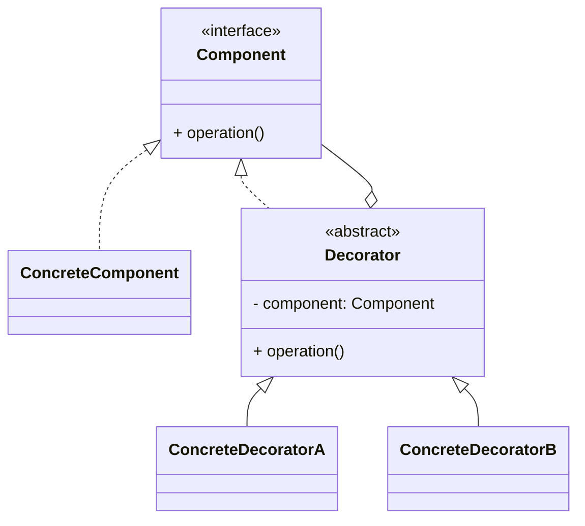

# 装饰器模式（Decorator）

> 所属分类：**结构型** 　|　 返回：[设计模式分类](../设计模式分类.md)


## 意图
动态地给一个对象添加一些额外的职责；就增加功能而言，装饰器比生成子类更为灵活。

## 结构（类图）


## 示例代码
```java
interface Coffee { double cost(); }
class SimpleCoffee implements Coffee { public double cost() { return 10; } }
abstract class CoffeeDecorator implements Coffee {
    protected Coffee coffee;
    public CoffeeDecorator(Coffee c) { this.coffee = c; }
}
class MilkDecorator extends CoffeeDecorator {
    public MilkDecorator(Coffee c) { super(c); }
    public double cost() { return coffee.cost() + 5; }
}
class SugarDecorator extends CoffeeDecorator {
    public SugarDecorator(Coffee c) { super(c); }
    public double cost() { return coffee.cost() + 2; }
}
// 使用：new SugarDecorator(new MilkDecorator(new SimpleCoffee())).cost();
```
> Java IO（`BufferedInputStream`、`DataInputStream`）即此模式的经典应用。

## 适用场景
- 需要在运行时动态、可组合地为对象增加职责，而不想用大量子类膨胀类层级。

## 与相似模式区别
- 与**适配器**：装饰器**不改接口**只加功能；适配器为兼容而**改接口**。
- 与**代理**：装饰器强调功能增强且可多层叠加；代理强调对原对象的访问控制。
