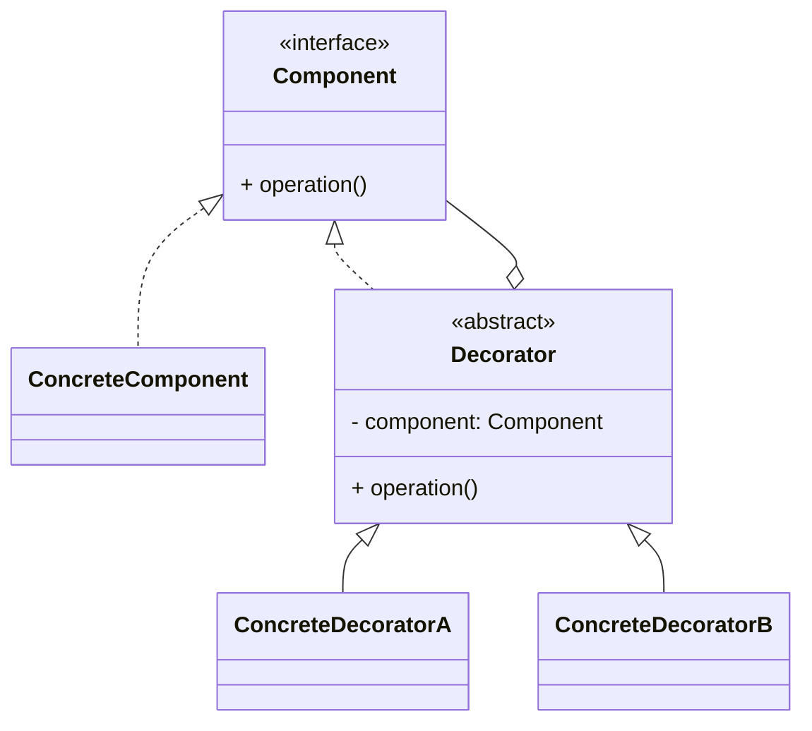

# 装饰器模式（Decorator）

> 所属分类：**结构型** 　|　 返回：[设计模式分类](../设计模式分类.md)


## 意图
动态地给一个对象添加一些额外的职责；就增加功能而言，装饰器比生成子类更为灵活。

## 结构（类图）


## 示例代码
```java
interface Coffee { double cost(); }
class SimpleCoffee implements Coffee { public double cost() { return 10; } }
abstract class CoffeeDecorator implements Coffee {
    protected Coffee coffee;
    public CoffeeDecorator(Coffee c) { this.coffee = c; }
}
class MilkDecorator extends CoffeeDecorator {
    public MilkDecorator(Coffee c) { super(c); }
    public double cost() { return coffee.cost() + 5; }
}
class SugarDecorator extends CoffeeDecorator {
    public SugarDecorator(Coffee c) { super(c); }
    public double cost() { return coffee.cost() + 2; }
}
// 使用：new SugarDecorator(new MilkDecorator(new SimpleCoffee())).cost();
```
> Java IO（`BufferedInputStream`、`DataInputStream`）即此模式的经典应用。

## 适用场景
- 需要在运行时动态、可组合地为对象增加职责，而不想用大量子类膨胀类层级。

## 与相似模式区别
- 与**适配器**：装饰器**不改接口**只加功能；适配器为兼容而**改接口**。
- 与**代理**：装饰器强调功能增强且可多层叠加；代理强调对原对象的访问控制。

## 不适用场景（反例）

- 只加**一层**功能且永久不变——直接子类继承更简单。
- 装饰后需要**调用具体子类的独特方法**——装饰器基于接口，会丢失具体类型信息（可用原生类型回退或泛型缓解）。
- 装饰链**过长且顺序敏感**——顺序错就出错，应考虑更显式的管线（如 Builder）。

## 在 JDK / Spring / 开源中的真实应用

- **JDK IO**：`BufferedInputStream` 装饰 `FileInputStream`、`DataInputStream` 叠加；`BufferedReader`/`LineNumberReader`。
- **Spring**：`BufferedOutputStream`、`HttpHeaders` 包装；`TransactionInterceptor` 链式装饰。
- **Collections**：`unmodifiableList`/`synchronizedList` 包装。

## 实现要点与常见坑

- **保持同一接口**：装饰器与组件实现相同接口，才能无限叠加。
- **顺序敏感**：`new BufferedInputStream(new FileInputStream)` 与反过来（不可）有顺序要求，先具体后缓冲。
- **与代理混淆**：装饰器『增强并透明传递同一接口』可叠加；代理『控制/替代访问』通常只有一层。
- **类型丢失**：装饰后 `instanceof` 具体类会失败，需要特定能力时设计回退或接口暴露。

## 面试高频追问

1. Q：装饰器 vs 继承？ A：装饰器运行期动态叠加功能，避免子类爆炸；继承编译期固定、组合爆炸。
2. Q：装饰器 vs 代理？ A：装饰器增强且可多层叠加、保持接口；代理控制访问，常单层替代原对象。
3. Q：JDK IO 哪里用了装饰器？ A：BufferedInputStream 包装 FileInputStream，可再套 DataInputStream。
4. Q：装饰器顺序重要吗？ A：重要，通常是『被装饰者在内、缓冲/转换在外』。
5. Q：装饰后 instanceof 原类型为何失败？ A：对象是装饰器实例而非原组件，需用接口或回退方法。
6. Q：装饰器缺点？ A：大量小类、装饰顺序易错、调试时调用栈深。
