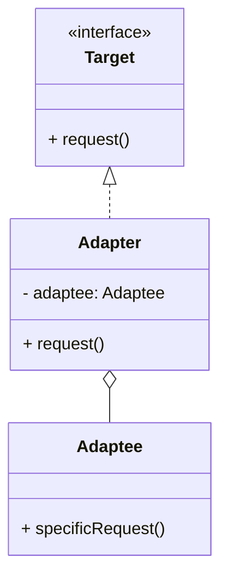

# 适配器模式（Adapter）

> 所属分类：**结构型** 　|　 返回：[设计模式分类](../设计模式分类.md)


## 意图
将一个类的接口转换成客户希望的另一个接口，使原本因接口不兼容而不能一起工作的类可以协同。

## 结构（类图）


## 示例代码
```java
class Adaptee { public void specificRequest() { System.out.println("适配者原本的方法"); } }
interface Target { void request(); }
class Adapter implements Target {
    private Adaptee adaptee = new Adaptee();
    public void request() { adaptee.specificRequest(); }  // 转换调用
}
```

## 适用场景
- 复用老系统/第三方库，但其接口与当前系统不匹配。
- 需要统一多个不兼容接口的对外契约（类适配器用继承、对象适配器用组合）。

## 与相似模式区别
- 与**桥接**：适配器让两个**已有**不兼容接口协作；桥接在**设计之初**把抽象与实现解耦。
- 与**装饰器**：适配器改变接口；装饰器保持接口不变、增强功能。
