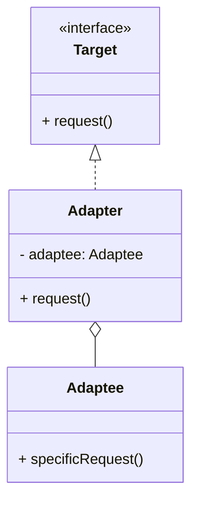

# 适配器模式（Adapter）

> 所属分类：**结构型** 　|　 返回：[设计模式分类](../设计模式分类.md)

> **一句话定义**：把一个类的**接口转换成客户期望的另一个接口**——让原本因接口不兼容而不能协作的类能一起工作（补救式解耦）。

## 意图

将一个类的接口转换成客户希望的另一个接口，使原本因接口不兼容而不能一起工作的类可以协同。适配器是「亡羊补牢」型的模式：接口已经存在且有差异，我们用一层适配把它对齐。

## 结构（类图）



## 示例代码（对象适配器，最常用）

```java
class Adaptee { public void specificRequest() { System.out.println("适配者原本的方法"); } }
interface Target { void request(); }
class Adapter implements Target {
    private Adaptee adaptee = new Adaptee();
    public void request() { adaptee.specificRequest(); }  // 转换调用
}
```

### 深挖：工程级适配器——第三方支付/短信渠道统一接口

```java
// 统一契约（Target）
public interface PaymentGateway {
    PayResult pay(PayRequest req);
    RefundResult refund(RefundRequest req);
}
// 老系统/第三方实现（Adaptee，接口各不相同）
public class WechatSdk {
    public WxPayResp doPay(WxPayReq r) { /* 完全不同签名 */ }
}
// 适配器：把 WechatSdk 包装成 PaymentGateway
@Component
public class WechatAdapter implements PaymentGateway {
    private final WechatSdk sdk;
    public PayResult pay(PayRequest req) {
        WxPayReq r = toWxReq(req);                 // 参数转换
        WxPayResp resp = sdk.doPay(r);
        return toPayResult(resp);                  // 结果转换
    }
    public RefundResult refund(RefundRequest req) { /* 类似转换 */ }
}
```

- **防腐层（ACL）思想**：适配器同时是 DDD 中的防腐层——隔离外部系统变化，业务域不感知第三方 SDK 升级。
- 每个渠道一个适配器，业务侧 `PaymentGateway` 依赖倒置，切换渠道只换注入的 Bean。

### 深挖：类适配器 vs 对象适配器

| 形态 | 机制 | 优点 | 缺点 |
|------|------|------|------|
| 类适配器 | 继承 Adaptee + 实现 Target（Java 需多继承，故不常用） | 无需持有引用 | 耦合具体类、Java 不支持多继承 |
| 对象适配器 | 持有 Adaptee 引用（组合） | 松耦合、可适配任意实现 | 多一层对象 |

## 适用场景

- 复用老系统/第三方库，但其接口与当前系统不匹配。
- 需要统一多个不兼容接口的对外契约（类适配器用继承、对象适配器用组合）。

## 与相似模式区别

- 与**桥接**：适配器让两个**已有**不兼容接口协作；桥接在**设计之初**把抽象与实现解耦。
- 与**装饰器**：适配器改变接口；装饰器保持接口不变、增强功能。
- 与**门面**：适配器改『一个对象』接口；门面包裹『多个子系统』提供统一入口。

## 不适用场景（反例）

- 接口**本来就兼容**——不需要适配器。
- 大量接口都需适配且彼此相似——可能是设计缺失，应统一接口而非到处写适配器。
- 适配器里**悄悄改写语义**（入参出参含义变了）——这是误用，应改契约或另起实现。

## 在 JDK / Spring / 开源中的真实应用

- **JDK**：`InputStreamReader`（字节流→字符流适配）、`Arrays.asList`（数组→List 适配，注意返回固定大小）。
- **Spring MVC**：`HandlerAdapter` 把各种 Controller（注解/Controller 接口/HttpRequestHandler）适配成统一调用。
- **MyBatis**：`Log` 适配器适配 Commons-Logging/SLF4J/Log4j 等。
- **Slf4j**：`slf4j-api` 是日志门面（facade），`logback-classic`/`log4j-slf4j-impl` 是适配器实现。

## 实现要点与常见坑

- **类适配器 vs 对象适配器**：类适配器用多继承（Java 用实现+继承，耦合具体类）；对象适配器持有被适配者引用，更松耦合、更常用。
- **双向适配谨慎**：同时适配 A→B 与 B→A 易混淆职责。
- **Arrays.asList 的坑**：返回的是固定大小 List，`add/remove` 抛 `UnsupportedOperationException`。

## 生产实践与重构信号

1. **重构信号**：代码里「调用第三方 SDK 的样板代码」散落多处 → 抽一个适配器/防腐层收敛。
2. **多供应商切换**：短信、支付、云存储、消息推送——每厂商一个适配器，业务统一接口，配置中心切换。
3. **兼容老接口**：老接口下线时用适配器把调用方过渡到新接口（双写期），避免大爆炸式重构。
4. **不要用适配器掩盖设计问题**：如果接口不兼容是因为「双方抽象粒度不一致」，先统一抽象，而不是加适配器硬接。

## 面试高频追问（20+ 条）

1. Q：适配器解决什么？ A：让两个接口不兼容的类能一起工作，做接口转换（补救式）。
2. Q：适配器 vs 桥接？ A：适配器是事后衔接不兼容接口；桥接是设计期就让抽象与实现解耦。
3. Q：类适配器与对象适配器？ A：类适配器靠继承（耦合具体类），对象适配器靠组合（持有引用，更灵活）。
4. Q：Spring MVC 哪用了适配器？ A：HandlerAdapter 统一适配不同类型的 Controller。
5. Q：JDK 适配器例子？ A：InputStreamReader（Stream→Reader）、Arrays.asList（数组→List）。
6. Q：适配器与门面区别？ A：适配器改『一个对象』接口；门面包装『多个子系统』提供统一入口。
7. Q：防腐层（ACL）是什么？ A：DDD 概念，用适配器隔离外部系统，领域层只见自己定义的接口。
8. Q：适配器与代理区别？ A：适配器改接口；代理保持接口、控制访问。
9. Q：什么时候不该用适配器？ A：接口本来就兼容、或适配器里悄悄改语义时。
10. Q：多支付渠道怎么设计？ A：PaymentGateway 接口 + 每渠道一个适配器 Bean，按配置注入。
11. Q：适配器能适配两个类吗？ A：对象适配器可同时持有多个被适配者（多适配者组合）。
12. Q：日志门面（SLF4J）是适配器吗？ A：门面+适配器组合：统一 API（facade），各实现桥接（adapter）。
13. Q：适配器会带来什么问题？ A：接口多一层调用、适配逻辑可能重复；大量适配器说明抽象没做好。
14. Q：为什么对象适配器更常用？ A：组合优于继承，不绑定具体类，可适配任意实现，便于测试。
15. Q：适配器如何测试？ A：用 mock 被适配者，验证适配器「转换正确、异常透传」。
16. Q：适配器双向使用有什么坑？ A：职责易混淆，建议单向适配，双向拆两个适配器。
17. Q：适配器会引入性能损耗吗？ A：一次适配转发，可忽略；重点在转换逻辑正确性。
18. Q：适配器与外观能一起用吗？ A：能，门面对外封装子系统，内部用适配器对齐各子系统接口。
19. Q：适配器在消息中间件的应用？ A：把不同 MQ（Kafka/RabbitMQ）的 client API 适配成统一 Producer/Consumer 接口。
20. Q：适配器 vs 中介者？ A：适配器是对齐两个对象接口；中介者是协调多个对象交互。

## 速记口诀

> **「接口不合加一层，转换适配救火用；对象优于类继承，防腐隔离外部变。」**
> 适配器（补救改接口）≠ 桥接（设计期解耦）≠ 装饰器（保接口加功能）。
