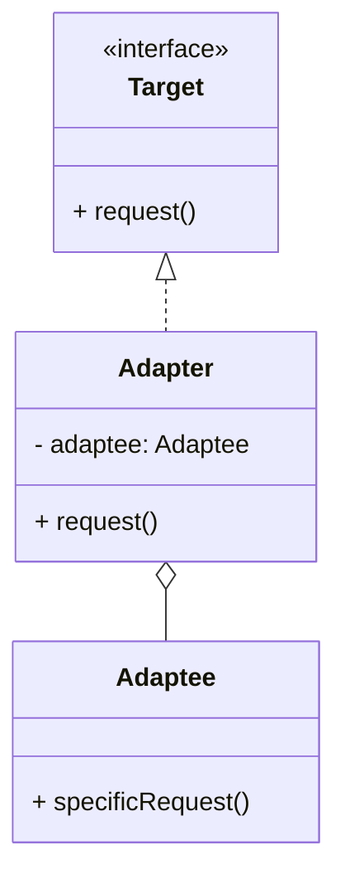

# 适配器模式（Adapter）

> 所属分类：**结构型** 　|　 返回：[设计模式分类](../设计模式分类.md)


## 意图
将一个类的接口转换成客户希望的另一个接口，使原本因接口不兼容而不能一起工作的类可以协同。

## 结构（类图）


## 示例代码
```java
class Adaptee { public void specificRequest() { System.out.println("适配者原本的方法"); } }
interface Target { void request(); }
class Adapter implements Target {
    private Adaptee adaptee = new Adaptee();
    public void request() { adaptee.specificRequest(); }  // 转换调用
}
```

## 适用场景
- 复用老系统/第三方库，但其接口与当前系统不匹配。
- 需要统一多个不兼容接口的对外契约（类适配器用继承、对象适配器用组合）。

## 与相似模式区别
- 与**桥接**：适配器让两个**已有**不兼容接口协作；桥接在**设计之初**把抽象与实现解耦。
- 与**装饰器**：适配器改变接口；装饰器保持接口不变、增强功能。

## 不适用场景（反例）

- 接口**本来就兼容**——不需要适配器。
- 大量接口都需适配且彼此相似——可能是设计缺失，应统一接口而非到处写适配器。
- 适配器里**悄悄改写语义**（入参出参含义变了）——这是误用，应改契约或另起实现。

## 在 JDK / Spring / 开源中的真实应用

- **JDK**：`InputStreamReader`（字节流→字符流适配）、`Arrays.asList`（数组→List 适配，注意返回固定大小）。
- **Spring MVC**：`HandlerAdapter` 把各种 Controller（注解/Controller 接口/HttpRequestHandler）适配成统一调用。
- **MyBatis**：`Log` 适配器适配 Commons-Logging/SLF4J/Log4j 等。

## 实现要点与常见坑

- **类适配器 vs 对象适配器**：类适配器用多继承（Java 用实现+继承，耦合具体类）；对象适配器持有被适配者引用，更松耦合、更常用。
- **双向适配谨慎**：同时适配 A→B 与 B→A 易混淆职责。
- **Arrays.asList 的坑**：返回的是固定大小 List，`add/remove` 抛 `UnsupportedOperationException`。

## 面试高频追问

1. Q：适配器解决什么？ A：让两个接口不兼容的类能一起工作，做接口转换（补救式）。
2. Q：适配器 vs 桥接？ A：适配器是事后衔接不兼容接口；桥接是设计期就让抽象与实现解耦。
3. Q：类适配器与对象适配器？ A：类适配器靠继承（耦合具体类），对象适配器靠组合（持有引用，更灵活）。
4. Q：Spring MVC 哪用了适配器？ A：HandlerAdapter 统一适配不同类型的 Controller。
5. Q：JDK 适配器例子？ A：InputStreamReader（Stream→Reader）、Arrays.asList（数组→List）。
6. Q：适配器与门面区别？ A：适配器改『一个对象』接口；门面包装『多个子系统』提供统一入口。
